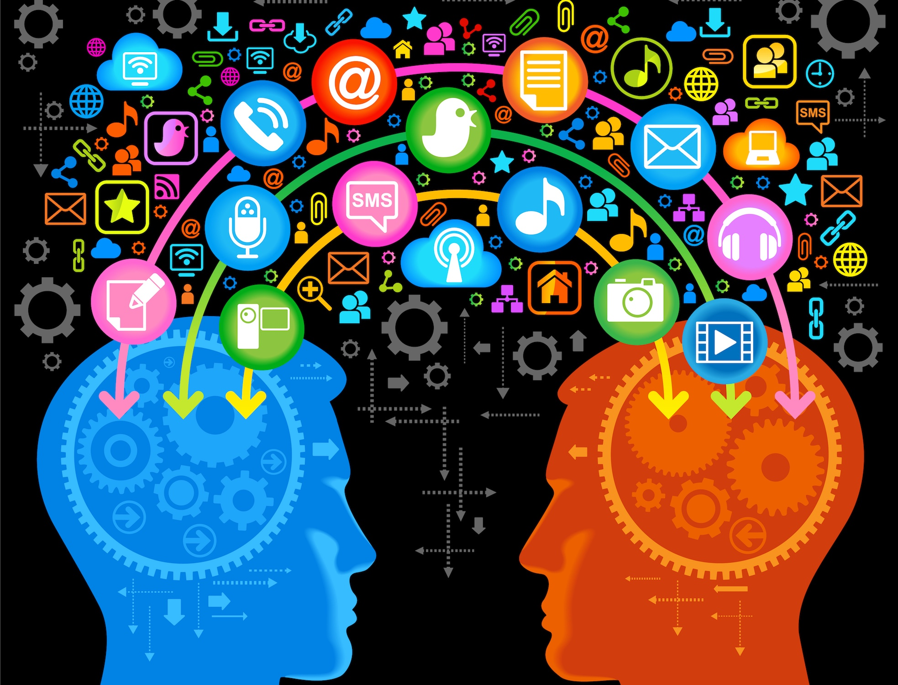
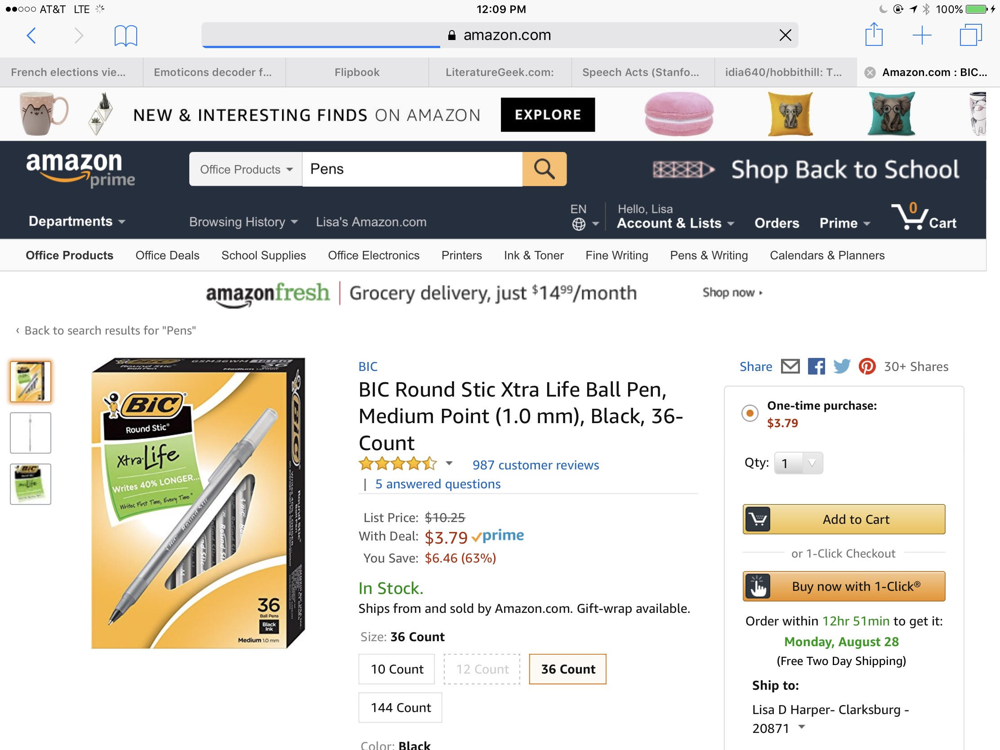
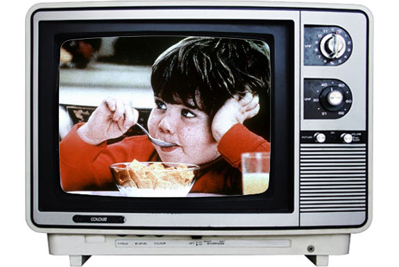
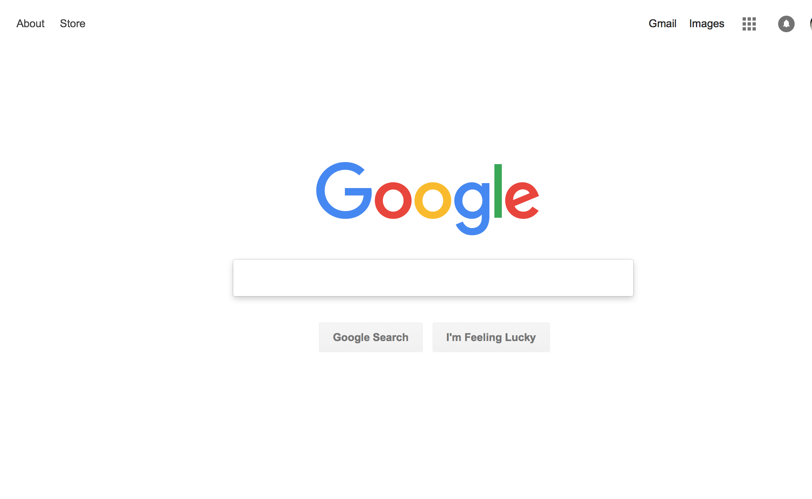

# Introduction
## Jan 29, 2019

---
## Outline for today

 1. Introductions

 2. What is this course about?

 3. What is HCI?

 4. Persuasive design

 5. Slack, GitHub

 6. Next week

---
# Introductions

1. Tell us about yourself
3. What's your academic/work background?
2. What program are you in?
4. How long have you been in it?
4. What do you hope to get out of your program?

*Also, please share something about yourself in [Slack #members](https://idia640.slack.com/messages/C6JN6KD8B)*

Note:

Please don't be shy about giving me feedback!
---

## What is this course about?

Note:

Image credit: https://www.earth.com/news/brains-fixated-social-lives/

We're going to focus on how you can drive user behavior to create a positive and persuasive interaction. This means getting under the hood of the human brain: how people perceive the world, think and make decisions, and communicate using language and graphics. Because we're social animals, we are also influenced by social and cultural environments. So this will be another lever that you can use to advantage for driving behavior.

Bias is a big part of this. Bias is the tendency to more heavily weight one option over another.

In an ideal user interaction, you shape and drive user experience. You anticipate what users will do because you know how they should respond based on your design.

---
## The Brain

Note:

The human brain has been evolving for a long time. (Sorry for the French!)

Hominids emerged millions of years ago and had relatively little brains but large jaws. Homids are distinguished from their paleo brethren by a markedly larger brain size and body size. Some speculate a correspondence with a more calorie and nutrient dense diet since the brain requires so much energy. In fact, our brain now consumes some 20% of the calories that we take in!

Image credit: http://www.bordalierinstitute.com/images/brainEvolution.jpg

---
## What Makes us Human?

Note:

There are many theories about how and why Homo sapiens are different than other species. In addition to the sudden growth of our brain size, development of fire, and development of language -- social anthropologists speculate what makes us truly human is our capacity to exchange thoughts. And this, fundamentally, rests upon social cooperation.

"When we use our brains, we often hook them up to external systems. These may be physical objects, such as pencil and paper or smartphones, that supersize our capacities for memory and reasoning. In conversation, the external systems to which we hook ourselves up are the bodies and minds of other people." Enfield, How we Talk, pg. 13

---
## User Interaction is Cooperative

Note:

A portion of this image is from Clark (1996) Discourse Continuum

- We share knowledge in order to be understood
- We coordinate our interaction
- We do so cooperatively
- User interaction is a joint activity where the designer and the user communicate via a user interface

---
## User Interaction is Conversational

<ul>
  <li>Clerk: Can I help you?</li>
  <li>Customer: How much is this?</li>
  <li>Clerk: That's 3.79</li>
  <li>Customer: I'll take it</li>
</ul>

Note:

- Structure, such as opening, closing
- Topic
- Turns
- Question answer pairs
- Expectation in terms of timing of response
- Expectation about who speaks next
- Expectation that the response is appropriate

And... it's a script. You know it. Even if they were speaking a different language entirely, you would recognize it and have expectations about what to expect.

---

Note:

How similar or different is this interaction to the previous dialogue?

---
## Speaker Contribution

<ul>
  <li>What do you want to communicate?</li>
  <li>What does the hearer know?</li>
  <li>How do you want the user to respond?</li>
</ul>

Note:

- As as designer, you are a participant in a conversation; when you plan a design, think of yourself as speaking to the user.

---

## As a designer, you plan for how you want the user to respond

Note:

- By 'respond', think about both behavior, in terms of actions, attitude, intent -- and feelings.
- Design is intrinsically communication.

- In this course, we will explore basic cognitive processes that you can use as levers to align user perceptions and actions.

- We'll be unpacking hidden structure that will develop you as a designer.

---
## Is there Interaction that is not Conversational?

Note:

Think about spell check. If you push a button to spell check your document, that is a request and response similar to conversational interaction.

But if you design the spell checker to automatically check spelling as the user types, it's a mechanism that enables the user to see better.

Both require understanding and anticipating the user's need.

---

## Human Computer Interaction

- **The study of interaction between people and technology**
- One goal of HCI, as a research discipline, is to achieve "naturalistic" interaction with computers. (e.g, <a target="_blank" href="https://www.youtube.com/watch?v=MA1hD3XRlh0">Star Trek</a>)
- HCI has mature, well-defined methodologies and scientific practice

Note:

 - Theory is drawn from what we know about how minds work and how humans interact in social situations
- Another way of thinking of "naturalistic" is the idea of minimizing the distance between the user's mental model of a task and the computer's representation and support of that task.

Practitioners (interaction designers) are concerned with practical problems in the world.

Researchers are interested in new design methodologies, experimentation to identify fundamental principles, and developing models that capture concepts and relations.

- HCI is the research correlate of "interaction design"

---
## HCI is a Multi-Disciplinary Field

<a style='text-decoration:none;' href='#/21'>Preece (2002)</a>

Note:

The term HCI was popularized in the 80' by Stuart Card, Thomas Moran, and Allen Newell in "The Psychology of Human-Computer Interaction".

---

## Research Methods

Primary methodologies include:

- Observational (e.g, ethnographic research)
- Survey research
- Controlled experimentation

Note:

We will look at each, but focus on hypothesis testing and ethnographic study.

- Measure alternative designs in a very precise way.
- Much foundational work has been conducted using experimental methods.
- And we need to understand scientific methods in order to read much of the foundational literature of HCI and applied (interaction) design.

---
## Learning Environment

<ul>
  <li><a href="https://idia640.github.io" target="_blank">Syllabus</a></li>
  <li><a href="https://github.com/idia640/course-materials" target="_blank">Course Materials</a></li>
  <li><a href="https://github.com/idia640/presentations" target="_blank">Presentation material</a></li>
  <li>Books and Articles</li>
  <li>Slack</li>
  <li>Journal Entries</li>
</ul>

Note:

- Philosophy

- I don't expect you to know how to read scientific papers from the start; this is one of our objectives. You will learn to pick apart research papers in this way:
  - Research question
  - Hypotheses
  - Variables
  - Research Design
  - Data collection/protocol
  - Analysis
  - Results/findings
- Other considerations in critiques:
  - Does the paper seem important or not? Does it make a contribution?
  - Is the methodology sound or suspect?
  - Does this paper get its message across clearly?
  - Does it change your thoughts or has it introduced new ideas to you?

 Then you will learn to present a scientific paper so that it is informative and interesting. And to do this, you have to diverge sharply from the written work.

- Informal objectives:
  - Give you the tools to argue for design decisions based on cognitive needs
  - Give you confidence that your decisions are sound
  - Perform well in interviews when asked about formal training
  - Get you started with professional collaboration tools like GitHub

- Hopefully, by the end of this class you feel comfortable with the following:
  - Reading scientific papers
  - Presenting a user-centered design concept
  - Attending / Participating in an HCI conference
  - Designing a simple experiment; perhaps, for your thesis

- Texts
  - Ware - the relation between seeing and cognition. Basic principles that are fundamental to cognition, in general.
  - Kahneman - Nobel prize winner in heuristics and biases in human decision making. Founded a revolution in 'behavioral economics', despite not being an economist, but a cognitive psychologist.
    - Prospect theory - people analyze choices in terms of losses and gains instead of final outcome.
    - Heuristics and Biases - people use mental shortcuts in decision-making, often focusing on one aspect of a problem over others.
  - Johnson - decomposes well-known design guidelines to psychological bases. Covers most of the topics in the class, though we will build on knowledge in this class, not starting from design principles, but from the other direction - from how the brain works.

---?image=images/6-persuasion-principles.jpg

Note:

- Persuasion
  - I'll give you a brief preview of persuasion and why we end with a capstone case study.
  - Persuasion concerns influencing user behavior; it builds on all of the knowledge you gain in this course from perceptual patterns (or frames) to
  decision-making in context.
  - And if you are interested in psychographics, you will find that these two ideas overlap heavily in terms of what you want to know about your users

---
##  What's the Difference?

- Coercion
- Manipulation
- Persuasion

Note:

Force / no force
Witting / not witting

---
## Coercion

Note:

It used to be TV commercials were watched coercively. There was no choice but to watch in order to continue watching your TV show. Even now, if you don't opt out and pay Google, YouTube forces you to watch ads.

---
## Manipulation

Note:

Milk at the back of the grocery store. Because milk turnover is the among the highest of items in the store, you are manipulated to walk through the store to get to the back to buy your milk.

---
## Persuasion

Note:

Your product explicitly provides an option that encourages a user to select a particular option.

---

## Persuasive, Manipulative?

- Story of Febreze https://charlesduhigg.com/new-york-times-magazine/, https://medium.com/@shahmm/how-design-thinking-transformed-febreze-into-a-1-billion-brand-dc7c86972bd5
- <a target="_blank" href="https://www.youtube.com/watch?v=IBbzNp25OHo">Jiffy</a> - "Choosy mothers..."
- Hearandplay.com - https://projectignite.com/what-is-marketing-automation/
- <a target="_blank" href="http://nudges.org/2010/06/09/nudging-in-new-york-lunchroom-cafeterias/">Nudging in NY lunchroom cafeterias</a>

Note:

- Febreze story. Charles Duhigg relays the story of how P&G turned a product failure to a product success by focusing on behavior. P&G scientists realized that Febreze could fit into a routine (later we'll see how routines become "scripts")

- Jif
  - Choosy moms choose jif.
  - Implication: If you don't choose Jif, you are not a good mother.

Hearandplay

Jermaine Griggs is an entrepreneur that had the first "play by ear" site online. It still has that 90's clunky look but is no less effective than it was when it first came online, despite lots of competition. In the late 2000's Griggs discovered "marketing automation tools" and Cialdini. He calls the interactions that he designs as "personalization". What he's really doing is understanding the motivations, intentions, and needs of his user base and holding dialogues via email and web sessions. He collects data to know who they are and where they are in the dialogue.

Thaler's blog highlights mechanism for "choice architecture" as:
- The tools highlighted are:
  - defaults
  - expecting error
  - understanding mappings
  - giving feedback
  - structuring complex choices
  - creating incentives

You are a choice architect!

---
## Nudge

Note:

Let's look at a closely at nudges.

“A nudge, as we will use the term, is any aspect of the choice architecture that alters people's behavior in a predictable way… nudges are not mandates. Putting fruit at eye level counts as a nudge. Banning junk food does not.” Thaler and Sunstein (2008)

Nudges are interventions that steer people in particular directions but that also allow them to go their own way. Thaler and Sunstein (2008) It shouldn't affect your autonomy nor should it provide significant "material incentive."

This concept seems simple on the surface, but there are still many potential ethical problems.
Nudging and Choice Architecture: Ethical Considerations. Sunstein  (2015)

https://dash.harvard.edu/bitstream/handle/1/17915544/Sunstein_809.pdf?sequence=1

image credit: [Nudge theory](http://www.thehansindia.com/posts/index/Education-&-Careers/2017-10-10/Nudge-theory/332342)

---

### From Behavioral Economics to UX

Note:

Both marketing professionals and UX designers are concerned with how cognitive, psychological, emotional, linguistic, social and cultural factors impact decision-making.

In fact, when we talk about decision-making, there is much to be learned from work in a field called Behavioral Economics.

Traditionally, economic models were based on the idea of rational decision-making where it assumed people made decisions by weighing options and choosing the most logical choice. But humans work nothing like this in practice. Daniel Kahneman won a 2002 Nobel prize in economics  for his work with Amos Tversky (deceased before 2002) in their joint work on human judgements and decision-making under uncertainty.

More recently, in 2017,Richard Thaler was awarded the same prize for his contribution to behavioral economics; people are in fact  predictably irrational.

In his work, Thaler uses the term "nudge". A nudge influences behavior without coercion or manipulation. It makes one option more attractive without forbidding other options.

---
## The Power of a Fly

Note:

Thaler's favorite illustration of a nudge is the etching of "small, photorealistic images of flies on the urinals near the drain [at Amsterdam's Schiphol Airport]. The idea was to give people something to aim at." This resulted in 80% reduction of urinal spillage and 8% reduction in total bathroom cleaning costs.  [How Richard Thaler harnessed the power of the urinal fly to win a Nobel Prize - The Washington Post](https://www.washingtonpost.com/news/wonk/wp/2017/10/09/whats-a-urinal-fly-and-what-does-it-have-to-with-winning-a-nobel-prize/?noredirect=on&utm_term=.907a4b799ff9)

It is this sort of behavior we will be focused on in class.  To fully understand how this works, we dip into basic ideas of how the human brain works from perception to cognition.

This idea of nudging, or guiding people to predictable actions means we can better predict their actions and also better avoid error. The question of HOW we do this is the topic of this class.

One caveat: you are not limited to nudges. To design a persuasive interaction, you will learn other tools that may be of use.

---
## Let's get started...

---
## Github

- What is GitHub?
- Learn how to navigate
- Learn how to use markdown to edit documents
- Understand the basics of collaborative version control

---
## Final Project: Case Study

- Tell a compelling story
- Define your target population (should be narrow)
- How do they typically behave now?
- Describe the behavior you wish to affect (observed via ethnographic or other research)
- Present your empirically guided design strategy

Note:

Your design can be as small as creating an option and moving your users towards it or more ambitious with multiple steps or even more so defining a new UX design entirely.

You will present your work as a poster presentation at the end of the course.

The important emphasis is on the idea of a 'story' that both grabs interest to draw in your audience, but also is convincing. You want your audience to believe that your solution will work. (Hence, also a focus on empiricism and cognitive principles.)

---

## Case Study Design Idea

Write a short problem statement on an interaction problem domain.

For this week, think of an problem area where you wish to positively affect user change. The nudge blog is a good place to start if you feel stuck. You just need a sentence or two.

https://nudges.files.wordpress.com/2008/04/our-dozen-nudges1.pdf

---

# Next Week

- Finish the practice journal entry
- Contribute a [case study idea](https://github.com/idia640/course-materials/blob/master/problem-statement.md) in [Slack #case-studies-spring19]( https://idia640.slack.com/archives/C6J56QY8G).
- Choose a scientific article to review and add a note to #discussion-spring19. First come, first served.
- Readings

Note:

This course starts out like a lion and ends like a lamb. I hope to get the less fun stuff out of the way in the first couple of weeks and then you can enjoy thinking about a case study idea that refers to concepts from this course.

---
## References

@ul[references]

- (Clark, H. (1996). In Using language (pg. 50). Cambridge University Press.)
- Cialdini, R. B. (2003). Influence: The Psychology of Persuasion. Harper-Collins.
- Preece, J., Rogers, Y. & Sharp, H. (2002).	Interaction Design: Beyond Human-computer Interaction. J. Wiley & Sons.
- Sunstein, C. (2015) Nudging and Choice Architecture: Ethical Considerations.
- Thaler, R. & Sunstein, C. (2008) Choice Architecture.

@ulend
---
