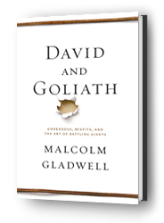
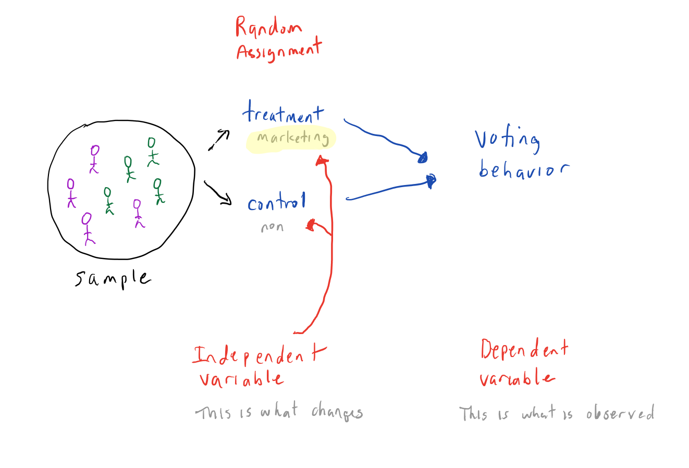
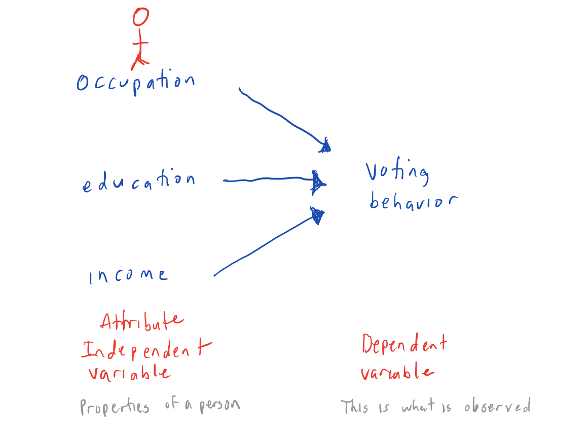
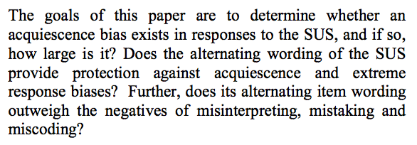

# HCI Methodologies
## Sept 5, 2017

---

## Primary methodologies

- Observational (e.g, ethnographic research)
- Survey
- Controlled experimentation

Note:

You may be wondering why I assigned the reading from last week. Perhaps, it was challenging for you. I'm assuming you know nothing about science nor how to read a scientific paper. You need to learn how to critical read a scientific paper because you will be the person on the UX team that has to deal with the question: "why are doing it like that?".

Have you ever been frustrated from a client or developer who brushes off your idea because, "everyone has opinions" and they consider your advice simply an opinion? The point of this course is to give you tools to both create a persuasive design, but also defend it using cognitive principles, and where necessary, science. You may also need to refute "bad science", so we will focus much attention on this.

We will look at each of the methodologies above, but focus on hypothesis testing this week.

Next week we'll look at Survey methodology and ethnographic research.

---
## Today's outline

- **Motivation**
- Objectives
- Controlled Experimentation
- Critical Review

Note:

This point of this segment is to make you understand the importance of questioning assumptions and to think like a scientist.
---

# Why do we need to know this stuff?

Note:

---
## Scientists are people
- They are inquisitive, but subject to the same biases as the rest of us.
- They work within a *paradigm*.
- Scientific observations are framed within a given paradigm.

Note:

Paradigm - A model of reality. Concepts, theories, methodologies, conventions.

Thomas Kuhn (Structure of Scientific Revolutions) - "Normal science is about accumulating knowledge". Sometimes technological (or societal) advances make it possible to observe or measure phenomena that were not measurable before. In such cases, there may be anomalous observations that cause a shift to a new paradigm.

Example:

If you find this interesting, the story is described in great detail in [The Gene: An Intimate History](https://www.amazon.com/Gene-Intimate-History-Siddhartha-Mukherjee/dp/1476733503) by Siddhartha Mukherjee. This is a fascinating story with many players, but focuses on how it is we know about something that was invisible for many years and how it changed humanity's understanding of itself.

Why is it we share traits with our parents? Aristotle thought that it was the fluids transmitted by our parents which gave form to our physical beings. In the late 1700's, Erasmus Darwin suggested that animals arise from a "living filament" that has the power to acquire new parts in response to stimuli, and that each successive generation could improve over the last. A French scientist, Lamarck argued that characteristics during a lifetime could be passed to offspring. Because there was insufficient observational data to fully back these ideas, theories of evolution abounded.

But in the 18th century, scientists studying plant and animal diversity began to experiment with hybridization. One such person was the monk Gregor Mendel, a detail-oriented man who who took copious notes on hybridization of pea plants, was interested in statistical properties of traits through successive hybridization of plants. He discovered traits were calculable from statistical rules. There was gathering evidence from Charles Darwin and others to suggest something within organisms could pass on to successive generations. It was not blood (as Aristotle hypothesized), since Francis Galton performed blood transfusions, ultimately, disproving transmission through blood. Weismann performed an experiment of removing tails from white mice and found that no mice were born without tails, giving strong evidence against Lamark's theory. Ultimately, in 1910, Morgan, looking at inheritance in fruit flies, discovered sex-links recessive traits and he traced these to sex chromosomes (visible via a light microscope). Ultimately, we discovered genes on chromosomes and the mechanism by which inheritance occurs. This change was precipitated by changes in technology which allowed us to make new observations - but also by changes in thinking in scientific discourse.

Mukherjee says that we're living in a post-genomic world -- we can now read and write ourselves. This is a new paradigm shift.
---

## Science is social (and political)

- Pressure from "authorities" and peers (within a paradigm)
- Need for grants, publications, etc.
- Media hype

Note:

But its subjective and political. Paradigms are backed by those with prominent reputations or within the majority. We will look at this sort of influence later in the semester.

---

# So what?

Note:

Science is full of bias. To top it off, the media seems to assume that anything published a scientist is valid.

---

## Question what seems authoritative -- scientific papers

-  "Normal" science
  - Publishing favors "new" and interesting work - claims may be over-stated
  - <a target="_blank" href="http://arstechnica.com/science/2016/03/social-science-reproducibility-not-great-but-not-as-bad-as-reported/">Results may not be reproducible</a>
  - <a target="_blank" href="http://www.psychologicalscience.org/index.php/convention/the-curse-of-knowledge-pinker-describes-a-key-cause-of-bad-writing.html">Writing may be "opaque"</a>

Note:

Link to an article about the "Reproducibility Project" which aims to replicate 100 empirical studies from several prominent journals in Psychology. What is reproducibility? It's the ability for someone else -- not the author -- to replicate the same study and with the same results. This is important in social science, since people tend to believe the results of a single study generalize across people, time, and culture. But, of course, and despite this, a social context is variable and difficult to reproduce.

This sprung out of a "crisis" from a [year of horrors](http://ejwagenmakers.com/2012/Wagenmakers2012Horrors.pdf) in 2011 where it was found that the psychologist Diederik Stapel published at least 30 papers on fabricated data and where John Bargh's study where participants walk more slowly after being primed with the "old" stereotype failed replication. On top of this, the [Open Science Collaboration](https://osf.io/vmrgu/) found that only 36% of 100 studies in psychology, could be replicated.

One of the things you'll learn from this segment of the course is that scientists write in a narrowly proscribed manner. While the structure of scientific papers makes it easy to parse and read them once you know what to expect, the language used can be obscure an confusing -- and there is little incentive to make such writing easier to understand.

Reading from the Pinker article above: (as it pertains very well to design, in general):

Pinker: “I think the curse of knowledge is the chief contributor to opaque writing,” Pinker explained. “It simply doesn’t occur to the writer that readers haven’t learned their jargon, don’t seem to know the intermediate steps that seem to them to be too obvious to mention, and can’t visualize a scene currently in the writer’s mind’s eye. And so the writer doesn’t bother to explain the jargon, or spell out the logic, or supply the concrete details — even when writing for professional peers.”

The slow and integrative nature of conscious perception is confirmed behaviorally by observations such as the “rabbit illusion” and its variants, where the way in which a stimulus is ultimately perceived is influenced by poststimulus events arising several hundreds of milliseconds after the original stimulus.

Pinker said that despite teaching and doing research in perception for almost 40 years, he “had no idea” what the sentence meant, could not identify what the writer was referring to by “a stimulus,” and had to look up the definition of rabbit illusion, which he discovered to be an obscure phenomenon in cutaneous perception:

“[I]t works as follows: The subject closes his eyes and sticks out his arm. The experimenter taps him three times on the wrist, three times on the elbow, three times on the shoulder, and it feels like a continuing series of taps running up the length of your arm, kind of like a hopping rabbit — hence, ‘the rabbit illusion.’

“Well, why didn’t they just say that?” Pinker asked, drawing chuckles from the audience.

But countering the curse of knowledge involves more than just empathizing with the reader, since social psychology studies show “that we’re not very good at figuring out what other people are thinking, even when we try really, really hard,” Pinker said.

Writers should, for example, show early drafts of their work to a representative reader. “You’d often be surprised to find that what’s obvious to you is not obvious to anyone else,” he said. They also can rewrite their piece several times without adding content, with the single goal of simply making the prose understandable, he added.

---

## "Sketchy" science

  - "Dodgy claims"
  - Journalistic error
  - <a target="_blank" href="http://www.chronicle.com/blogs/linguafranca/2012/03/15/bad-science-reporting-effect/">"Bad science" reporting effect</a>
  - "Gladwellian gap"

*We need to understand conventions scientists use to communicate their findings.*

Note:

"Dodgy claims" - see Ben Goldacre video below.

---

## "Dodgy claims"
 
<iframe src="https://embed-ssl.ted.com/talks/ben_goldacre_battling_bad_science.html" width="640" height="360" frameborder="0" scrolling="no" webkitAllowFullScreen mozallowfullscreen allowFullScreen></iframe>

Note:

Play first minute+ in class.

- We're impressed by authority
- Distortion of evidence - lab study in a petri dish extrapolated to you
- Compare effects against nothing (just "better than nothing" -  think about placebo effects)
- Personal stories (e.g., cure of Alzheimer's)
- "missing data" - negative trails are missing. Companies routinely withhold this sort of data. Tamiflu - promise that this drug reduces the complications of flu (pneumonia & death). But scientists are unable to get this data.

---
## Journalistic Error

<a target="_blank" href="https://www.bostonglobe.com/news/politics/2015/10/20/donald-trump-and-ben-carson-speak-grade-school-level-that-today-voters-can-quickly-grasp/LUCBY6uwQAxiLvvXbVTSUN/story.html">Boston Globe: Oct 20, 2015</a>

"The Globe reviewed the language used by 19 presidential candidates, Democrats and Republicans, in speeches announcing their campaigns for the 2016 presidential election. The review, using a common algorithm called the **Flesch-Kincaid readability test** that crunches word choice and sentence structure and spits out grade-level rankings, produced some striking results."

Note:

"The Republican candidates — like Trump — who are speaking at a level easily understood by people at the lower end of the education spectrum are outperforming their highfalutin opponents in the polls. Simpler language resonates with a broader swath of voters in an era of 140-character Twitter tweets and 10-second television sound bites, say specialists on political speech."

Does Flesch-Kincaid apply?? NO. It was designed for written text and not speech. (It has other flaws, as well. See punctution example on next page.)

---
## "Flesch Kincaid"

Credit: <a target="_blank" href="http://languagelog.ldc.upenn.edu/nll/?p=21847">LanguageLog Blog</a>

Note:

---
## "Gladwellian gap"

"Gladwell **proves** that not only do many successful people have dyslexia, but that they have become successful in large part because of having to deal with their difficulty."

Observation from a source quoted in <a target="_blank" href="http://www.slate.com/articles/health_and_science/science/2013/10/malcolm_gladwell_critique_david_and_goliath_misrepresents_the_science.html">Chabris, Slate Magazine, Oct 2013</a>

Note:

I'm a Gladwell fan, but it's important to understand the context of his writing. He's a persuasive story-teller.

- Malcolm Gladwell is hugely **influential** - perhaps, more so, than the scientists he reports on.
- Alternates between reports on scientific claims and rhetorical language:
 - "If you take away the gift of reading, you create the gift of listening."

 From Gladwell:

“I am a story-teller, and I look to academic research … for ways of augmenting story-telling. The reason I don’t do things their way is because their way has a cost: it makes their writing inaccessible. If you are someone who has as their goal ... to reach a lay audience ... you can't do it their way.”

http://www.telegraph.co.uk/culture/books/authorinterviews/10335491/Malcolm-Gladwell-interview.html

"In his Telegraph interview, Gladwell again played down the seriousness of his work: "The mistake is to think these books are ends in themselves. My books are gateway drugs—they lead you to the hard stuff."

From the Slate article:

"And David and Goliath does cite scholarly works, books and journal articles, and journalism, in its footnotes and endnotes. But I wonder how many readers will follow those links, as compared to the number who will take its categorical claims at face value. And of those that do follow the links, how many will realize that many of the most important links are missing?"

Crude influence ratio cited by Googling the phrase:
Gladwell: proved 5,300, showed 19,200 = 24,500 total
Pinker: proved 9, showed 625 = 634 total

Tip: it is good practice to check footnotes and follow links to sources.

---
## Today's Outline

- Motivation
- **Objectives**
- Controlled Experimentation
- Critical Review
---
## Objectives

1. Learn to be open-minded, but skeptical. Question what you read.
2.  Recognize where to find -- and how to interpret -- key information in a scientific article.
3. Recognize key differences between experimental and non-experimental research designs.
4. Recognize where potential problems may occur.

Note:

Elements of a scientific paper you will learn to identify.
- Central research question
- Hypothesis
- Research design
- Conditions and variables
- Results/Key findings

---
## Today's outline

- Motivation
- Objectives
- **Controlled Experimentation**
- Critical Review

---
## UX Research Methods

Image credit: <a href="https://www.nngroup.com/articles/which-ux-research-methods/">Norman Nielsen</a>

Note:

Does not account for experimental studies. https://www.nngroup.com/articles/which-ux-research-methods/

- Both qualitative and quantitative may be interested in using both objective and subjective data. But, generally, quantitative studies focus on structured data while qualitative studies focus on more open-ended questions.

---
## Some dichotomies in HCI research methods

- Lab vs field (natural context)
- Participant report vs. researcher observation
- Quantitative vs qualitative
- Behavioral vs. attitudinal (do versus say)

Today the focus is on **Randomized experimental** (lab, observations, quantitative, behavioral)

Note:

- There are a number of different ways to slice and dice research methods - but it's difficult to find a single representation that adequately describes such a multi-dimensional topic.

---
## Structure of research

Image credit: Gliner, Morgan, and Leech (2011), p. 20

Note:

- Mature conventions
- Papers follow well-defined structure
---
## What if the question is very broad?

Image credit: Chow, S. (2010). p. 450

Note:

If you are interested in doing a quantitative master's or doctoral thesis using experimentation, this is how you would break down your problem.

---
## HCI research methods (deeper look)

Inserted image from Gliner, Morgan & Leech (2011) p. 11

Note:

This slide puts into context all of the research methods we will be concerned with in this course. Let's walk through it.

We'll look at ethnographic research and survey methodology next week, but for this week you need to know the difference between experimental and non-experimental research designs.

---
## Randomized experimental

Note:

In this example independent variables are active - they can be manipulated. However, it's not always the case that independent variables are active like this. We'll see this in quasi-experiments next.

A sample should be representative of the population you are studying. It needs to sufficiently sized and representative.

In this example, imagine that the treatment was the effect of a marketing campaign. One group was subject to a treatment, and the other was not.

Here we are only looking at one variable and that variable is categorical with just one distinction.

You could also imagine variables with multiple levels such as small, medium, and large.

And you could imagine being interested in something like assessing readability on the basis of multiple variables such as, text color, size, and font.

---
## Quasi-Experimental

No random groups are assigned.

- For example,
 - Two university classes are given two different exam types.
 - Groups where subjects had selected the treatment (e.g., stress reduction via Tai Chi versus meditation)

---
## Non-Experimental (Observational)

Note:

Suppose you want to understand voter behavior. You could use quantitative methods to do so.

- You could summarize data by population attributes.
- You could relate variables such as age, income, gender, and education level to make some sort of prediction
- you could also compare different sub-populations  to look at differences between them.

Note these are all inherent attributes of a person - you can't assign them these attributes.

---
## Back to the overview

 Image credit: Gliner, Morgan, and Leech (2011), p. 11

Note:

---
## Today's outline

- Motivation
- Objectives
- Controlled Experimentation
- **Critical Review**

---
## Sample Paper

<a href="https://github.com/idia640/course-materials/blob/master/sauro_lewisCHI2011.pdf">Download</a>

Note:

https://www.usability.gov/how-to-and-tools/methods/system-usability-scale.html

Based on research, a SUS score above a 68 would be considered above average and anything below 68 is below average.

---
## Research question

- Statement about the relationship between two or more variables
 - Should be stated clearly and unambiguously
 - Should fill a gap in knowledge
 - Should be testable
 - Should be ethical

Example from: Sauro & Lewis (2011)

Note:

---
## Study null hypothesis

- There is no difference in extreme response bias
between Normal and Positive SUS.

- "To **measure extreme response bias**, we counted **the number of times respondents provided either the highest or lowest response option (1 or 5) for both questionnaire types for all items**."

Note:

You should be able to find the variables and things being measured (e.g., normal vs positive control and a variable such as response options.)

You don't need to understand much about statistics, but a few things would be helpful.

N = number of subjects
Mean = average across respondants
SD = Standard deviation tells you about the spread of responses. Are they are very similar, or do they deviate across a broader spectrum of answers?

---
## Why "no difference"?

Note:

You can't prove something is true. Science rests on a principle that Karl Popper described as "falsifiability" - which basically means there is the means to dispute some claim about a theory.

The tool science uses to do this is inferential statistics. By studying a sample population, which is an analog of THE population, evidence inferred from the sample gives you confidence that the same experiment performed over the total population would derive the same results.

The way null hypothesis testing works is that you look for whether there is a difference between two groups; is there a relationship between independent variable(s) and a dependent variable. If you find a statistical difference -- the behavior of the treatment group is sufficiently different from the control group -- then you have evidence to support an alternative hypothesis to the null hypothesis.

Ideally, the alternative hypothesis has either explanatory or predictive power.

---
## Research Approach / Design

- What design does the article describe?
  - Experimental vs. Non-Experimental
  - Can you assess further?
    - Randomized experimental
    - Quasi experimental
    - Comparative
    - Associational
    - Descriptive

Note:

The Sauro article describe a randomized experimental approach.

---
## Conditions & variables

- Conditions - What are the groups?

- Variables
  - **Independent variable (IV)** - Presumed cause
    - Active - e.g., positive/normal SUS
    - Attribute - Property of a person such as age
  - **Dependent variable (DV)** - outcome
  - **Extraneous** - Variables that need to be ruled out.
  - **Confounding** - interacts with both the IV and DV.

Note:

Extraneous: For example, minor visual differences in cross-browser display.

When there are more than two IVs, the design is said to be factorial.

---
## Confounding variable

Note:

---
## Common sense critique

- Use your common sense and consider:
 - Do you think the study looked at enough people?
 - How we subjects chosen? (Are they really random? Are they representational of the population in question?)
 - Does the study measure what you think it measures? (e.g., if you are assessing happiness from tweets, does the use of "positive" words really reflect happiness?; construct validity)

---
## Common sense critique (2)
 - Do you think the experiment was reliable and would generally result in consistent results?
 - Can you imagine any confounding variables they didn't mention?
 - Do you think similar experiments in other contexts would produce the same results? (external validity)
 - Do you think results would hold outside of laboratory conditions in other contexts? (ecological validity)

Note:

---
## Critical Review

For next week:
- What is the central research question addressed?
- For each experiment, summarize (briefly!):
 - Hypothesis
 - Research design
 - Conditions & variables
 - Findings

Note:

This document is in your github directory. Go in and edit it, but don't forget to preview it and make sure it looks like you think it should. I would recommend using an external editor with spell/grammar check and then pasting it into the window. Fiddle with your markdown for headers or bullets from there, or use an external markdown editor to test.

---
## Critical thinking

- Does the paper seem significant or not? Why or why not?
- Does the methodology seem sound or suspect? In what sense?
- Can you think of confounding variables that the author did not discuss?
- Does this paper get its message across clearly? How or how not?
- Does it change your thoughts or has it introduced new ideas to you? In what way?

---

## Critical thinking (cont.)

- Do you think the study is reproduce-able (like an exact recipe) or that the author left out too many details? What do you think needed more explanation?
- Can you imagine how insights from this paper might be used in design?

Note:

- Record what you read
- Some authors are not clear - good point for critique... but at least give an example, if you can.

---
## References

Chow, S. "Experimental Design." In Encyclopedia of Research Design. Neil J. Salkind, editor. (Thousand Oaks, CA: Sage, 2010), pp. 448-453.

Gliner, J., Morgan, G., & Leech, N. (2011). Research methods in applied settings: An integrated approach to design and analysis. Routledge.

Kuhn, T. (2012). The structure of scientific revolutions. University of Chicago press.

---
## References (cont.)

Sauro, J., & Lewis, J. (2011, May). When designing usability questionnaires, does it hurt to be positive? In Proceedings of the SIGCHI Conference on Human Factors in Computing Systems (pp. 2215-2224). ACM.

---
