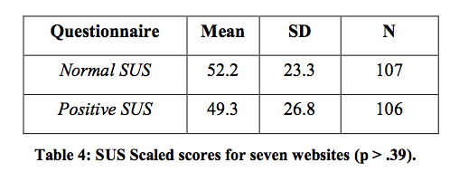

# Hypothesis Testing
## 5 September

---

## HCI methodologies

Primary methodologies include:

- Observational (e.g, ethnographic research)
- Survey
- Controlled experimentation

Note:

You may be wondering why I assigned the reading from last week. Perhaps, it was challenging for you. I'm assuming you know nothing about science nor how to read a scientific paper. You need to learn how to critical read a scientific paper because you will be the person on the UX team that has to deal with the question: "why are doing it like that?".

Have you ever been frustrated from a client or developer who brushes off your idea because, "everyone has opinions" and they consider your advice simply an opinion? The point of this course is to give you tools to both create a persuasive design, but also defend it using cognitive principles, and where necessary, science. You may also need to refute "bad science", so we will focus much attention on this.

We will look at each of the methodologies above, but focus on hypothesis testing this week.
---
## Today's outline

- **Motivation**
- Objectives
- Controlled Experimentation
- Critical Review

Note:

This point of this segment is to make you understand the importance of questioning assumptions and to think like a scientist.
---

# Why do we need to know this stuff?

Note:

---
## Scientists are people
- They are inquisitive, but subject to the same biases as the rest of us.
- They work within a *paradigm*.
- Scientific observations are framed within a given paradigm.

Note:

---

## Science is social (and political)

- Pressure from "authorities" and peers (within a paradigm)
- Need for grants, publications, etc.
- Media hype

Note:

Paradigm - A model of reality. Concepts, theories, methodologies, conventions

Thomas Kuhn (Structure of Scientific Revolutions) - "Normal science is about
accumulating knowledge". Sometimes technological (or societal) advances make it
possible to observe or measure phenomena that were not measurable before. In such cases, there may be anomalous observations that cause a shift to a new paradigm.

But its subjective and political. Paradigms are backed by those with prominent
reputations or within the majority. We will look at this sort of influence later in the semester.

---

# So what?

Note:

Science is full of bias. To top it off, the media seems to assume that anything published a scientist is valid.

---

## Question what seems authoritative -- scientific papers

-  "Normal" science
  - Publishing favors "new" and interesting work - claims may be over-stated
  - [Results may not be reproducible](http://arstechnica.com/science/2016/03/social-science-reproducibility-not-great-but-not-as-bad-as-reported/)
  - [Writing may be "opaque"](http://www.psychologicalscience.org/index.php/convention/the-curse-of-knowledge-pinker-describes-a-key-cause-of-bad-writing.html)

Note:

---

## "Sketchy" science
  - Dodgy claims
  - Journalistic error - and ["bad science" reporting effect](http://www.chronicle.com/blogs/linguafranca/2012/03/15/bad-science-reporting-effect/)
  - "Gladwellian gap"

*We need to understand conventions scientists use to communicate their findings.*

Note:

---

## "Dodgy claims"
 
<iframe src="https://embed-ssl.ted.com/talks/ben_goldacre_battling_bad_science.html" width="640" height="360" frameborder="0" scrolling="no" webkitAllowFullScreen mozallowfullscreen allowFullScreen></iframe>

Note:

---
## Journalistic Error

[Boston Globe: Oct 20, 2015](https://www.bostonglobe.com/news/politics/2015/10/20/donald-trump-and-ben-carson-speak-grade-school-level-that-today-voters-can-quickly-grasp/LUCBY6uwQAxiLvvXbVTSUN/story.html)

The Globe reviewed the language used by 19 presidential candidates, Democrats and Republicans, in speeches announcing their campaigns for the 2016 presidential election. The review, using a common algorithm called the **Flesch-Kincaid readability test** that crunches word choice and sentence structure and spits out grade-level rankings, produced some striking results.

The Republican candidates — like Trump — who are speaking at a level easily understood by people at the lower end of the education spectrum are outperforming their highfalutin opponents in the polls. Simpler language resonates with a broader swath of voters in an era of 140-character Twitter tweets and 10-second television sound bites, say specialists on political speech.

.red[Does Flesch-Kincaid apply?? NO. It was designed for written text and not speech. (It has other flaws, as well. See punctution example on next page.)]

Note:

---
## "Flesch Kincaid"

It’s coming from more than Mexico. It’s coming from all over South and Latin America. And it’s coming probably — probably — from the Middle East. But we don’t know. Because we have no protection and we have no competence, we don’t know what’s happening. And it’s got to stop and it’s got to stop fast. [Grade level 4.4]

It’s coming from more than Mexico, it’s coming from all over South and Latin America, and it’s coming probably — probably — from the Middle East. But we don’t know, because we have no protection and we have no competence, we don’t know what’s happening. And it’s got to stop and it’s got to stop fast. [Grade level 8.5]

It’s coming from more than Mexico, it’s coming from all over South and Latin America, and it’s coming probably — probably — from the Middle East; but we don’t know, because we have no protection and we have no competence, we don’t know what’s happening. And it’s got to stop and it’s got to stop fast. [Grade level 12.5]

Credit: [LanguageLog Blog](http://languagelog.ldc.upenn.edu/nll/?p=21847)

Note:

---
## "Gladwellian gap"

- Malcolm Gladwell hugely **influential** - perhaps, more so, than the scientists he reports on.
- Alternates between reports on scientific claims and rhetorical language:
 - "If you take away the gift of reading, you create the gift of listening."
 - Reader-writer's take-away: "Gladwell proves that not only do many successful people have dyslexia, but that they have become successful in large part because of having to deal with their difficulty."

Observations from [Chabris, Slate Magazine, Oct 2013](http://www.slate.com/articles/health_and_science/science/2013/10/malcolm_gladwell_critique_david_and_goliath_misrepresents_the_science.html)
]

Check footnotes and follow links to sources!

Note:

“I am a story-teller, and I look to academic research … for ways of augmenting story-telling. The reason I don’t do things their way is because their way has a cost: it makes their writing inaccessible. If you are someone who has as their goal ... to reach a lay audience ... you can't do it their way.”

"In his Telegraph interview, Gladwell again played down the seriousness of his work: "The mistake is to think these books are ends in themselves. My books are gateway drugs—they lead you to the hard stuff." And David and Goliath does cite scholarly works, books and journal articles, and journalism, in its footnotes and endnotes. But I wonder how many readers will follow those links, as compared to the number who will take its categorical claims at face value. And of those that do follow the links, how many will realize that many of the most important links are missing?"

---
## Outline

- Motivation
- **Objectives**
- Controlled Experimentation
- Critical Review
---
## Objectives

- Learn to be open-minded, but skeptical. Question what you read.
- Recognize where to find -- and how to interpret -- key information in a scientific article:
 - Central research question
 - Hypothesis
 - Research design
 - Conditions and variables
 - Results/Key findings

- Recognize key differences between experimental and non-experimental research designs.

- Recognize where potential problems may occur.

Note:

---
## Today's outline

- Motivation
- Objectives
- **Controlled Experimentation**
- Critical Review
---
## Some dichotomies in research methods

- Lab vs field (natural context)
- Participant report vs. researcher observation
- Quantitative vs qualitative
- Behavioral vs. attitudinal (what people do versus say)

Today the focus is on **Randomized experimental** (lab, observations, quantitative, behavioral)

Note:

- There are a number of different ways to slice and dice research methods -
but it's difficult to find a single representation that adequately describes for this multi-dimensional topic.

Here is one "landscape", but it does not account for experimental studies: https://www.nngroup.com/articles/which-ux-research-methods/
This is another
- Both qualitative and quantitative may be interested in using both objective and subjective data. But, generally, quantitative studies focus on structured data while qualitative studies focus on more open-ended questions.

---
## Structure of research

Image credit: Gliner, Morgan, and Leech (2011), p. 20

Note:

- Mature conventions
- Papers follow well-defined structure
---
## What if the question is very broad?

Image credit: Chow, S. (2010). pp. 450

Note:

---
## HCI research methods (deeper look)

.footnote[.red.bold[*] Inserted image from Gliner, Morgan & Leech (2011) p. 11]

Note:

---
## Randomized experimental

(For quasi-experimental, no random groups are assigned. For example, two university classes are given two different exam types.)
---
## Non experimental

Note:

---
## Back to the overview

 Image credit: Gliner, Morgan, and Leech (2011), p. 11

Note:

---
## Today's outline

- Motivation
- Objectives
- Controlled Experimentation
- **Critical Review**

---
## Research question

- Statement about the relationship between two or more variables
 - Should be stated clearly and unambiguously
 - Should fill a gap in knowledge
 - Should be testable
 - Should be ethical

Example from: Sauro & Lewis (2011)

Note:

---
## Study hypothesis

 - The variables and thing being measured
  - Normal vs Positive (conditions)
  - highest/lowest response option (variable)

 - From example paper, "To **measure extreme response bias**, we counted **the number of times respondents provided either the highest or lowest response option (1 or 5) for both questionnaire types for all items**."

 

Hypothesis 1: .red[**There is no difference in extreme response bias
between Normal and Positive SUS.**

Note:

---
## Why "no difference"?

Note:

This contrasts with an alternative hypothesis and is examined statistically.
---

## Research Approach / Design

- Experimental vs. Non-Experimental
- Try to narrow this down using examples from the hand-out:
  - Randomized experimental
  - Quasi experimental
  - Comparative
  - Associational
  - Descriptive
---
# Conditions & variables
### Conditions
Conditions under which groups are compared. (e.g., Positive SUS and normal SUS)
### Variables
Characteristics of the study or participants that vary
- **Independent variable (IV)** - Presumed cause
  - Active - The intervention (e.g., positive/normal SUS).
  - Attribute - Property of a person such as gender or age.

- **Dependent variable (DV)** - outcome
- **Extraneous** - Variables that need to be ruled out. For example, minor visual differences in cross-browser display.
  - .red[Confounding] - interacts with both the IV and DV.

Note:

When there are more than two IVs, the design is said to be factorial.

---
## Confounding variable

# Note

---
## Common sense critique

- There are of things we did not go into (e.g., sampling, statistics) - so don't sweat over understanding these parts.

- Use your common sense and consider:
 - Do you think the study looked at enough people?
 - How we subjects chosen? (Are they really random? Are they representational of the population in question?)
 - Does the study measure what you think it measures? (e.g., if you are assessing happiness from tweets, does the use of "positive" words really reflect happiness?; construct validity)
 - Do you think the experiment was reliable and would generally result in consistent results?
 - Can you imagine any confounding variables they didn't mention? (e.g., threats to internal validity)
 - Do you think similar experiments in other contexts would produce the same results? (external validity)
 - Do you think results would hold outside of laboratory conditions in other contexts? (ecological validity)

Note:

---
## Next Week's Assignment (cont.)

Summary
- What is the central research question addressed?
- For each experiment, summarize (briefly!):
 - Hypothesis
 - Research design - Is it experimental or non-experimental? Did the authors provide more detail or can you figure it out? (E.g., specific approach)
 - Conditions & variables
 - Findings

Note:

---
Critical thinking (respond to 5)
 - Does the paper seem significant or not? Why or why not?
 - Does the methodology seem sound or suspect? In what sense?
 - Can you think of confounding variables that the author did not discuss?
 - Does this paper get its message across clearly? How or how not?
 - Does it change your thoughts or has it introduced new ideas to you? In what way?
 - Do you think the study is reproduce-able (like an exact recipe) or that the author left out too many details? What do you think needed more explanation?
 - Can you imagine how insights from this paper might be used in design?

Note:

- Record what you read
- Some authors are not clear - good point for critique... but at least give an example, if you can

---
# References

Chow, S. "Experimental Design." In Encyclopedia of Research Design. Neil J. Salkind, editor. (Thousand Oaks, CA: Sage, 2010), pp. 448-453.

Gliner, J., Morgan, G., & Leech, N. (2011). Research methods in applied settings: An integrated approach to design and analysis. Routledge.

Kuhn, T. (2012). The structure of scientific revolutions. University of Chicago press.

Sauro, J., & Lewis, J. (2011, May). When designing usability questionnaires, does it hurt to be positive?. In Proceedings of the SIGCHI Conference on Human Factors in Computing Systems (pp. 2215-2224). ACM.

---
