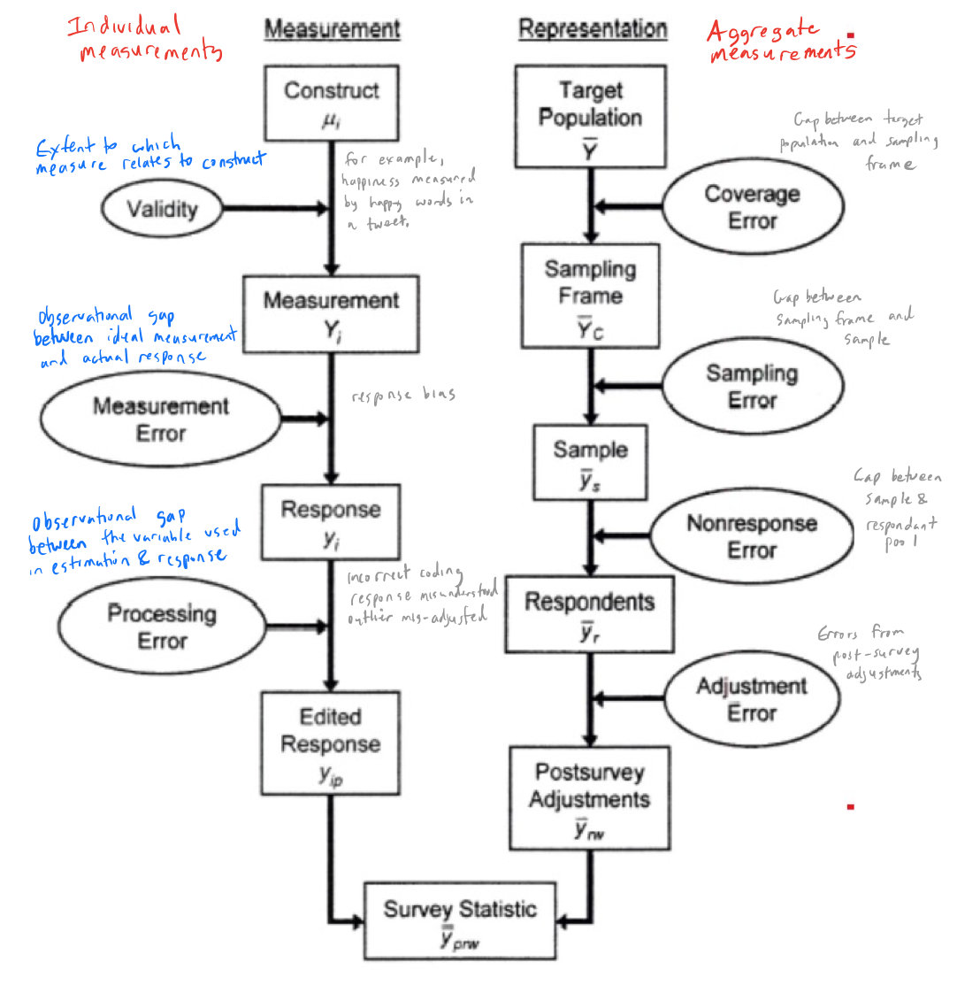

# HCI Research Methods (2)
## 12 September 2017

---
## Last week: Experimentation
### Or... "Crash course on how to read a science paper"

- Review
- How did it go?
- Paper example "When designing usability questionnaires does it hurt to be positive?"
- If we have time, [Susan Etlinger](http://www.ted.com/speakers/susan_etlinger)  - smart, well-considered, ethical use of data
---
## Review

Note:

We started with experimentation because you needed sufficient knowledge to read scientific papers.

When and why you would choose to conduct an experiment?

 - You want to compare performance (e.g., efficiency, effectiveness between groups under varying conditions)
 - You are interested in discovering how things work and are looking for causal relations between variables.

We looked briefly at potential problems with the design experiments - but we put aside problems with sampling and statistical analysis.

The structure of a scientific paper gives insight into how you might think about assessing potential UX problems.
- Research Design
- Methods
- Discussion

---
## Smart, well-considered, ethical use of data

<iframe src="https://embed-ssl.ted.com/talks/susan_etlinger_what_do_we_do_with_all_this_big_data.html" width="640" height="360" frameborder="0" scrolling="no" webkitAllowFullScreen mozallowfullscreen allowFullScreen></iframe>

Fundamentally, we use experimentation to answer hard questions -- big data is increasingly important in such debates.

Note:

---
## Today's outline

- Survey Methodology
- Ethnography & Ethnomethodolgy

Note: As mentioned before,

---

## Comparing three research traditions

- **Empirical** - Evidence acquired through observation and experimentation to justify a belief or claim. (Contrasts with view that reason alone is sufficient evidence.)
  - Experimental
  - (Some) Surveys
  - Ethnography
    - **Analytical** - In sociology/anthropology - detailed portrayal of a sociocultural phenomenon. Includes frames (e.g., restaurant, shop) and concepts.
    - ** Generative** - Potential for identifying new experiences and phenomena. Important while trying to understand a problem.

Note:

---
## Objectives

1. Characterize the survey process from both a design and quality perspective
2. Learn about how and why errors arise in surveys
3. Explore examples of analytical and generative practice in ethnography and conversation analysis

Note:

---
# Comparing survey methodology to experimentation

#### Differences
- Surveys can't explicitly control IVs and DVs
- Surveys based on participant responses rather than researcher observations
- Surveys may potentially reach a larger population
- Surveys may be descriptive studies useful for understanding attitudes or preferences

#### Similarity

- A survey can be a quantitative (statistical) analysis that explores relationships between variables

Note:

Strengths: large #s, may cost little to develop and administer. Elicitation of attitudes.

Weaknesses: Biases from lack of response, or nature and accuracy. Intentional mis-reporting, mis-understanding, poor recall, difficulty with self-assessment.

Verbal surveys - interviews
Written surveys - questionnaires
---

# As in an experiment, start with the research question

Note:

 Written or verbal?

---
## Surveys are inherently inferential

Note:

---
## Survey Design

Note:

---
## Survey Measurement

Note:

---
## Examples of question (response) biases

1. Effect of wording - consistent with educational level of intended respondants.

2. Sensitivity - Respondants must be willing to answer

3. Question complexity and clarity - Avoid double negatives and long questions, jargon, acronyms, etc.

4. Tone - Avoid biased wording or wording that evokes an emotional response.

Note:

---
## Examples of biased contexts
1. Order of questions
2. Contrast effects of questions immediately preceding
3. Length of survey (questions given more attention at beginning rather than later)
4. Fowler (1995) notes respondants more likely to use rankings on the left side of a continuum, regardless of whether it is decreasing or increasing

Note:

---

## Survey References

Glasow, P. A. (2005). Fundamentals of survey research methodology. Retrieved January, 18, 2013.

Gliner, J., Morgan, G., & Leech, N. (2011). Research methods in applied settings: An integrated approach to design and analysis. Routledge.

Groves, R. (2004). Survey errors and survey costs. John Wiley & Sons.

Groves, R., Fowler Jr, F., Couper, M., Lepkowski, J., Singer, E., & Tourangeau, R. (2009). Survey methodology 2nd ed. John Wiley & Sons.

Fowler, J., Floyd J. (1995). Improving survey questions: Design and evaluation (Vol 38). Sage Publications.
---

## What is ethnography?
The practice of observing people in their natural environments
---
## Why should you as a designer care?

<iframe width="560" height="315" src="https://www.youtube.com/embed/nV0jY5VgymI" frameborder="0" allowfullscreen></iframe>

Ellen Isaacs

Note:

More than market research - focus is on understanding what matters to people.

Lucy Suchman influenced technologists into thinking that researchers should watch people using technology

May involve different methodologies. Most common is participant observation where the ethnographer is immersed in a culture as an active participant.

Note:

---

# Ethnomethodology
... is concerned with studying situated activities/practices (or methods) of groups in everyday life. The focus is on how groups of people understand and produce a social order

Note:

Bottom-up view of sociology. Discovery-based observation.

---
## Conversation Analysis -- emerged from ethnomethodolgy

#### Practice and methods for studying talk and social interaction.

- There are norms in conversation where certain kinds of activities should happen.
- Interaction is structured.
- CA uses naturally occurring interactions to include both verbal and non-verbal conduct.

---

From Sacks, 1992, vol. I: 3):

A. This is Mr. Smith, may I help you?

.red[B: I can't hear you]

A. This is Mr. Smith

.red[B: Smith]

Note:

"Talk" is quite systematic. Language has certain regularities.

Conversation analysts find patterns that can be formulated as normative behavior. They do so by gathering many instances of talk across many similar situations.

This situated research is useful for design.

Main concepts and findings:
- turn-taking organization
- organization of action/sequences
- preference organization
- repair
- topic structure
- storytelling
- openings and closings
- small talk

---
## Connection between CA and "nudge"

<iframe width="560" height="315" src="https://www.youtube.com/embed/e-QbxjXDwXU" frameborder="0" allowfullscreen></iframe>

*"Small changes in environments that can lead to big changes in behavior"*

Note:

CA analysts not interested in why. But how it happens and why it happens. Many hundreds of conversations. People think they know about talk, until they look closely.

---
## Ethnographers in the Commercial World

<iframe width="560" height="315" src="https://www.youtube.com/embed/ORkl15ogwOA" frameborder="0" allowfullscreen></iframe>

What can ethnography teach us in the commercial world? Implications for design (design ethnography)

Note:

---

## Next Week

- Vision
- First journal entry

Note:

- Path:
  - vision, attention, memory/priming/learning, emotion
  - language, decision-making, persuasion, culture, social networks
- Use your own style; e.g., minimal notes, thoughtful narrative
- I will grade using the rubric and do not judge your learning points
- Please give thought to your examples -- this is really the heart of the assignment.

---
