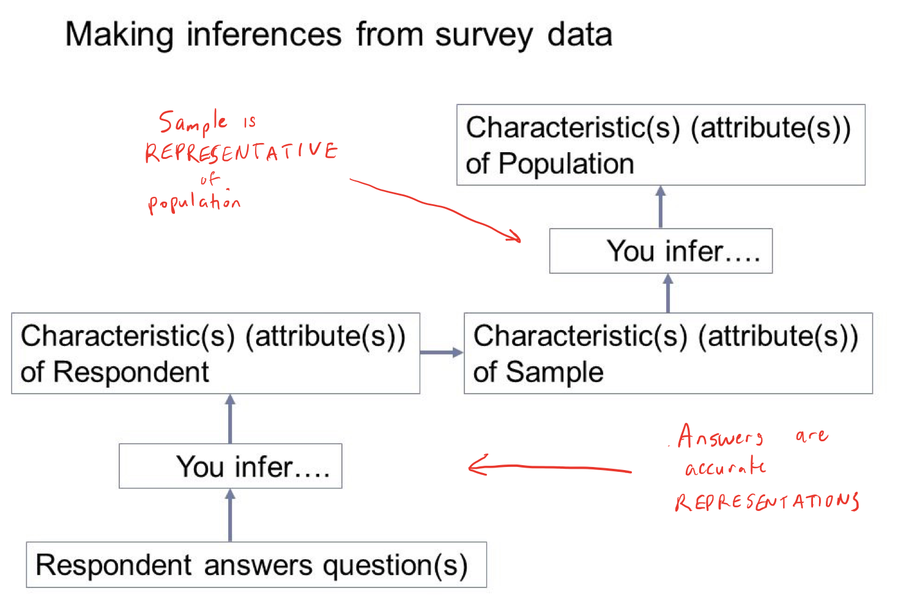
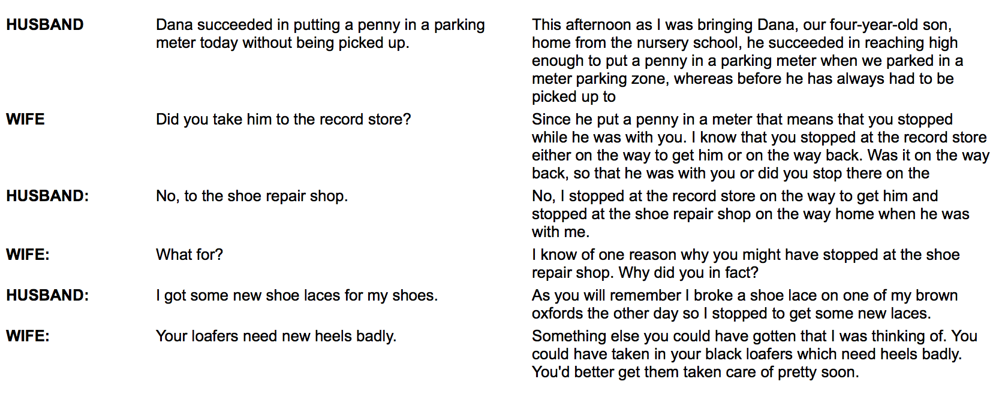
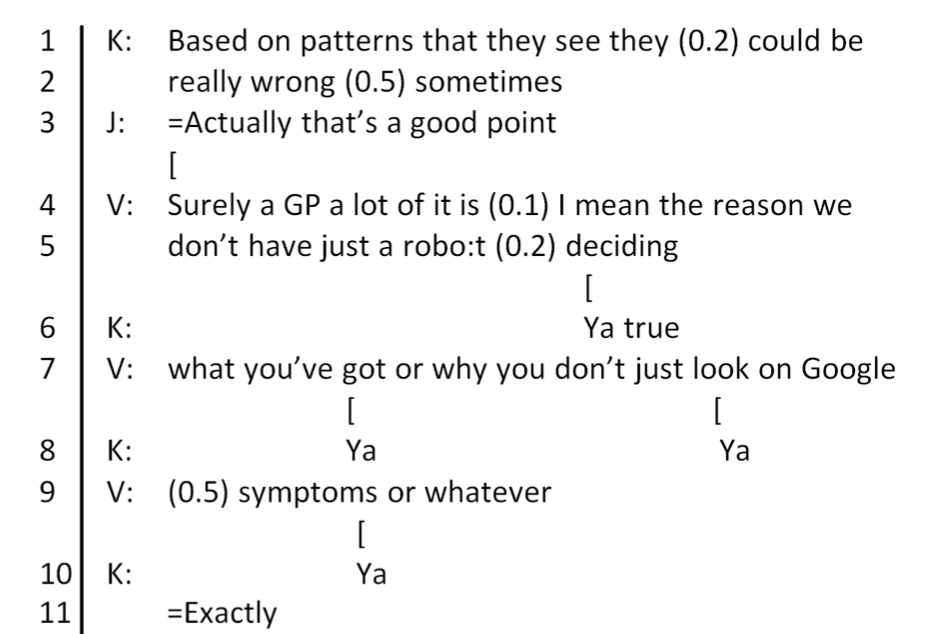

# HCI Research Methods (2)
## 12 September 2017

---
## Last week: Experimentation
### (Or... "Crash course on how to read a science paper")

- Review
- How did it go?

Note:

As a reminder, you may find the need to refer to scientific research when you are making UX design recommendations. Review papers to which you refer, and remain skeptical.

---
## Review

Note:

We started with experimentation because you needed sufficient knowledge to read scientific papers.
- Scientific evidence used in course texts form the under-pinnings of everything you will learn about the brain and behavior
- You need the ability to evaluate scientific evidence -- don't just believe journalists or "authoritative" sources. Go back and look for yourself
- As the UX expert on your team, be the person that asks the question, "does this make sense?" What do I know from scientific evidence (your texts will be helpful; another fun one is "100 things designers need to know about people")
- Use scientific evidence to support your own design decisions; UI design is not just "opinion"

When and why you would choose to conduct an experiment?

 - You want to compare performance (e.g., efficiency, effectiveness between groups under varying conditions)
 - You are interested in discovering how things work and are looking for causal relations between variables.

We looked briefly at potential problems with the design experiments - but we put aside problems with sampling and statistical analysis.

The structure of a scientific paper gives insight into how you might think about assessing potential UX problems.
- Research Design
- Methods
- Discussion

---
## Critical Thinking

<iframe src="https://embed-ssl.ted.com/talks/susan_etlinger_what_do_we_do_with_all_this_big_data.html" width="640" height="360" frameborder="0" scrolling="no" webkitAllowFullScreen mozallowfullscreen allowFullScreen></iframe>

Note:

If we have time, [Susan Etlinger](https://www.ted.com/talks/susan_etlinger_what_do_we_do_with_all_this_big_data)  - smart, well-considered, ethical use of data

Experiments create data. Remember the crisis in the social sciences regarding reproducibility?

It's extremely important that data is created under a context. And it is also created by people.

"We have to ask questions - and hard questions - to move past counting things to understanding them."

Great story about Ettlinger's autistic child. Metrics on evaluation put his development level at 3 years old... as a 9-month old (from a factual standpoint; gaze, attention, language). But at 5, he taught himself how to ask Google Search questions. He was teaching himself to communicate. Ettlinger learned that assessments often over-value one metric (verbal communication) over others.

Summarizing: data doesn't create meaning - people do. We need to spend more time on our critical thinking skills. We need to spend more time on things like social sciences, humanities, rhetoric -- these things help us become better thinkers. "Because after all, if I can spot a problem in an argument, it doesn't much matter whether it's expressed in words or in numbers."

"And it means questioning disciplines like demographics. Why? Because they're based on assumptions about who we all are based on our gender and our age and where we live as opposed to data on what we actually think and do. And since we have this data, we need to treat it with appropriate privacy controls and consumer opt-in, and beyond that, we need to be clear about our hypotheses, the methodologies that we use, and our confidence in the result."

---
## Today's outline

- Survey Methodology
- Ethnography & Ethnomethodolgy
- Wrap-up: Evaluation

Note: As mentioned before, this class considers three research methodological frameworks you may not get much exposure to in other classes.

In particular, I chose these because you will need to think about how you would evaluate your persuasive design concept that you will create during this course. We'll talk more about this later.

---

### Comparing research traditions

- **Empirical** - Evidence acquired through observation and experimentation to justify a belief or claim.
  - Experimental
  - (Some) Surveys
  - Ethnography
    - **Analytical** - detailed portrayal of a sociocultural phenomenon. Includes scripts/frames (e.g., restaurant, shop) and concepts.
    - ** Generative** - Potential for identifying new experiences and phenomena.

Note:

Empirical tradition contrasts with view that reason alone is sufficient evidence.

When we talked about experiments, we discussed empirical research as a process. (Note, scientific papers, while not designed for reading top-down, very much mirror the process of investigative research.)

- Start with an observation and generate an inquiry to causes.
- Generate hypotheses that explain the phenomenon.
- Design experiments to test hypotheses. The experimental design should consider and rule out other explanations. Background research is essential to this end.
- Collect data to test hypotheses.
= Finally, evaluate or interpret the data.
Evaluation: Interpret the data. Remember that there are always inferences that accompany results. Does this apply to the broader population, would you see the same results in the wild, etc.

Surveys:

Like experiments, surveys may be empirical from the standpoint of answering who, what, and where questions -- but, unlike experiments, they can't answer why questions.  In order to answer why questions, experiments are needed.

Ethnography:

As a research methodology, ethnographic research is focused on inquiry. It too, is empirical, as it is focused on observational data. It is about understanding the "world view" of the people you are studying.

Generative ethnography is a useful tool for developing an understanding of a problem. An example might be shadowing a person or a team while they do their work.

Similar types of generative research include contextual interviews and focus groups.

Evaluation:

At the end of today, we'll look at when you might employ empirical research.
---

## Objectives

1. Characterize the survey process from both a design and quality perspective
2. Learn about how and why errors arise in surveys
3. Explore examples of analytical and generative practice in ethnography and conversation analysis
4. Understand at what point in the design process you would employ these methods

Note:

---
### Comparing survey methodology to experimentation

#### Differences
- Surveys can't explicitly control IVs and DVs
- Surveys are on participant responses rather than researcher observations
- Surveys may potentially reach a larger population
- Surveys may be descriptive studies useful for understanding attitudes or preferences

#### Similarity

- A survey can be a quantitative (statistical) analysis that explores relationships between variables

Note:

Remember:
- Independent Variable (IV) – What is causing a change in another variable of interest
-  Dependent Variable (DV) – the variable of interest (what is measured)

Strengths: large #s, may cost little to develop and administer. Elicitation of attitudes.

Weaknesses: Biases from lack of response, or nature and accuracy. Intentional mis-reporting, mis-understanding, poor recall, difficulty with self-assessment.

Verbal surveys - interviews
Written surveys - questionnaires
---

## Just as with an experiment, start with the research question

Note:

(You can guess that the same pattern that applied to experiments and surveys applies to ethnographic research.)

---
## Surveys are inherently inferential

Note:

(Just like experiments!)

---

##  Survey process
#### Two steps: sampling plan and procedure

Image credit: Groves et al. (2009), p. 47

Note:

Note the two tracks here. This figure from Groves et al. 2009 (figure 2.4) shows how you have to make decisions both about the people you will sample and the measurements you will take. These decisions come together when you  collect data. Also, you will want to test (or pilot) your survey before you run on your actual sample.

---
## Survey Design

Image credit: Groves et al. (2009), p. 42

Note:

I've annotated this figure with an example where you trying to find out how many new jobs have been created at zoos.

In this hypothetical example, you may want to assess recent growth in the zoo industry. But you can't ask every possible zoo, because some may be too small. So you decide to look at zoos with at least 500 employees and an HR department. Your sampling frame contains a list of every zoo that meets this criteria. For your sample, you decide to contact every zoo that meets this criteria, and for which you have contact info for their HR department. The respondants for this survey is HR. Finally, you may have some post-survey adjustments because not all of the zoos will respond or some other error occurs.

On the left side, you decide on a measurement for growth in terms of new jobs created. You can't directly observe growth, but you can measure new jobs and use this figure to infer growth. You write your survey question such as "How many new jobs were created in your company in the last month". Then you describe what you mean so your question is as clear as possible. Hopefully, HR responds. If this survey collection is done online, you might have "edited responses". An edited response may be a follow-up question to verify or clarify.

---
## Survey Measurement

Image credit: Groves et al. (2009), p. 48

Note:

As a survey designer, your focus is to minimize error during each stage of survey design and execution. Keep in mind, as with experiments, conclusions from surveys are inferences. So you need to be aware where errors may occur.

One way to look at errors is as 'gaps'. Between each successive stage you may have a gap between your ideal measurement and actual measurement. (I'll walk through these annotations in class.)

The 'happiness' measurement on the left side is a hypothetical example where you want to measure how happy a twitter user is by using measuring a ratio of happy to not happy words in a tweet. This is an excellent example of construct validity: could you argue that this is not a valid construct?

---
## Examples of question (response) biases

1. Effect of wording - consistent with educational level of intended respondants.

2. Sensitivity - Respondants must be willing to answer

3. Question complexity and clarity - Avoid double negatives and long questions, jargon, acronyms, etc.

4. Tone - Avoid biased wording or wording that evokes an emotional response.

Note:

Surveys are prone to many sorts of response bias. Tourangeau, Rips and Rasinski is a bood that dives into the psychology of survey response.

Later in the semster, we'll talk in particular about how prior context biases your thinking by setting up a comparison or constrast.

---
## Examples of biased contexts
1. Order of questions
2. Contrast effects of questions immediately preceding
3. Length of survey (questions given more attention at beginning rather than later)
4. Fowler (1995) notes respondants more likely to use rankings on the left side of a continuum, regardless of whether it is decreasing or increasing

Note:

---

## Survey References

Glasow, P. A. (2005). Fundamentals of survey research methodology. Retrieved January, 18, 2013.

Gliner, J., Morgan, G., & Leech, N. (2011). Research methods in applied settings: An integrated approach to design and analysis. Routledge.

Groves, R. (2004). Survey errors and survey costs. John Wiley & Sons.

---
## Survey References

Groves, R., Fowler Jr, F., Couper, M., Lepkowski, J., Singer, E., & Tourangeau, R. (2009). Survey methodology 2nd ed. John Wiley & Sons.

Fowler, J., Floyd J. (1995). Improving survey questions: Design and evaluation (Vol 38). Sage Publications.

Tourangeau, R., Rips, L. J., & Rasinski, K. (2000). The psychology of survey response. Cambridge University Press.
---
## Methodologies... We Steal Stuff!

<iframe width="560" height="315" src="https://www.youtube.com/embed/oXUKdMRkFCA?rel=0&amp;showinfo=0" frameborder="0" allowfullscreen></iframe>

Anthropology, Sociology, Linguistics??

---
## Anthropology & IDIA

Note:

Ethnography is an empirical practice we borrow from Anthropology. It is the practice of observing people in their natural environments.

Broadly, ethnography seeks to describe the world-view of a particular people or culture. It is an empirical discipline, though the researcher makes observations from the point-of-view of the subject. Typically, an ethnographic study accounts for both observations and the meaning of symbols within society.

---
## Why should you as a designer care?

<iframe width="560" height="315" src="https://www.youtube.com/embed/nV0jY5VgymI" frameborder="0" allowfullscreen></iframe>

Ellen Isaacs

Note:

More than market research - focus is on understanding what matters to people.

Lucy Suchman influenced technologists into thinking that researchers should watch people using technology

May involve different methodologies. Most common is participant observation where the ethnographer is immersed in a culture as an active participant.

---
## Sociology & IDIA

From: Garfinkel (1967) p. 25-26

Note:

Consider ethnomethodology as a bottom-up view of sociology. It's focus is on discovery-based observation.

Harold Garfinkel  was a sociologist who established a program known as "ethnomethodology" during the 60s and 70s. While sociology studies social relations, interactions and groups -- ethnomethodology strives to find the social order that people create in everyday life.

What does this mean? From a practical perspective, Garfinkel seemed to be interested in how to adequately describe social phenomena given that most of what we take for granted  (e.g., prior knowledge, social convention, setting) needs to be accounted for in observations of social life. That is, an outsider cannot adequately refer to a described social situation without accounting for things that are not explicitly accounted for.

This is a useful and important idea: to truly understand a user's goals, activities, motivations, and so forth -- you need to observe close in situ... and also dig into the peculiarity of what they actually do and say. Seek to understand practices through the world view of the people observed, instead of via the institutions that are external to social practice.

While this overlaps in some degree with ethnography. Ethnomethodology is more strictly concerned with how people make sense of everyday affairs.

---
## Linguistics & IDIA

Image credit: Zawilska & Albury (2015)

Note:

Conversation Analysis was borne out of ethnomethodology, notably by the researchers Sacks, Schegloff, and Jefferson. The main concept is that interaction has it's own structure or organization. And, in addition to social, physical, institutional and cultural contexts, conversation itself has a context that is created and updated through talk.

CA is concerned with observing language use to look for recurrent patterns. We're looking briefly at this so that you gain an appreciation of how very small details about what someone says can be very important.

---
## Conversation Analysis

#### Practice and methods for studying talk and social interaction

- There are norms in conversation where certain kinds of activities should happen.
- Interaction is structured.
- CA uses naturally occurring interactions to include both verbal and non-verbal conduct.

Note:

CA emerged out of ethnomethodology and the ida that "talk" is quite systematic; language has certain regularities.

Conversation analysts find patterns that can be formulated as normative behavior. They do so by gathering many instances of talk across many similar situations.

This situated research is useful for design.

Main concepts and findings:
- turn-taking organization
- organization of action/sequences
- preference organization
- repair
- topic structure
- storytelling
- openings and closings
- small talk

---
## Connection between CA and "nudge"

<iframe width="560" height="315" src="https://www.youtube.com/embed/e-QbxjXDwXU" frameborder="0" allowfullscreen></iframe>

*"Small changes in environments that can lead to big changes in behavior"*

Note:

CA analysts not interested in why. But how it happens and why it happens. Many hundreds of conversations. People think they know about talk, until they look closely.

---
## Ethnographers in the Commercial World

<iframe width="560" height="315" src="https://www.youtube.com/embed/ORkl15ogwOA" frameborder="0" allowfullscreen></iframe>

What can ethnography teach us in the commercial world? Implications for design (design ethnography)

Note:

---
## Ethnography/Ethnomethodology References

Garfinkel, H. (1967). Studies in. Studies in ethnomethodology. Englewood Cliffs, NJ.

Zawilska, A., & Albury, S. (2015, April). An Ethnomethodologically-Informed Approach to Interface Design for Social Interactions around Video Online. In ICWSM (pp. 706-710).

---
## Research Methods in empirical evaluation

1. Understanding the problem / user (ethnographic research)
2. Gather information about characteristics, attitude, opinion of a user group (survey)
3. Assess need, demand, impact (survey)
4. Evaluate differences / causes (experimentation)

Note:

Empirical methods are used at all points in a design lifecycle.
- Understanding of the user community
- Generation of a concept
- Assessment of concept viability
- Evaluation of a new design choice

---
## Take-away

Understanding users in context is a broad topic of great importance in UX. Tease out patterns by close observation.

---
## Case Study Design

- Narrative focused on a small user population (nail this down)
- Think about whether you can do any ethnographic research
- You have broad goals - now consider a concrete situation and a short list of points to address
- No design solutions yet!

Note:

We haven't really spoken about what a case study is yet. You got an idea of how to formulate the problem and then frame a nudge from [the nudge blog](http://nudges.org/2011/09/21/a-devious-little-marketing-nudge/) and  [dozen nudges](https://nudges.files.wordpress.com/2008/04/our-dozen-nudges1.pdf). From this, you inferred something about how persuasion, as well. (we'll get into this in much more depth during the semester.)

Case Studies are another useful tool. They are applied often in the social sciences and I've used them at work in order to delve into a particular situation or user story. They've been surprisingly effective in communicating some aspect of a complex problem in a way that less technical, and more senior stakeholders can understand: they comprise a narrative that lets you tell the story of your design choice.

Essentially, a case study is a in-depth study of a particular situation. We can use this research design to examine how a design concept might work. They are very narrow (they can't be fit to all people), but they are also very flexible.

Case studies help you find situations that you didn't anticipate. They also help you see problems that you hadn't imagined.

The first thing you need to do for your case study (once your broader objective has been established) is to isolate to a particular population or sub-group.

Extrapolate a short list of points that you want to make and address. You will need these for clarifying the problem and linking to choice points in your design.

I would like to see your case study presented in something like a digital poster. (For example, you can compress down 2 or 4 slides onto one page.) So it should be succinct.

I'll talk about why I think this is an important deliverable in class; hopefully you will be able to use your case study to start our expand your design portfolio.

---
## Next Week

- Review and refine your case study idea - revise & narrow to a defined user group and concrete situation. Add an update to [Slack #case-studies](https://idia640.slack.com/messages/C6J56QY8G0)
- First journal entry - sense & perception

Note:

- Case study
  - Fix on a target user population (or market segment) for your case-study. Be focused.
  - Consider whether it is possible for you to do an informal ethnographic study. (Thinking about how to do this may help you narrow down your target.)
  - Imagine a concrete situation one of your users might encounter - website/app, communications campaign, physical environment. For example, Busra's healthcare scenario... You can use something that exists and you are improving upon or something more novel that you can sketch.

- Journal
  - Use your own style; e.g., minimal notes, thoughtful narrative
  - I will grade using the rubric and do not judge your learning points
  - Please give thought to your examples -- this is really the heart of the assignment.
  - Your journal entries will appear in Slack for all of us to read.
---
