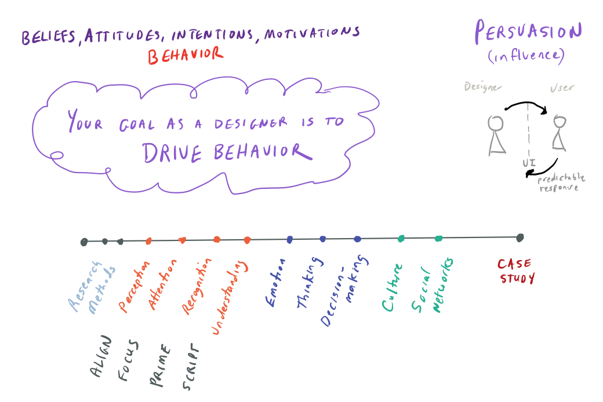
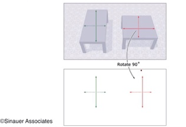
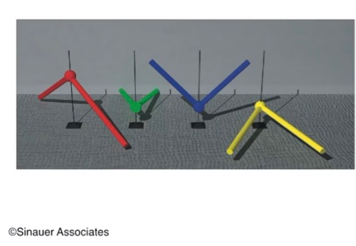
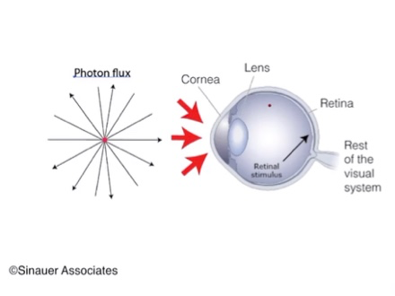
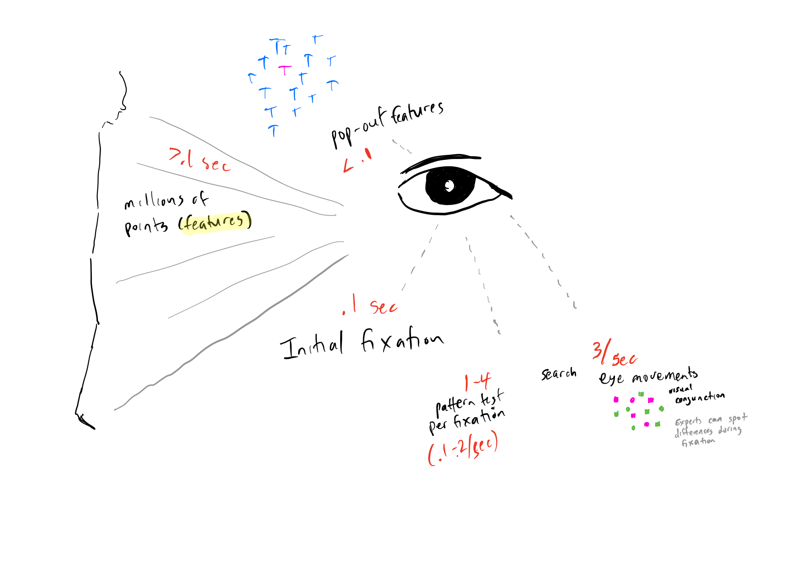
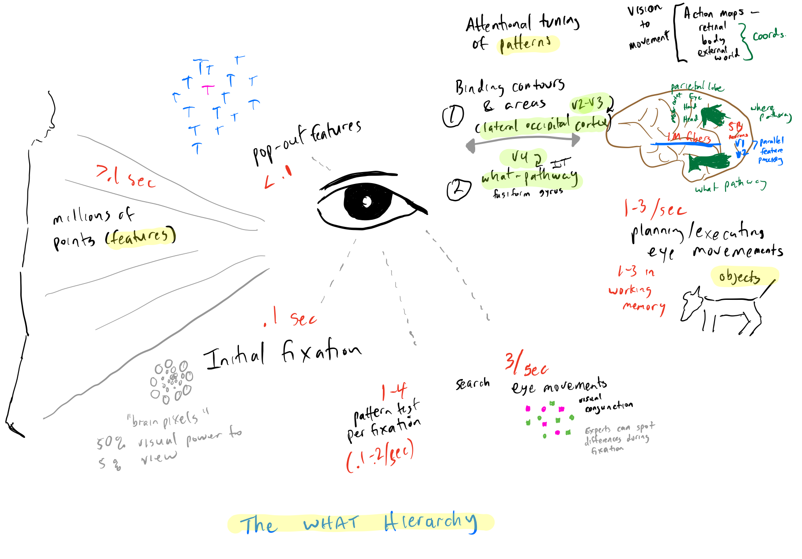

# How do we know what we see?

18 September 2018

---

## Course Map

Note:

## What is persuasion?

Persuasion refers to influence of a person's beliefs, attitudes, intentions, motivations, or behaviors. (Gass & Seiter, 2010)

## Why is this important for UX design?

User Experience (UX) design refers directly to user attitude and behavior toward a product, system, or service.  UX is also fundamentally interactive in the sense that the message and experience is designed to *communicate*. Just as in conversation, your design elicits a response. As a designer, you want that response to be predictable.

## How do we persuade?

This is the topic of this course. While the formal course description says that you are to learn "concepts from cognitive psychology and visual processing to explore human problem-solving, learning, knowledge representation, and problems of interface design", we can pull these concepts under a framework for persuasive design so that you gain a more intuitive grasp of how all of the ideas fit together.

A simple way to understand the context of persuasion, imagine the situation where you want to affect user behavior: you want them to take an action such as a button click.

The following conditions apply:
- The user has choices (and they are not random).
- The user is at a decision point (whether he/she is aware of this or not).

This means,
- You, as the designer, have aligned user (visual) perception
- You drive user attention (often visually)
- The user recognizes that the button is something to be clicked and that click will produce a specific action, based on priming and memory
- The user understands what script he/she is in and how to respond. (For example, "add to cart", "buy", "next")

These pre-conditions form the first part of what we will cover.  The second half of the course focuses on decision-making and factors that affect user decisions. So we will talk about:

- Emotion, dual-process theory (Kahneman), and cognitive bias
- Aesthetics and attractiveness
- Cultural knowledge and expectation
- Social influence

As you will see, much decision-making is affected by unconscious processes. You will want to leverage these whenever you can.

Ultimately, you are driving for the user to respond in a specific way. All of the factors above have levers that you can employ to do so. By the end of the course, you will understand that humans are very good at pattern detection and this biases how they behave. And your goal as a designer is ultimately to drive behavior.

There are all sorts of interesting books on rhetoric and persuasion. Many are focused on language, though increasingly, there has been study centered on how advertisers' persuade. They are, after all, master's of persuasion and manipulation!

---

## Outline

1. How does seeing work?
1. What is visual perception?
1. How do we construct meaning from visual information?
1. How do we think of things we can't see or touch?

---

## Objective

- Understand pre-attentive (passive) processes
- Understand how perception is active

Note:

In principle, the idea of "aligning user perception" is simple: you want the user to perceive what you want them to perceive. The difficult thing is knowing what they actually perceive. So while there is a lot of detail in Ware about how vision operates at a low level, you should at least understand the difference between pre-attentive processes and higher-order (active) processes - and how to use these two concepts to advantage.

Pre-attentive visual processing is what it sounds like: sub-conscious visual processing. Visual scenes segmentation is pre-attentive, where features are grouped together against a background.

In this image, you see shapes above. But your recognition and understanding of these shapes is affected by higher-order processes.

As visual information travels through the visual cortex, the brain continues to filter and processes information. Information that has the higher salience (we'll talk more about this next week) -- or stands out -- is analyzed further.

Perception includes not only passive pre-attentive processes, but is affected by attention, memory, learning, belief, expectations, and goals.

---?survey=https://docs.google.com/forms/d/e/1FAIpQLSd1k-2PRzwjupMP1GZpqLojz877sr7V6ey2vJc3fK4tq6LOqQ/viewform?usp=sf_link

---

## Bottom-line up front

1. Perception is an active process
1. Perception is biased
1. We are optimized for contrast
1. Pop-out features can drive visual search
1. We make sense of the world by detecting patterns (Gestalt)
1. Colors are affected by nearby context

Note:

I like the concept from Ware that "seeing" is a sequence of "visual queries". Each time your eye stops, you are looking for patterns. As a designer, understand what visual queries are necessary and support them.

User perception is biased on:
- past experience (expectations)
- current context
- user goals
Ware talks about "bottom-up" feature detection processes and "top-down" goal-driven processes. He also notes that these occur simultaneously.

The lowest level feature detection in the primary visual cortex is sensitive to feature-level contrasts that can drive visual search. These are pre-attentive and start in the retina. The best features for pop-out include color, orientation, size, motion and stereoscopic depth. (I'll show a slide depicting a summarizing figure from Ware shortly.)

Ware notes that we are sensitive to all sorts of patterns -- not just shapes, colors, etc. but also temporal patterns in sequences and action patterns. We also use our innate ability to understand visual, spatial, and temporal patterns in higher level concepts via metaphor. Ware mentions:
- We can use a pattern such as closeness to mean 'similar' in a spatial context.
Letters can represent sounds.
- Colors can also be symbolic and somewhat culture dependent. (Red as danger, for example.)
- More color saturation can mean "more important"

Red-Green, Blue-Black, and Black-White are special because they produce the most extreme signal on one channel while being neutral on other channels. And, again, colors can carry additional cultural meaning.

---

## How does seeing work?

- Illusions
- The inverse problem
- Visual stimuli
- Visual system

Note:

First, let's take a brief look at how vision works.

Much of the material in this segment is augmented by thinking captured from Dale Purvis' (2010) book "Brains: How they seem to work".

Foundationally, brain and behavior scientists agree that that brain extracts features from sensory stimuli and then combine them in representations in higher cortical areas. These are the signals we perceive and use.

According to Purvis, the problem is that stimuli are very noisy and understanding how the brain takes sensory signals and generates perceptions is unclear.

We'd like to say that there is a straightforward process that begins with the detection of features in the retina and moves toward a representation in the cerebral cortex.

The real problem is context -- as we will see. So let's take a look at that. I'll show you several examples from Purvis: luminance, color, geometry, and angles.

---

## Luminance

*Our vision does not work like a camera*

Note:

The inner circle has the same luminance in both color contexts. (Luminance is "brightness")

---

## Color

Note:

Note the center tile on the top and the center one on the facing side.

---

## Color

Note: Again, you perceive the two tiles differently because the visual context differs.
---

## Geometry

---

## Geometry

---

## Angles

Note:

The visual world is unknowable: we can't actually see the world like a camera. Purvis (2010) believes we evolved perception to behavioral feedback due to operational successes in evolutionary time.

While these illusions may seem like tricks of the visual system, they simply reflect a fundamental state-of-affairs for how vision works.

---

## Visual Spectrum

*We see only a tiny portion of the electromagnetic spectrum*

Note:

We have the illusion of believing we see everything there is to see. This, coupled with the observations above should cause you to question how vision works.

---

## Visual Stimuli

What reaches the eye is not an image but a (chaotic) photon flux. ** Somehow the eye has evolved to make an image on the retina.**

Note:

What is a photon? It is an elementary particle of light and carries energy. We're used to talking about 'brightness' or 'luminance' instead of photons since we care more about the neuropsychological effect of light on the eye.

What's different between an eye and a camera?

We'll see shortly -- but while cameras distribute pixels uniformly across a scene, the brain does not! It concentrates them in the fovea.

---

## The inverse problem

Note:

Purvis (2015) notes that there is a problem with vision as feature representation; he calls this "the inverse problem". The basic idea is that there is no way to actually calculate the world from the signals we receive (we are trying to calculate cause from results).

If you look at the picture above, properties such as orientation, distance, and size are not actually conveyed in the photon flux. So how is it that we see these things?!

In early Hubel and Wiesel studies in the 1950's and 1960's, neurons in the primary visual pathway of cats and monkeys were found to respond to light stimuli in specific ways. They discovered that neurons on the V1 part of the cortex responded selectively to retinal activation (bars with different orientation, etc.). This led to they theory that the visual system operates in a straight-forward way of feature extraction, filtering, processing and analytic combination so that an approximate representation of physical reality guides our behavior in the world: we see the world as it is.

Purvis suggests this is wrong. He motivates the need for a paradigmatic shift by pointing out "the inverse problem." He believes that our perceptions are derived empirically by association between sensory patterns and the relative success of behavior in response to patterns.

And we have reason to believe this theory has some validity. Looking at perceptual responses in probabilistic terms is something we can model computationally and also explore via experimentation with human subjects, animals, and even virtual organisms.

We will talk a lot about 'bias' in this course. A bias is a tendency for one choice over another. Neurons operate in networks and can receive thousands of inputs. Some of these inputs are excitatory and some are inhibitory. Neurons fundamentally work via a model of biased competition. This model leads to efficiencies - as we will see over-and-over again when we talk about pattern-matching processes.

This is really important for vision. Biased signals can come from bottom-up processes and top-down processes which we will talk about in a bit.

Purves, Morgenstern, Wojtach, 2015, "Perception and Reality: Why a Wholly Empirical Paradigm is Needed to Understand Vision", Front. Syst. Neurosci., 18

---

## Visual System

Note:

Let's move now to what happens in the eye.

Since the cornea is heavier than air, when light hits its curved surface, it is refracted.

*The cornea alters the speed and direction of light rays*

The lens refines the light a bit earlier.

Let's focus in on a structure called the fovea. A primary feature of central vision is the macula lutea (you can see it here because it's color and blood vasculature difference than the rest of the retina). The **fovea** (center of macula lutea) has the greatest detail and finest resolution of the eye. To see, we need to make sure we align our eyes to a point of fixation so that objects falls on the fovea. In this way, we can see detail and color. The fovea is the area of greatest sensitivity.

---

## Fovea

Note:

Ware notes that at arms length, we can resolve 100 points on the head of a pin. But on the edge of our visual field, we can only resolve something the size of a human head.

---

## Foveal resolution

Note:

In order to see, you have to move your eyes continually.

---

## Fixations and Reading

Image credit: Hans-Werner34 at English Wikipedia, CC BY-SA 3.0

Note:

This picture shows the acuity of foveal vision in reading during one fixation.

We'll see some video of reading in just a bit.

https://commons.wikimedia.org/w/index.php?curid=4057935

---

## Retina

*The retina is the interface between the non-neural and neural parts of the eye.*

Note:

Back to the retina, we talked about the fovea which sits in the middle of the retina. Let's look more at the retina.

The retina sits at the back of the eye. It has a layer of cells that are photosensitive.

Let's look at why they are at the back of the eye.

---

## Photoreceptors

Note:

 70% of all human receptors are visual. Receptors are protein molecules that receives a signal (in this case chemical) and produce a response.

Photoreceptors contain photopigments that react to light. Some change their shape when they absorb a photon. When photopigments change shape, they trigger chemical reactions that send signals to the visual cortex indicating how much light there is at some point on the retina. Thus, light is received as electromagnetic radiation in waves and is turned into nerve impulses that the brain understands.

There are a number of specialized cells in the retina. Aside from photoreceptor cells, there are also horizontal cells, bipolar cells, amacrine cells, and ganglion cells.  They all perform certain kinds of functions. For example, horizontal cells help process information in a lateral direction, as well as in light and dim conditions.

---

## Distribution of rods and cones

Note:

This diagram shows the distribution of rods and cones in the human retina. Cones are centered at the fovea, while rods occur throughout the retina.

 Different types of photoreceptors contain different kinds of photopigment -- the main kinds are known as rods and cones. Rod cells are much more numerous except for in the area of the fovea (center of the macula lutea). Rods are more sensitive than cones and we rely on them when there is little light. Cones, on the other hand, enable us to see distinguish color.

Though, modern humans are accustomed to more light than our ancestors, presumably from an evolutionary standpoint, we needed both types of photoreceptors to accommodate a range of conditions.

---

## Photon capture of rods and cones

Note:

Both rods and cones are efficient at capturing photons. Rods converge on ganglion cells through intermediary processors. About 100 converge on a single ganglion cell. It takes about 100 rods to detect a single flash of light.

Cones capture more photons and converge on ganglion cells at about 1:1.

They also are responsible for us seeing color. We have three types - short, middle and long-wavelength sensitive. (Just like old style TVs!)

We also have far fewer short-wavelength sensitive (blue) cones. And these are less sensitive to light than longer wave-length cones. As a consequence, showing detail on a blue or dark background results in illegibility. but, by contrast yellow (almost as light as white since it excites both mid- and long-wavelength cones) is very distinct on a dark background.

---

## Luminance range

Note:

Luminance is a measure of light emission or reflection. In this figure, you can see that it encompasses orders of magnitude (meaning, the scale is not linear).

---

## Primary visual pathway

Note:

This is the route from the eye to what we perceive. The superior colliculus is responsible for the coordination of eye movements.

We really don't know why there is hemisphere crossing. Perhaps it is evolutionary?

---

## Feature detection (pre-attentive)

<iframe width="560" height="315" src="https://www.youtube.com/embed/RPv0a9ftu6Y" frameborder="0" allowfullscreen></iframe>

<a target="_blank" href="https://www.youtube.com/watch?v=IOHayh06LJ4">Hubel and Wiesel cat experiment</a>

Note:

Basically, Hubel and Wiesel discovered that there are different sorts of detectors in the eye. Some are specialized or edge detection, some for motion detection, some for color, depth, etc. Kittens that did not receive certain kinds of visual signals during early development were not able to develope them later.

---

## Pop-out

Note:

Pop-out features are detected "pre-attentively" (automatically) starting from the retina. Something that pops out can be seen in a single eye fixation (less than a tenth of a second). They do not require several eye movements nor "cognitively effortful search".

Something useful for the periphery of vision to drive attention is motion. It's not included in this chart but can be used to drive an orienting response. Ware references a study by Hillstrom and Yantis (1994) that suggests it's not enough to have something moving in the visual field: it must enter into the visual field to generate an orienting response.

(Imagine leaves blowing on trees in the background of view - they will not startle you to orient on them.)

Also, not noted here is color. These require more effort to distinguish and are more context sensitive. We'll talk about color in a bit.

---

## Feature detection (summary)

While there are 100M visual receptors, there are billions of neurons simultaneously processing edges, contours, shapes, color, motion and depth.

Note:

- Strongest pop-out affects when a single target objects differs in some feature from all other identical. Degree of contrast important. The more variable the background, the larger the difference. Color, orientation, size, motion & stereoscopic depth. Less than .1 sec. You can see a pop-out during a single fixation.
- There is no pop-out effect for 2 more features at the same time.
- Learning does not help much in this (hard-wired) phase.
- Detection field  (area around center of the fovea) matters - the differences must be close enough together in visual space.

---

## Brief note on color

Note:

This image illustrates the mosaic of cones in the retina. The red, blue, and green circles represent the approximate density of cone types. Most cones are red sensitive (mid-wavelengths), but there are far fewer blue sensitive. The image on the right illustrates a type of color blindness where there are no red sensitive cones.

Three color opponent channels:
- red-green (middle and long wavelengths)
- yellow-blue (luminance and blue cones)
- black-white (luminance/light intensity)

Color blindness (generally red-green): 8% of males, 1 % females affected.

Aside from color blindness, color can be challenging in design for other reasons. **We are designed to see differences between patches of light: not absolute values.**

Thus, luminescent (i.e. brightness) differences easier to see than chromatic differences.

- luminescent channel conveys motion more effectively.
- conveys stereoscopic depth.
- conveys shape from shading difference.
- it's is non-linear; we're more sensitive to dark grey differences than light differences.
- We are more sensitive to properties of surfaces in the environment rather than light coming from those surfaces.

---

## Visual thinking

"Visual thinking consists of a series of acts of attention, driving eye movements and tuning our pattern finding circuits. These acts of attention are called visual queries."

*Colin Ware, Visual Thinking for Design, 2011, p. 128-129*

---

### What does Ware mean by "visual queries"?

Note:

Up till now, we've been talking about low level feature processing, primarily up to the point of the retina. But -- since our eye is not like a camera -- our eyes have to move to see.

Eye movement is characterized by saccadic eye movements (when vision is suppressed) and fixations.

We perceive during fixations, which last on the order of .1-.2 seconds.

Thus, we sample the environment to see and can only see a small amount at a time. Information not critical is not retained.

Note what happens when you focus on the letters and lines in this image. What does this word spell?

Now try to interpret the expressions on the faces in the background.

You are driving perception top-down while you try to perform these tasks and your brain naturally suppresses information that is less relevant to what you are doing.

In fact, information is simultaneously moving both top-down and bottom-up. While you are attending to the task of finding relevant information, you are also doing pattern matching as you receive input into your brain from features in the visual field.s

---
## Saccadic eye movements

Note:

The Russian physiologist, Alfred Yarbas, was the first to do eye tracking. He used a contact lens with a mirror on it and subjects would look at a scene. (You can see what his equipment looked like here! https://en.m.wikipedia.org/wiki/Eye_tracking)

What are our eyes doing when looking at a scene normally? They are making **saccadic eye movements** as we look at scenes on a continual basis. This is a very jerky movement. Our eyes move for periods around 50 ms and when they do, we are actually blind. What we see are brief fixations of 200-250.

Our eye movements are not random. For example, people look at informational characteristics of a face and spend less time on in-informative regions. This is completely unconscious.

"All the records ... show conclusively that the character of the eye movement is either completely independent of or only very slightly dependent on the material of the picture and how it was made, provided that it is flat or nearly flat."[6] The cyclical pattern in the examination of pictures "is dependent on not only what is shown on the picture, but also the problem facing the observer and the information that he hopes to gain from the picture."[7]

From Yarbus (1967):

"Records of eye movements show that the observer's attention is usually held only by certain elements of the picture.... Eye movement reflects the human thought processes; so the observer's thought may be followed to some extent from records of eye movement (the thought accompanying the examination of the particular object). It is easy to determine from these records which elements attract the observer's eye (and, consequently, his thought), in what order, and how often.

Yarbus, A. L. (1967), p. 190. Eye Movements and Vision, New York: Plenum. (Originally published in Russian 1962)

Depending on the task, our brain and visual system execute a search (or visual query) to gather information and satisfy a query.

Visual Queries: The Foundation of Thinking
https://pdfs.semanticscholar.org/c96c/037abe3929b763afca7be9c2e39fc298bffd.pdf

---

## Illusion: All is in conscious awareness

<iframe width="560" height="315" src="https://www.youtube.com/embed/IGQmdoK_ZfY" frameborder="0" allowfullscreen></iframe>

Note:

The illusion is that everything we perceive is in conscious awareness!

.1 seconds seems instantaneous. We can't hold the whole world in conscious awareness. We see the world in sequences of fixations and our brains fill in the gaps.

Change blindness reflects our small capacity of visual working memory. This is the reason we need external visual aids. Our attention is displayed by task-relevant data.

---

## Seeing is attention

Working memory resources are used to briefly retain in focal attention those resources that are needed.

Note:

Working memory is quite short - only seconds! (We'll talk more about memory next week.)

---

## Attentional tuning of features

 *Patterns are the power of vision*

Note:

Attentional tuning does operate at the feature level. But because patterns are made up of features the same principles are play during visual queries. More complex patterns, such as the blobs that we quickly recognize as faces, and the lines connecting symbols, which we may track with our eyes, once we recognize that they are letters - are really patterns of patterns.

Planning and executing eye movements occurs between 1-3 times per second.

For each fixation, a person can do between 1-4 pattern tests.

---

## Binding

Note:

Feature binding occurs above the level of basic visual features.

In this stage, patterns such as continuous contours are constructed. There is a biased competition for feature processing. For example, excitatory signals on neurons are prevalent within a neighborhood. Likewise, there tends to be inhibition on non-related inputs.

Feature binding is also affected by top-down attentional processes (goals, actions, understanding, etc.) We are continually re-link visual and non-visual features; we see what we are looking for and we get information when we need it.

---

## Ames illusion

<iframe width="560" height="315" src="https://www.youtube.com/embed/gJhyu6nlGt8" frameborder="0" allowfullscreen></iframe>

Note:

Our brain is connecting lines and recognizing objects on the basis of assumptions we have about the way the world works.

---

## Perception

*Binding together of visual information with non-visual concepts is perception.*

---

## Top-down interaction

<iframe width="560" height="315" src="https://www.youtube.com/embed/UCy-Lc6hfFA" frameborder="0" allowfullscreen></iframe>

Note:

Ware notes that the brain acts like a distributed computer with no central conductor; different parts of the brain can go about doing different things through very loose coordination.

---

## Different people can perceive the world differently

  <iframe width="560" height="315" src="https://www.youtube.com/embed/jexnhNfOzHg" frameborder="0" allowfullscreen></iframe>

<a target="_blank" href="https://www.wired.com/2015/02/science-one-agrees-color-dress/">https://www.wired.com/2015/02/science-one-agrees-color-dress/</a>

---

## Planning and reading

<iframe width="560" height="315" src="https://www.youtube.com/embed/VFIZDZwdf-0" frameborder="0" allowfullscreen></iframe>

Note:

Our expectations and also rehearsed skill play a role in the efficiency of reading. Note in this eye-tracking study that the more skilled child reads ahead of dictation.

---

## Challenges to reading

<iframe width="560" height="315" src="https://www.youtube.com/embed/TwNNij89qro" frameborder="0" allowfullscreen></iframe>

Note:

In fact, how text is arranged on a page or screen also affects reading efficiency.

---

### Design tips: visual queries (1)

- Break down tasks visually.
- It's often easier to re-do than remember.
- Multi-scale visual structure makes search easier.
- Closeness in visual space important.
- For two or more objects in visual query, use different channels (e.g, size, color, orientation, motion, grouping, etc). Getting pop-out effects on more than 2-3 symbols can be challenging.
- Signaling icons should emerge and disappear periodically to reduce habituation.

---

### Design tips: visual queries (2)

- Prior experience leads to pattern of eye movement tendencies. Scanning strategies are shaped by the predictability of the environment. Regardless, experts may find patterns more quickly on fixations, but still cannot find them out of the corner of one's eye.
- Start with unique hues for color coding. Use no more than a dozen. Background matters.
- Color is multi-dimensional and affected by context.
- Remember that colors are often used symbolically in different cultures.

---

### Design tips: visual queries (3)

- Shape perception are mainly based on luminance. (Useful in maps for revealing patterns.)
- We don't see color peripherally, search tasks might be more effective with shape.
- Luminance contrasts are especially useful for detail and small text.

---

## "What hierarchy" - How objected are represented in the mind

Note:

From features represented in V1 as very simple patterns (such as color, lines, etc.), as signals move from V1 to V2 more complex patterns are detected (e.g, borders of objects). Then as signals are propagated forward, still more patterns are "attuned" at higher levels. In V4, objects (as patterns) are recognized; this is a sort of information reduction. Once you have an object in mind, your brain fills in all sorts of information about what you expect to see. Objects can be stored in visual working memory. We can only hold about three objects in attention at a time -- and visual working memory lasts only seconds. But because we can bind non-visual associational information with visual information, top-down search processes are supported by expectations about objects we've perceived.

In this diagram, you can also see two post V1/V2 pathways: the "what" pathway is concerned with the identification of objects, while the "where" pathway keeps track of locations. Again, bias is very important here: we're biased not to re-visit things we've observed. Where pathways are also connected to representations of ourselves and our bodies.

---

## References

- Purves, D. (2010). Brains: How They Seem to Work. Ft Press.

- Purves D, Morgenstern Y, & Wojtach WT. (2015). Perception and reality: Why a wholly empirical paradigm is needed to understand vision. Front. Syst. Neurosci. 9:156.

- Ware, C. (2010). Visual Thinking for Design. Morgan Kaufmann.

- Ware, C. (2012). Information visualization: perception for design. Elsevier.

---

## Next Week

- Journal
- Next week we'll talk about memory, priming, learning, and attention

Note:

I hope you enjoyed your first journal entry. I will give you feedback on this first entry to help guide your success in later entries.

---?survey=https://docs.google.com/forms/d/e/1FAIpQLSeteJDSyUMPMHd1ZtVfK_zpC9MIX8ZigJi9LbSv-T2QrXr6eA/viewform?usp=sf_link

Note:

1. people (one person or a small group of people)
2. narrative or story
3. choice
4. nudge
5. scientific or empirical

A case study is a research method that relies on detailed observations of a person or group over a period of time. It focuses on a particular situation and is a story about change. Case studies are useful in the early stages of research when you are trying to understand a problem. They are also useful for communicating to stakeholders and policy makers.

They bear similarity to personas (for more information look for material by Alan Cooper on this topic).

What are some differences between ethnographic research and personas?

By now you have thought something about a general problem area. If you are having difficulty, pick something that already has a design that you could improve in order to guide user behavior in a more positive direction.
