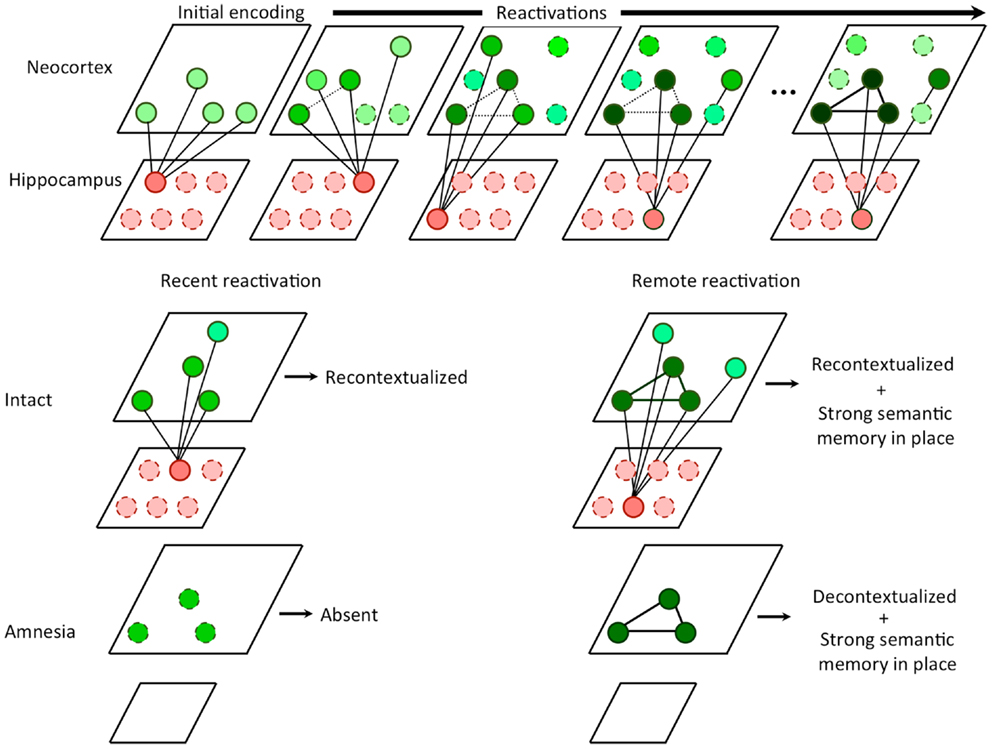
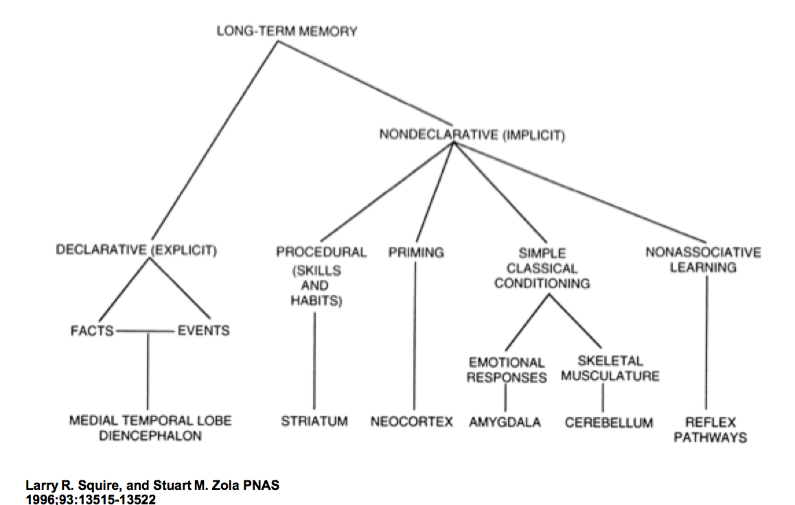
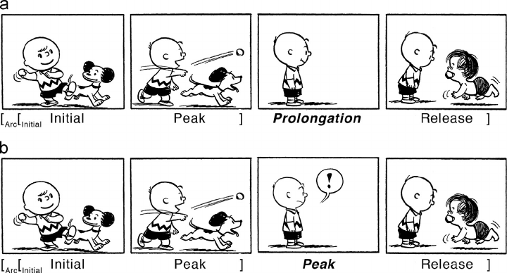
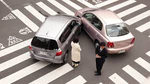

## How do we know about things?
### 26 Sept 2017

---

## Outline

1. Review
1. Objectives
1. What is priming?
1. How does memory work?
1. Schemas, scripts, and frames
1. What affects learning?
1. Driving attention
1. Multimodal communication
1. Summary

---

## Review: Visual queries

- Cognitive task driven by prior knowledge, current context ("display gist"), and goals
- Visual search time is reduced by "pop-out"
- Proximity matters
- Attention prioritizes task relevant objects thus biasing the process

Note:

Last week we talked about visual queries and introduced the idea of "aligning (user) perception". This is just a brief re-cap on what we learned last week.

Our eye differs dramatically from a camera. Cameras capture light and distribute information evenly across a plane. Our eyes capture information differentially from the fovea to the periphery of the retina. We are attuned to luminance, contrasts, shapes and movement -- our perception of color is a psychological response that is subjective.

Ware describes perception (within a task-based context) as visual queries.  "Visual information from the display is processed as a feature space map weighted according to a search pattern. A visual scanning strategy is activated based on prior knowledge, display gist, and the task." (Ware, p. 399)

During eye movement, choosing the next based target location is also driven by prior knowledge, display gist, and task. But because pre-attentive search is a parallel process where the entire visual area is simultaneously analyzed using low level features, visual search is most efficient is a target pattern is pre-attentively distinct; A very distinct target will be found in a single eye movement.

As Ware also notes, "a small number of cognitive markers may be placed in a working memory spatial map of the display to hold task-relevent information when necessary." (Ware, p. 399)

---

## Cognitive biases (perception)

- Change blindness (Simons & Levin, 1998; https://vimeo.com/81039224)
- Inattentional blindness (Simons & Chabris, 1999; logo study in Slack discussion)

*Visual memory reflects our expectation*

Note:

Why?

We have sensory memory. These allow us to retain impressions after a stimulus has ceased.

- Iconic (visual).  Very brief, 1/4 second. To understand the experience of this, think of how lightening appears to last longer than it does. People are very poor a detecting continuity changes, such as in the change blindness study. As we will see today, **visual memory reflects our expectations**. Prior knowledge and expectation include social constraints. (For example, a 1998 Simons and Levin study where college students were more likely to detection a person-switch when experimenters dressed like students than when dressed like construction workers. http://psych.unl.edu/mdodd/Psy263SIS/SimonsLevin.pdf)

- Auditory (echoic). Duration is longer - perhaps, 4 seconds. This makes sense in the context where iconic memory has large capacity to take in a lot quickly, but auditory signals stretch out over time.

- Haptic (touch). Different parts of the body are differentially sensitive to touch information.

---

## Patterns of patterns 

- Faces, objects, music, letters, words, etc.
- We can develop skill at recognizing particular kinds of patterns

Note:

In the pre-frontal cortex, goals themselves are activated patterns that represent our goals and the means to achieve them. They bias signals to other brain structures to guide the flow of activity along neural pathways This leads to the completion of tasks associated with those goals.

---

## Objectives

1. Understand the role of attention in memory
1. Understand the basics of how memory, priming, and learning work
1. Understand the potential for cognitive bias in memory
1. Acquire a few basic techniques for "driving attention"

---

## How does memory work?

Note:

This is Henry Molaison. His case study gave us deep insight into how memory works. Because of severe epilepsy, he had a portion of his brain removed (including the hippocampus).

---

# *Attention is roughly equivalent to working memory*

Note:

Attention is roughly equivalent to working memory. What matters is what you attend. Working memory is a temporary nexus where links are formed between activated patterns - both visual and non-visual.

You can only actually attend a few things at once.  But what are those things?

A well-known study from Miller (1956) described the magical number of seven, plus or minus two. But it turns out that it’s actually only about four, plus or minus one. We appear to remember more because we extend the functional size of our memory by chunking information: we group smaller units of information into chunks to extend the capacity of memory.

Because of limits to working memory, one of the main bottlenecks in visual thinking. Objects can be held in working memory from fixation to fixation. But retaining them reduces what can be picked up in a future fixation. Thus, working memory is highly volatile.

---

## Working memory

*"a temporary storage system under attentional control that underpins our capacity for complex thought"* (Baddeley, 2007, p.1)

Note:

This diagram from Baddeley 2007 represents a rough schematic how how we think memory is composed. It's an alternative to older hypotheses centered on "short-term" memory.

Working memory spans .1 seconds to a couple of seconds. It supports ongoing cognitive work. Working memory is where temporary connections are formed between visual and non-visual information. The most important non-visual links drive visual queries and are likely retained in working memory.

Memory is networked and activated by a small amount of information through visual system to visual working memory. We don't always notice small changes.

Visual working memory is better with pictures than words (picture superiority effect). We don't know exactly know why...but this is very important to UI design and advertising.

Binding requires attentional processes.

- Stroop effect (the word color and the color of the text interfere, for example)

Baddeley's multi component model can be broken down into the phonological loop, visuo-spatial sketchpad, episodic buffer, and central executive.

Phonological loop:
- left hemisphere
- holding acoustic or speech-based sequences
- articulatory rehearsal mechanism (e.g. remember license plate)
- possibly, important for chunking (breaking up verbal information into coherent phrases). - modality effect (auditory)
- plays a role in the conversion from visual information to verbal
- memory effects: rhyming causes confusion, and word length has an effect on recall.

Visuospatio sketchpad - similar function for visual or spatially encoded items.
- right hemisphere
- separates "what" versus "where" mechanisms

Central executive - attentionally limited system that selects and manipulates patterns / objects in the subsystems.
- central to planning, problem solving
- necessary for shifting & switching attention (when plan not working)
- implicated in fluency - ability to quickly and efficiently search for and generate new info
- plays a role in inhibition - stop doing irrelevant actions
- functions to keep goals in mind
- self-monitoring - check on progress

Episodic memory is a sub-system that:
- links long term memory
- integrates information from other sub-systems into a unified experience
- small area of storage capacity that does not depend on perceptual input.
- limit on "chunks of information" that can be bound together coherently
- Gives us the experience of current consciousness
- back up store to PSTM and VSSTM.

Design implications:
- One implication for design (as Johnson notes), is that we need feedback to understand the state of a system or to remember where we were just seconds ago. 
- Another point that he makes is that when a webpage contains a call to action, you should limit this to only one.

An important subtlty is that when a person tries to carry out two tasks simultaneously using the same perceptual channel, performance is less efficient than when performing the tasks individually. We'll look at multimodal communcation a bit later in this segment.

---

## Picture superiority effect

*Pictures have advantages over words with regards to coding and retrieval of stored memory*

Note:

Paivio dual-coding theory hypothesizes that we use both visual and verbal information to code, represent, and retrieve information. But associations that can be stored as both images and words may be more easily stored and retrieved. This hypothesis is compatible with Baddeley's model, but is difficult to prove and there are alternative hypotheses.

Thus, mental images aid in learning -- but they will also be useful in persuasion, as we will see later.

---

## Chunking

Note:

Chunking is as process by which individual pieces are bound together and stored as a coherent group.

Information architecture depends strongly on the notion of chunking. The idea is that we create cognitive representations chunks (e.g., lists) that are more easily remembered than as individual items themselves. 

Sensitivities:

- 2-6 chunks (Miller's study and follow-ups). Phone numbers and date conventions are an example.
- modality effect - channel and perceptual properties have an effect 
- recall effect (when you retrieve)
- distraction effect
- language and culture effect
- familiarity effect

---

## What HM taught us

<iframe width="560" height="315" src="https://www.youtube.com/embed/Vwigmktix2Y" frameborder="0" allowfullscreen></iframe>

<a target="_blank" href="https://www.youtube.com/watch?v=Y0Od5DrdPA4">H.M.</a>

Note:

95% of what we consciously perceive is already in our heads as long-term memory. It is also our identity. It is reconstructed - not a video camera.

Midbrain (hippocampus) key to formation of long term memories.

Success yields strengthening of pathways supporting a neural activation sequence.

---

## What is priming?

*Exposure to a stimulus (images or pathways) experienced before influence the response to another stimulus; processing is faster the next time around for a period of time (day or two).*

Note:

Priming works across all senses and modalities: verbal & visual. It is fften dependent on the physical conditions under which encoding occurred: context matters.
Priming works best when in the same modality.

Priming affects semantic networks: for example, dog primes cat in an associate task. Dog primes wolf in a semantic task.

Affects:
- identification
- perceptions & judgements (what is that? vs who is that?)
- subsequent behavior
- goals and motivations

kindness priming - positive mood state increases helpfulness. Manipulate attentional focus toward oneself or toward another to whom a positive mood had been indiced. Carlson, Charlin, & Miller 1989

---

## How are memories formed?

<a target="_blank" href="http://journal.frontiersin.org/article/10.3389/fnbeh.2013.00107/full">Yassa & Reagh, 2013</a>

Note:

Memory consolidation debate.

Hippocampus required for retrieval of memories, but for how long?

As memories get older, they are decontextualized due to competition among partially overlapping traces and become more semantic and reliant on neocortical storage.

Ware says 95% of what we consciously perceive is already in our heads in memory. Meaning is activated by small amounts of information that are processed visually to working memory.

Explicit learning - visual patterns and associations must be the focus of attention to make it into visual working memory. Then an association with this information must be made between visual and verbal information. Then memory consolidation must be made. Hippocampus. LTM results in strengthening of neural connections, increasing the likelihood that a particular neural chain will re-activate.

- Emotion plays a role (we'll talk about this later)
- Familar paths affect learning

---

## Memory sub-systems

Note:

Memory and learning are two sides of the same coin. But there are different sub-systems at play and these are useful to understand.

### Nondeclarative memory

- Implicit - whatever is retained during daily life. Very little explicitly recalled. 50% in 20 mins.

Memory that does not require consciousness and can operate without awareness. For example, people who unconsciously develop new speech patterns when they move to a new region.

- Classical conditioning. Sometimes called **Pavlovian conditioning** or stimulus-response. In this kind of learning, an organism learned that certain stimuli are reliable predictors of the imminent onset of other important stimuli (Pavlov, 1923; Radvansky 2017 p. 178). Pavlov stumbled across then while studying digestion (for which he received a Nobel prize). While he was studying the  initial phases of digestion (salivation), he found that dogs sometimes salivated when they weren’t fed. So he tested this theory. The dogs learned that a bell preceded meat, and so began to salivate when the bell rang, but before being fed.

- Associative learning. Another kind of learning is a stimulus-stimulus learning where two stimuli occur in close proximity driving a cause-effect relationship.

When learning, an important thing to understand is what happens during forgetting, when there is no re-inforcement by association. 

- **Spontaneous recovery** can occur when extinction of the association has occurred and there is a long delay. The previous pattern will re-emerge, though not as strongly.
- There is also a **savings effect** where less time is required to learn than the first time; the association is not entirely gone.

- Procedural memory

Motor memory needs to go through a process of consolidation to become more permanent and enduring. If there is declarative knowledge acquired prior to learning a motor skill, it may delay consolidation making it more likely to be forgotten. 

**Negative transfer** occurs when someone has learned a skill and then learned a new, closely related one. For example, going from a standard-shift car to automatic. There is overlap between old and new information. Those older traces are so storing, they are activated when trying to learn something new and this blocks acquisition of new information. 

You can test implicit memory indirectly via priming. Priming occurs when people can more quickly and accurately retrieve information because of prior exposure. **Repetition priming** involves a decrease in neural activity in some areas, such as the visual cortex. Previously processed images prime the usual pathways so that they are processed faster in the future. And more canonical or typical objects in typical views recognized more quickly. There is biased competition between priming and top-down information.
  
Such images are  sensitive to the level of representation. For example, reading a list of words will elicit faster responses to recognition of those words out-of-context such as within a paragraph. If a paragraph had been read earlier, it may be read faster later, though not individual words in a word list out-of-context.

- Explicit (semantic or episodic) memory. Expressly memorized. Visual patterns and associations must be the focus of attention to make it into visual working memory. Also connections must be made between visual and verbal. 24-hour consolidation.

While I won’t spend any time on episodic memory (memory of events), both semantic memory and episodic memory are a kind of declarative memory that contrasts with procedural and implicit memory above. Semantic memory builds upon nondeclarative memory such as native language competency, which is acquired very young. Semantic memories are generalized and "encyclopedic" - they are not tied to time or place. They are also highly inter-related and decay over time. To learn declarative information, you need to be consciously aware during learning.

Semantic memory is structured based on shared aspects of meaning. For example, when you think of a dog, you may consider that it’s a sort of animal and has four legs and a tail. When you think of a tail, you consider that some breeds are known for docked tails. Concepts are activated via spreading. Spreading activation may also affected by emotion — an example cited is that people respond after to happy words when in a happy mood and after to sad words in a sad move (Olafson & Ferraro 2001) [Note: check to see if this study has been replicated successfully!]

Unlike repetition priming, **semantic priming** occurs at the unit of a "concept" and brings with it related concepts. Such priming helps people detect inconsistencies in conversation. If some unexpected word is spoken, your brain starts to work harder to figure out what is going on. And this happens in a very regular way about 400ms after the inconsistency.

---

## A few learning biases

- Primacy effect
- Recency effect
- Suffix effect

Note: 

Time has a large impact on learning and retrieval of information. We tend to remember information at the beginning and end of a set. 

- Primacy effect is accounted for by virtue of opportunity for more rehearsal and better consolidation into long term memory. This gets larger, the more rehearsal time given.
- Recency effect accounts for the observation that the more recent something is rehearsed, the more likely it is to be remembered later. They are also not displaced by later information.
- Suffix effect. If you are given a list of words to remember and the experimenter than prompts you to recall the sequence by indicating "go", that word will present interference that is not experienced had nothing been said as a prompt. This effect is influenced by location in space, voice (different person), and other perceptual qualities.

---

## Skills acquisition

Note:

Three stages of **skills acquisition**: 
- Cognitive stage. Deliberative effort with high cognitive effort. Conscious assessment comparing current state with desired state.
- Associative stage.  Memories are becoming directly associated with different aspects of the skill. Still requires direct retrieval of information and conscious effort, but with more ease.
- Autonomous stage. Skills more more preceduralized and largely unconscious. Moved from being dominated by declarative knowledge to procedural knowledge.

---

## Schemas and frames in learning

*Background knowledge*
<iframe width="560" height="315" src="https://www.youtube.com/embed/o4HHCgFmkcI" frameborder="0" allowfullscreen></iframe>

Note:

Frames - objects within a frame bias your perception. For example, 
- Camera angle / view (visual attention)
- Situations & activities
- Schemas simplify & distort to bring relevant information into focus

- Memory is networked and activated by a small amount of information through visual system to visual working memory. We don't always notice small changes.

Because we experience situations as they unfold, we are quick to organize information into schemas that help us to recognize situations and quickly react to commonly encountered situations. This sort of semantic memory is known as a schema. It’s like a blueprint that help to abstract a situation and then also interpret or re-construct information.

When you have a schema, you are able to quickly assess what is important. For example, think about a “making toast" schema. You will quickly pick out the important aspects, based on what you have in your kitchen and what is needed to accomplish the task.

Abstractions allow you to compress information into smaller bits that can be unpacked.

Similarly, interpretation of abstracts allows you to fill in gaps for missing information.  This is also where problems happen. While we can integrate bits and pieces of information belonging to schema from small fragments (just like we do with perception), the inferences we make may be wrong. And yet these inferences may be remembered as "true".

Schemas that are conventionalized as **scripts** are temporally ordered and structured to capture the regularity of a common sequence of events. Most actual knowledge about what to do is inferred. The use of scripts influences how information is retrieved and used.

---

## Visual narrative

Note:

A visual narrative is a story told through visual media. It takes advantage of schemas and scripts and how our brains use them to process information.

The value is that it can be used to capture and control what the audience is attending from moment-to-moment. You want to "frame information so that object attention is inescapable." (Ware, p. 139)

---

## What affects learning?

<iframe width="560" height="315" src="https://www.youtube.com/embed/zqdfFdUvwS4" frameborder="0" allowfullscreen></iframe>

*optional: watch later*

Note:

We won't watch this video in class, but it's pretty cool! There are lots of practical ideas about how to improve brain function and learning.

- Exercise 
- Evolution
- Brain wiring - environment, age effects
- "Don't be boring" - meaning ("gist") before data. Short attention (10 minute mark)
- More elaborate encoding (more connections) and initial encoding is important for retrieval.
- LTM requires repetition. Incorporate new information gradually and regularly
- Sleep
- Don't stress (cortisol damages to include hippocampus)
- Stimulate your senses (multimodally)
- Vision the most dominant sense taking up more than half of the brain's resources (pictorial superiority effect)
- Gender - retrieval effects
- Humans are natural explorers and active learners

---

## Framing effects and memory

Note:

This week, I'm introducing to you a new cognitive bias that relates to memory.

Framing is presentation from a specific perspective. Framing can affect memory.

From Aldert Vrij’s Detecting Lies and Deceipt:

“Participants saw a film of a traffic accident and then answered questions about the event, including the question ‘About how fast were the cars going when they contacted each other?’ Other participants received the same information, except that the verb ‘contacted’ was replaced by either hit, bumped, collided, or smashed. Even though all of the participants saw the same film, the wording of the questions affected their answers. The speed estimates (in miles per hour) were 31, 34, 38, 39, and 41, respectively.

One week later, the participants were asked whether they had seen broken glass at the accident site. Although the correct answer was ‘no,’ 32% of the participants who were given the ‘smashed’ condition said that they had. Hence the wording of the question can influence their memory of the incident."

---

## Driving attention

Note:

Image gists are processed quickly. One way to command attention is to trigger unexpected relations.

For example, because most ads may incur only a a single fixation, advertisers spend effort on trying to keep your attention.

Concepts that are more highly connected are retrieved faster, the more connections the more easily retrieved. Conversely, inhibition can be used to narrow parts of semantic memory. Later in this class, we’ll see that ads that are highly specific may be less effective for this reason.

---

## *Preferences* can be induced by an **exposure effect**

Note:

When someone has been exposed to something previously, they experience a mild positive association. The strength of this effect can grown with exposures. It’s also merely likely to occur with exposures across multiple contexts. And, there is an embodied aspect to exposure.

Note, this is an example of repetition priming as mentioned earlier.

---

## Sustaining attention: Seeking & novelty

<a target="_blank" href="http://www.slate.com/articles/health_and_science/science/2009/08/seeking.html">SEEKING</a> is an emotional state. (Jaak Panksepp, affective neuroscience)

Note:

> "It is the mammalian motivational engine that each day gets us out of the bed, or den, or hole to venture forth into the world. It's why, as animal scientist Temple Grandin writes in Animals Make Us Human, experiments show that animals in captivity would prefer to have to search for their food than to have it delivered to them.

> For humans, this desire to search is not just about fulfilling our physical needs. Panksepp says that humans can get just as excited about abstract rewards as tangible ones. He says that when we get thrilled about the world of ideas, about making intellectual connections, about divining meaning, it is the seeking circuits that are firing."

(Pankseep identifies 7:  PLAY, PANIC/GRIEF, FEAR, RAGE, SEEKING, LUST and CARE)

"The juice that fuels the seeking system is the neurotransmitter dopamine. The dopamine circuits "promote states of eagerness and directed purpose," Panksepp writes. It's a state humans love to be in. So good does it feel that we seek out activities, or substances, that keep this system aroused—cocaine and amphetamines, drugs of stimulation, are particularly effective at stirring it."

---

## Sustaining attention: Cognitive threads

1. Establish a problem
2. Elaborate a problem
3. Resolve a problem

*Cognitive thread - the sequence of concepts in visual and verbal working memory, together with the links between them.*

Note:

- Presentations more effective as a narrative
- Headlines & titles draw audience when asked as a question for which the answer is not known
- Audiences seek cognitive resolution - another motivation for sustained attention
- Artists and advertisers try to hold viewer attention through novelty: i.e., puzzles, non-canonical views, surrealist art, etc.

---

## Design for communication is multimodal

*Diagram narrative*

What makes this a narrative? Change over time

Note:

- Diagrams are both visual and linguistic

- Graphical symbols are used for conventional understanding and are embedded in our culture. Trigger associations. Emotional valence used to to garner interest, as well.

- Visual symbols pass through visual pattern finding machinery and then processed in neural sub-systems associated with verbal processing (Broca, Wernicke's area). But socially designed. Shared knowledge.

- Language, gesture and graphical components can be used to "point". Gaze, orientation, motion. Deixis is the link between words and images.

- This diagram exploits both narrative and information-gathering exploration.

Animated graphics no better than static for instruction. Why? To fast, too complex, disappear, hard to perceive as discrete steps.
---

## Deixis ("pointing")

Note:

We mix graphical and linguistic information; a call-to-action involves an action-sequence (button press). Using the metaphor of a button, we drive attention toward the action we want the user to take and we make it easy for them to visualize invocation of a kinetic act.

---

## Maps and memory

Note:

The schematic representation of a route in the diagram to the right is particularly effective by capturing elements that are particularly salient, while eliminating cluttering detail:

- generalize turn angle to ~90
- curves in roads
- diminish long straight distances
- enlarge short tricky turns
- use of landmarks

---

## Compositionality of graphics

<a target="_blank" href="http://www.thevisuallinguist.com">http://www.thevisuallinguist.com</a>

Note:

Some communicative graphics can take on properties that are more linguistic in nature, such as compositionality.

---

## Graphics augment cognition
(Barbara Tversky, http://www-psych.stanford.edu/~bt/diagrams/index.html)

- Long term memory
- Record information
- Convey information
- Reinforce other channels
- Promote inferences
- Enable new ideas - ambiguity may be useful
- Facilitate collaboration - externalize common ground, gestures on diagrams

Note:

---

## Recurrent themes

- We are pattern detectors
- Perception is biased
- Vision is king
- We are prediction machines
- We are driven to follow narrative threads through schemas and inference
- Attention in limited

Note:

We are pattern detectors and are perception is biased. One additional feature is important to call out: we are also prediction machines. We’re constantly making predictions about the state of the world. Ware notes that, because we see the world in small jumps from fixation to fixation, we have expectations about how things are connected. So if we see a motion trajectory of an object, we expect to see it continue. These inferences are essential for us to see and perceive the world. These same inferences drive our understanding of temporal patterns and narrative patterns. We are driven to follow narrative threads.

---

## References

- Baddeley, A. (2007). Working memory, thought, and action (Vol. 45). OUP Oxford.

- Johnson, J. (2013). Designing with the mind in mind: simple guide to understanding user interface design guidelines. Elsevier.

- Miller, J. (1956). The magical number seven, plus or minus two: Some limits on our capacity for processing information. Psychological Review, 63: 81-97.

- Tversky, B. - http://www-psych.stanford.edu/~bt/diagrams/index.html

---

## References (cont.)

- Yassa, M. & Z. Reagh. (2013). Competitive trace thery: a role for the hippocampus in contextual interference during retrieval. Retrieved from:
<a target="_blank" href="http://journal.frontiersin.org/article/10.3389/fnbeh.2013.00107/full">http://journal.frontiersin.org/article/10.3389/fnbeh.2013.00107/full</a>

- Yoffe, E. (2009). How the brain hard-wires us to love google, Twitter, and texting. And why that's dangerous. Slate Magazine. Retrieved from: http://www.slate.com/articles/health_and_science/science/2009/08/seeking.html

- Ware, C. (2000). Information Visualization: Perception for Design.

- Ware, C. (2010). Visual Thinking for Design. Morgan Kaufmann.

---

## Next Week

- Journal
- Kahneman 1-9

Note:

