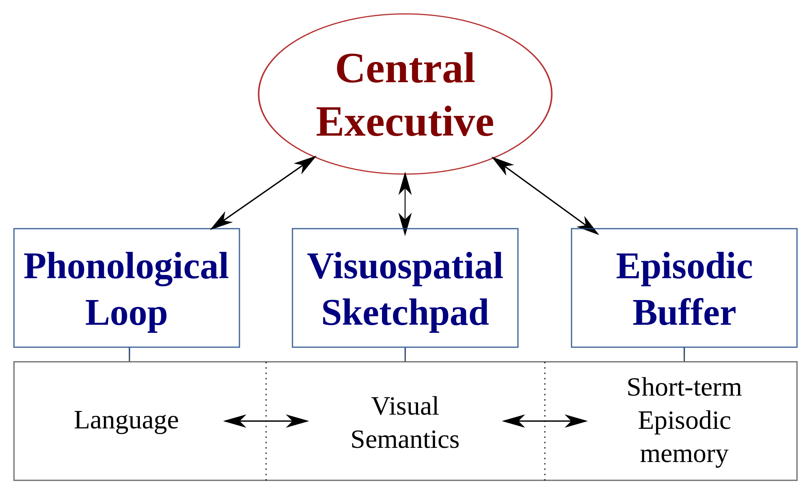
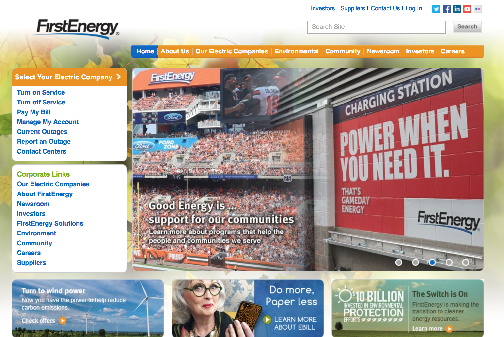
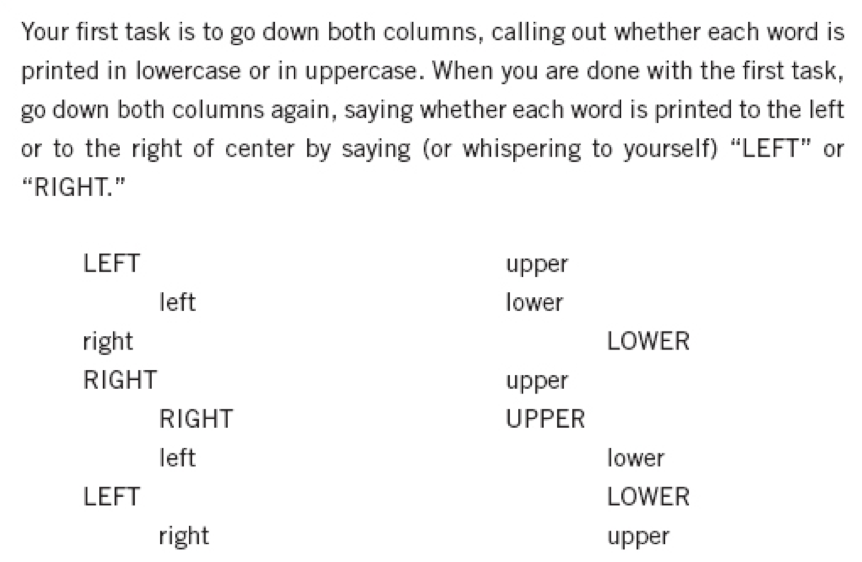
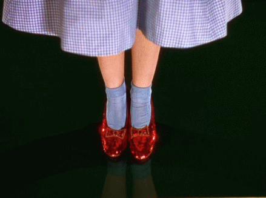
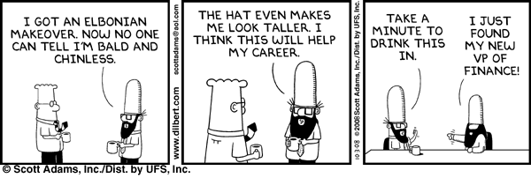

# How we do think?
## 3 Oct 2017

---

## Outline

*Behavior is our medium*

1. Review: Memory
1. Dual processing theory - Biases and Heuristics

---

Objectives

*Understand practical ways in which system one and two bias thinking*
- Availability heuristic
- Halo effect
- Social priming
- Familiarity
- Cognitive ease
- Coherence
- Confirmation bias

Note:

Kahneman's premise is that it easier to recognize other people's mistakes than our own. Kahneman, himself, references work that is now considered suspect -- but that shouldn't distract from really outstanding work that he and Tversky propagated.

---

## Review: Working memory

*"a temporary storage system under attentional control that underpins our capacity for complex thought"* (Baddeley,2007, p.1)

**Replaces what was previously called short-term memory**

Note:

.1 seconds - a few seconds. Support ongoing cognitive work. Temporary grouping where connections are formed between the visual and non-visual. The most important non-visual links are help in WM.

Visual chunks bind to non-visual. Image mind to phrases. They also bind to action plans to execute a function.

Memory is networked and activated by a small amount of information through visual system to visual working memory. We don't always notice small changes.

Multi component model - components process in parallel:
- Phonological loop
    - holds acoustic or speech-based sequences
    - articulatory rehearsal mechanism (e.g. remember license plate)
    - left hemisphere
    - possibly, important for chunking (breaking up verbal information into coherent phrases). - modality effect here.
    - conversion from visual to verbal
    - memory effects: rhyming causes confusion, and word length has an effect on recall.
- Visuo-spatial sketch pad - similar function for visual or spatially encoded items.
    - right hemisphere
    - separate what versus where mechanisms
- Central executive - attentionally limited system that selects and manipulates patterns / objects in the subsystems.
    - planning, problem solving
    - shifting & switching attention (when plan not working)
    - fluency - ability to quickly and efficiently search for and generate new info
    - inhibition - stop doing irrelevant actions
    - keep goals in mind
    - self-monitoring - check on progress
- Episodic memory is a sub-system that:
    - links LT memory
    - integrates information from other sub-systems into a unified experience
    - small area of storage capacity that does not depend on perceptual input.
    - limit on "chunks of information" that can be bound together coherently
    - Gives us the experience of current consciousness
    - back up store to PSTM and VSSTM.

---

## Design considerations

- **Chunk information** (task & information structure)
- **Picture superiority effect** (advantage of pictures over words)
- **Prime important concepts** (e.g., search icon in mobile apps, brands, concepts)
- **Exposure effect** (familiarity and preference)
- **Use common schemas & frames** (e.g., shopping carts, landmarks for route finding)
- **Direct & sustain attention** using inherent interest in SEEKING and novelty, cognitive threads

---

## Design considerations (2)
- **Coordinate messages across modalities**
 - Graphical symbols to convey conventional information (but consider cross-cultural effects)
 - Arrows to direct attention
 - Spatial organization to chunk and aid comprehension
 - Visual and linguistic concordance (tone of voice, font, colors, shapes, message)

---

## You want to encourage users to sign up for automatically billing

*How could you make this more persuasive?*

Note:

It's not at all clear that the developer of this user experience actually did want this...

---
# Walk-through example

[FirstEnergy Corp Example](https://www.evernote.com/shard/s1/sh/72b46774-d277-4d10-b982-0c52bb79f84f/7b444d5211b53c61fdf31c10888178d6)

Note:

- Clear goal or task representation
- Chunking
- Menu headings inconsistent (more difficult to compare)
- Menu headings change with screen change - where are we?
- Unexpectedly, asterix after "enroll"... what does this mean?
- Button with multiple actions??
- Different site?
- Reference to locations seems odd... if we're in their system, don't they know where we are?

---

## Pupillary dilation as measure of effort

Image credit: [Avik Ganguly, April 2012](http://avik-ganguly.blogspot.com/2012/04/surprise-and-cognitive-workload-effect.html)

Note:

When taxing our working memory, we're effectively blind. "Mental sprint"

General law of "least effort" applies both the cognitive and physical exertion.

---

## Stroop effect

Note:

Example from Kahneman p 25.

"Conflict between an automated response and intention to control." p. 26

Some cognitive illusions come from conflict between our intuitive thinking and controlled thoughts.

---

## "There's no place like..."

Note:

"Retrieval is the process of recovering a target memory based on one or more cues" Baddeley

Name a fruit: banana versus guava. A guava is a fruit but has a weaker association to fruit.

Retrieval is a progression from one or more cues to a target memory via associative cnnections.

Many things serve as cues. We have a content addressable memory like Google (any content in memory can serve as a cue).

Retrieval spreads as via spreading activation. When something is in focus, it stimulates a trace. Higher levels of activation result in greater accessibility.

Damasio, Self Comes to Mind, 2013

---

## Associative memory

*"Composite memory of the sensory and motor activities related to the interaction between the organism and object during a certain period of time."*

Damasio, 2011, Self Comes to Mind, p. 133

Image credit: Reser, 2013, [The Neurological Process for Mental Continuity and Internally Generated Thought](http://www.cognitivemechanics.net/on_consciousness)

Note:

- We perceive by engagement.
- To recall, we play back an approximation of a perception.
- Sensory areas can only create one sensory image at a time, but the PFC can hold the salient goal or goal-relevant features of several at a time. Reser, 2013

- sensorimotor patterns for viewing (eye, neck, head, body)
- sensorimotor patterns for touching & manipulation (hand, location)
- sensorimotor patterns from evocation of previous memories
- sensorimotor patterns related to trigger of emotions and feelings relative to the object

"Remembering a person or event or telling a story necessitates recall; recognizing objects and situations around us necessitates recall as well; so does thinking about objects with which we have interacted and about events we have perceived, and so does the entire imaginative process with which we plan for the future" Damasio, Self Comes to Mind, 2011, p. 136

Convergence zones marry two types of memory systems: dispositional and associative maps
- dispositions - reactivates network of past perceptions in image space. knowledgebase for reconstruction. implicit and unconscious memory.
- image space - explicit images that are both conscious and unconscious.

- Hierarchy of complexity (semantic/episodic or generic/contextual)
    - unique personal entities & events (most)
    - unique non-personal entities & events
    - non-unique entities & events

---

## Concept activation

- Is Sam friendly?
- Is Sam unfriendly?

Different thoughts come to mind when asked one way or the other.

Note:

Kahneman gives a simple example of using the word "EAT" to prime your response to SO_P". You likely would not have the same first response as you would if you had been primed with "WASH".

---

## Cognitive illusion?

1. How many dates did you have last month?
2. How happy are you these days?

Results in very different responses than...

1. How happy are you these days?
2. How many dates did you have last month?

Note:

framing, priming

---

## Vomits

Note:

We react (physically and mentally) as if this is a real thing. Words are linked together to prepare a context for future developments.

Sequence matters

---

## Halo effect

Note:

Initial concepts change the meaning of those that appear later. We make these impressions coherent - we suppress ambiguity.

"Most impressions and thoughts arise in your conscious experience without your knowing how they got there." Kahneman, pg 4

And sequence matters

---

## Social priming

Trivial manipulations *may* have large effect.

Note:

The experiment took place in an office kitchen with an "honesty box". On the wall was a suggested price list for tea and coffee.  Above the price list, the researchers posted a new image each week for 10 weeks alternative between images of flowers and human eyes.

When staff were primed by seeing eyes above the price list, they paid almost three times as much as when they saw the flowers.

http://www.ncbi.nlm.nih.gov/pmc/articles/PMC1686213/

---

## Behavior is our medium
Robert Fabricant, Frog Design, 2009

Note:

The central business of interaction design concerns affecting and guiding behavior.

We've talked about some means for guiding attention, and sustaining attention. Now we're getting into the meat-and-potatoes of designing for behavior change.

---

## Dual Processing Theory

Note:

System 1 - no effort, no sense of voluntary control
 - perception, recognition, orientation
 - learned associations
 - learned skills such as reading and social cues
System 2 - attention allocation, associated with subjective experience of agency, choice and concentration.

System 1 depends heavily on the limbic system - Visceral, autonomic processes. Includes the hippocampus, important to forming memories. Also includes the amygdala, important to emotional processes and basal ganglia connected to intentional movement. Heavily modulated by dopamine (neurotransmitter which plays a role in reward) - important to motivation and learning.

Faces are processed via support from the amygdala. The amygdala is involved in evaluating the trustworthiness of an individuals.  It also plays a role in the overall evaluation of first impressions of faces. [We'll talk more about faces shortly.]

"We are blind to our blindness"

System 1 always suggests - if endorsed by System 2, impressions and intuitions turn into beliefs. You generally believe your impressions and act on your desires.

System 2 activated when an event is detected that violates the model of the world that System 1 maintains. Or when System 1 does not have an answer.

---

## “*Automatic system* takes longer to say than *System 1*”

Kahneman, 2011, p. 29

Note:

and therefore takes more space in your working memory. This matters, because anything that occupies your working memory reduces your ability to think.

---

## Cognitive ease

Note:

Cognitive ease associates with good feelings. (Perhaps, you enjoy Kahneman more than Ware?)

Familiarity - words you've seen before you will see more clearly [bolding]

Consistency will also bias beliefs

"A reliable way to make people believe in falsehoods is frequent repetition, because familiarity is not easily distinguished from truth."

---

## Familiarity

*The body temperature of a chicken is...?*

Note:

People who were repeatedly exposed to the phrase “the body temperature of a chicken” were more likely to accept as true the statement that “the body temperature of a chicken is 144 °” (or any other arbitrary number). The familiarity of one phrase in the statement sufficed to make the whole statement feel familiar, and therefore true.

Zajonc

"The consequences of repeated exposures benefit the organism in its relations to the immediate animate and inanimate environment. They allow the organism to distinguish objects and habitats that are safe from those that are not, and they are the most primitive basis of social attachments. Therefore, they form the basis for social organization and cohesion— the basic sources of psychological and social stability."

---

## Design concepts (Kahneman)

<ul>
<li style="font-size: .7em">Use simple language</li>
<li style="font-size: .7em">Use high quality paper to maximize contrast</li>
<li style="font-size: .7em">Bright blue or red more persuasive that green, yellow, or pale blue (culture sensitive)</li>
<li style="font-size: .7em">Make messages memorable</li>
<li style="font-size: .7em">Rhyming judged more insightful</li>
<li style="font-size: .7em">Choose a source to quote with a name easy to pronounce</li>
<li style="font-size: .7em">More frequent stimuli, more favorable perception</li>
<li style="font-size: .7em">Positive mood</li>
<li style="font-size: .7em">Priming, clear font, pre-exposed words</li>
<li style="font-size: .7em">Coherence</li>
</ul>

Note:

"Much of what we now know would have sounded like science fiction thirty or forty years ago. It was beyond imagining that bad font influences judgements of truth and improves cognitive performance, or that an emotional response to a triad of words mediates impressions of coherence. Psychology has come a long way." (Kahnman, pg, 70)

---

## Social understanding comes naturally

<iframe width="560" height="315" src="https://www.youtube.com/embed/n9TWwG4SFWQ" frameborder="0" allowfullscreen></iframe>

*Write down what happened*

http://blogs.scientificamerican.com/thoughtful-animal/animating-anthropomorphism-giving-minds-to-geometric-shapes-video/

Note:

[Fritz Heider and Mary-Ann Simmel]

We intuit socially

"what kind of person is the big triangle?"

Write down what happened (cuing!)

We see literal, goal-directed (anthropomorphic actions) and attribute social behavior (feelings, motivations)

"Which leads to a chilling question. If it is so easy to imbue geometric shapes with human-like thoughts, feelings, intentions, and desires, how is it equally easy for some people to view others of their own species as decidedly non-human?" p. 76

---

## Linda Problem

Linda is thirty-one years old, single, outspoken, and very bright. She majored in philosophy. As a student, she was deeply concerned with issues of discrimination and social justice, and also participated in antinuclear demonstrations.

**Is Linda more likely to be a "(a) bank teller" or a "(b) bank teller and active in the feminist movement"?**

Kahneman, 2011, Thinking, Fast and Slow (p. 156)

Note:

We substitute the question with one easier to answer. 

Humans naturally good at grammar but not at statistics. Mental models belong to System 1:
- We estimate probability based on on how easy it is to retrieve memories. 
- Emotion-charged memories are easier to retrieve.
- We tend to over-estimate the probability of violent crime and under-estimate more benign statistics such as good works.

How is this useful?

- Is everything normal? Situations evaluated as good or bad. Good mood and cognitive ease are associated with feelings of safety and familiarity.

[Make the system familiar - not too much change]

---

## How easy is it to make a decision based on appearance?

https://www.researchgate.net/publication/265419044_Social_Attributions_from_Faces_Determinants_Consequences_Accuracy_and_Functional_Significance

Note:

Todorov reference in Kahneman pg. 90.

 "Todorov showed his [Princeton] students pictures of men's faces, sometimes for as little as one-tenth of a seciond, and asked them to rate the faces on various attributes, including likability and competence. Observers agreed quite well on these ratings. The faces that Todorov showed were not a random set: they were the campaign portraits of politicians competing for elective office."

When he compared the results of electoral races to ratings of competence, what happened?

In about 70% of the races, the winner was the canddate whose face had earned higher ratings of competence. Todorov judged "competence" by combining two dimentions of strength and trustworthiness. [No way to prove this, but this reflects judgements influenced by attributes we value.]

We're very good at relative judgements - using prototypes & exemplars.

Quantity irrelevant emotional context has a larger impact. Underlying dimension of intensity. We can do this across scales, as well.

Kahneman calls this a mental shotgun (excess computation) combined with intensity matching makes it possible to have intuitive judgements about things that we know little about.

Follow-up studies... 
Wartime to peacetime voting preference (ULittle, Roberts, Jones, Debruine 2012)

What about in advertising?

"Imagine that an organization has a list of FB friends, and through some kind of algorithm can detect two friends that you like the most. And then they create, in real time, a facial composite of these two friends. Now studies prior to ours have shown that people don't recognize any longer even themselves in facial composites, but they react to those composites in a positive manner. So next time you are looking for a certain prodct, and there is an ad suggesting you to buy it, it will not just be a standard spokeperson. It will be one of your friends, and you will not even know that this is happening. " (Aquisti, 2013)

---

## People let their likes and dislikes determine their beliefs about the world

Note:

---

## System 1 constructs coherence

Risk for confirmation bias

https://origin-www.bloombergview.com/view/articles/2016-01-08/how-facebook-makes-us-dumber

Note:

"Facebook users tended to choose and share stories containing messages they accept, and to neglect those they reject. If a story fits with what people already believe, they are far more likely to be interested in it and thus to spread it.

As Del Vicario and her coauthors put it, “users mostly tend to select and share content according to a specific narrative and to ignore the rest.” On Facebook, the result is the formation of a lot of “homogeneous, polarized clusters.” Within those clusters, new information moves quickly among friends (often in just a few hours).

The consequence is the “proliferation of biased narratives fomented by unsubstantiated rumors, mistrust, and paranoia.” And while the study focuses on Facebook users, there is little doubt that something similar happens on other social media, such as Twitter -- and in the real world as well."

---

## How to break comparisons

http://evilbydesign.info/greed/break-coherence/

Note:

System 1 is coherence seeking. It suggests solutions to the un-suspecting System 2.

"To justify higher prices, make the new option appear sufficiently different that it shouldn’t be compared to other options."

---

## References

- Baddeley, A. (2007). Working memory, thought, and action (Vol. 45). OUP Oxford.

- Damasio, A. (2012). Self comes to mind: Constructing the conscious brain. Vintage.

- Kahneman, D. (2011). Thinking, fast and slow. Macmillan.

---

## References (2)

- Reser, J. E. (2013). The neurological process responsible for mental continuity and internally generated thought. Conference for the Association for the Scientific Study of Consciousness, ASSC 17, July 12th-15th. Retrieved from: http://www.cognitivemechanics.net/on_consciousness

---

### Next Week

1. Journal
1. Emotion (alt video for Damasio)
1. Discussion led by Justin

Note:

Last year feedback by students on Damasio was tepid. He writes popular books (much like Kahneman) that cater to non-experts. So I don't know if a negative reaction is because of his style, or because I dropped students into the middle of one of his books. Thus, I've provided a video of him speaking as an alternative to his material.