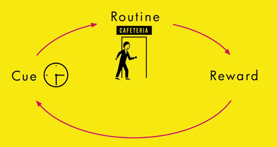

# How do emotions affect belief?
## 10 Oct 2017

---

## Outline

1. Emotions & Feelings
  - What are they?
  - Are emotions universal?
  - How do they work?
  - Effects:
      - Perception
      - Memory
      - Attention
      - Priming
      - Thinking
      - Beliefs
      - Attitudes
1. Habits
  - How do habit loops work?
  - Interaction within social groups?
1. Interaction Design: Behavior as a Medium (Video)
---

# **The orator persuades by means of his hearers, when they are roused to emotion by his speech; for the judgements we deliver are not the same when we are influenced by joy or sorrow, love or hate**
Aristotle, Rhetorica, I, II.5

NOtes

Emotional arousal is essential in persuasion

---

## Emotions & feelings

Antonio Damasio, Looking for Spinoza, Joy, Sorrow and the Feeling Brain, 2004, figure 2.2, p37

Notes:

A nesting principle - "feelings are a mental expression of all other levels of homestatic regulation." (Damasio)

Not exactly like a Russian doll, since only some of lower, simpler reactions are incorporated into higher order machinery.

(Damasio, Looking for Spinoza pp 37-38)

"The brain is constantly receiving signals from the body, registering what is going on inside of us. It then processes the signals in neural maps, which it then compiles in the so-called somatosensory centers. Feelings occur when the maps are read and it becomes apparent that emotional changes have been recorded—as snapshots of our physical state, so to speak."
http://www.scientificamerican.com/article/feeling-our-emotions/

Feelings are how our mind interprets and perceives feedback from our bodies in an the environment.

Feelings of emotion are the composite perceptions of what happens in the body and mind when we are emoting. Feelings are images of actions; feelings are perceptions.

Emotion creates visceral responses (feelings) that run in parallel paths to thoughts and beliefs as we experience in the moment and then recall in the future.

---

http://www.paulekman.com/uncategorized/darwins-claim-universals-facial-expression-challenged/

Note:

Are emotions universal? There appear to be universal facial expressions which are reflections of emotion through feeling.

Damasio mentions fear, anger, sadness, happiness, disgust, and surprise as "so-called universal emotions"

Facial expressions not only are informative about individuals’ feelings, but patterns of neurophysiological activation in their bodies.

Emotions are automated programs of actions. [ Facial expressions, posture, etc.)

Expressions are universal - predictably stable biological constructs. Emotional expression, and what triggers emotions are not.

Background emotions: enthusiasm, discouragement. Operate covertly triggering emotions without one's awareness.

---

## Foundation of Human and Animal Emotions

https://youtu.be/65e2qScV_K8

Note:

Both Damasio and Panksepp refer to two "background emotions": enthusiasm and discouragement

Emotions tied to drives and motivations which are components of each emotion.

Emotional states unfold over time in a chain of events, triggered by images of objects or events (actual or recalled)

Emotion (amygdala) involves sensing and detection, measurement and degree of internal need, incentive process, prediction). Happiness or sadness alter one's drives and motivations.

Positive emotions:

Oxytocin is released when a mother touches a child. Reduces panic and separation responses. Also found in breast milk.

Brain opiods are partially addictive and give us a sense of security.

---

## Social emotions

For example:
- Compassion
- Embarrassment
- Shame
- Guilt
- Contempt
- Jealousy
- Envy
- Pride
- Admiration

https://youtu.be/HEOyqNU6H-c (innate cooperation)
https://www.youtube.com/watch?v=HL45pVdsRvE (inequity)

Note:

Some emotions are triggered in social settings. More recent evolutionarily. Focus on mental and social feelings rather than physical. Form a natural grounding for ethical systems.

Actions in the disgust program have been co-opted by a social emotion: contempt.

---

## How does emotion work?

Blakeslee S, Dr Joseph Ledoux, [Using Rats to Trace Routes of Fear](http://www.nytimes.com/1996/11/05/science/using-rats-to-trace-anatomy-of-fear-biology-of-emotion.html?_r=0), NYT, Nov 5, 1996. Image: http://www.cns.nyu.edu/home/ledoux/

Note:

Amygdala gets input from all sensory systems and higher order systems such as the PFC.

Creates Pavlovian associations.

If a bell occurs just before food, then the sound is associated with a positive event. It helps stamp in experiences in a stronger way.

This is useful for adaptive behavior - guides goal-directed behavior.

It's part of our mammalian brain - fight or flight. It was designed to detect predators. The human amygdala contains cells that fire in response to expressions on faces and may also react to objects of fear.

Double wiring - separate emotion and cognition - but interacting.

Feelings of emotion are continuous because so tightly connected to bodily states. Not wiped clean like images - feeling requires attention.

---

# The amygdala in 5 minutes

<iframe width="560" height="315" src="https://www.youtube.com/embed/fDD5wvFMH6U" frameborder="0" allowfullscreen></iframe>

---

## Emotions on perception

Note:

Our perception of steepness will change depending on mood. Feeling sad, steeper.

Fear can also affect low-level visual processes.

Emotion and motivation can also make things easier to see.

Zadra & Clore, 2011

---

## Emotions on memory

Note:

Memory stores accompanying emotion.

Negative emotion leads to recall of ideas of negative facts.

Perceptual signals from images reach multiple parts of the brain responsible for language, movement, conceptual association - but also may trigger an emotional chain reaction. May only take a few hundred milliseconds, but consumes much energy having an affect on mental resources such as attention and working memory.

---

## Emotions on attention

Note:

Emotional arousal guides attention.

It also facilitates early visual processing.

Contrast sensitivity at threshhold improved by 3% following a fearful face.

The amygdala has reciprocal connections with visual processing regions and may receive information about emotional salience quickly and prior to awareness.

People see better in the presence of an emotional stimulus.

(Phelps, Ling, Carrasco, 2006)

5 ms neuron to fire
.2 ms conscious of a pattern
.5 ms "feeling"
.8 ms to process a concept.

If this is so, the amygdala processes fear, perhaps, as quickly as recognition of a pattern.

---

## Emotions on priming

- **Implicit attitudes** are expressed automatically.  The PFC may consciously attempt to suppress implicit attitudes to reflect an explicit attitude.
- There is an inter-dependence between executive and affective processes
  - Emotionally salient information can disrupt the ability to attend to task-relevant information (Arnsten & Goldman-Rakic, 1998)
  - Emotional stimuli can enhance cognitive processing (Delcos & MCarthy, 2006)

Note:

Explicit & implicit ethnocentrism are distinct.  Social groups and activated attitudes have an indirect relationship on implicit ethnocentrism.

"The amygdala is implicated in the automatic evaluation of socially relevant stimuli, while the anterior cingulate and dorsolateral prefrontal cortices are involved in the detection and regulation, respectively, of implicit attitude." (Stanley, Phelps, Banaji, 2008).

Cunningham, Nazlek, Banaji, 2004 - us/them ethnocentrism. Task goals can affect - move attention away from social category toward an individual person or shared task and the response may disappear.

---

## Emotions on thinking

Note:

System 1 based on formed habits and difficult to change or manipulate (more on habits shortly)

Effects on thinking - sadness slows down thinking.

---

# A belief which does not spring from conviction in the emotions in no belief at all

Evelyn Scott, writer

Note:

Emotions influence the content and strength of belief - amplifies or alters by making them resistant to change.

Emotion stronger than belief stronger than knowledge in the context of action.

---

## Emotions on attitude

Image credit: http://www.whatsappstatusbest.com/2014/07/attitude-whatsapp-status-best.html

Note:

Long term affect is sentiment - perhaps, a latent representation of feeling?

Attitude - orientation  toward or away; reflects the potential for intent - positive, negative favorability. Predictive of behavior for choices, judgements and behavior.

---

# As soon as behavior becomes automatic, the PFC is not needed: your  brain is working less.

---

## Habit loops

*Habits help overcome decision fatigue... sound familiar?*

Note:

The cue signals the brain to go into system 1 processing mode.

The central executive is disengaged and thinking/behavior is automatic.

It takes effort to overcome this.

http://charlesduhigg.com/how-habits-work/

---
## How do they work?

Note:

Sequences of actions are "chunked" into behavior loops linked to the basal ganglia - brain region critical to habits, addiction, and procedural learning. Learned patterns remain in the brain after the behavior is extinguished.

After numerous repetitions, the cerebral cortex is required less -- even for retrieving memory.

http://news.mit.edu/2005/habit

Barnes, Kubota, Hu, Jin, Graybiel Nature 2005

Have you ever driven home without conscious memory of actively piloting your drive, though you attended to all of the individual actions such as turns, signals, etc.?

---

## Social habits?

Note:

Activated both at a personal level and within social groups.

"Peer pressure— and the social habits that encourage people to conform to group expectations— is difficult to describe, because it often differs in form and expression from person to person. These social habits aren’t so much one consistent pattern as dozens of individual habits that ultimately cause everyone to move in the same direction. The habits of peer pressure, however, have something in common. They often spread through weak ties. And they gain their authority through communal expectations. If you ignore the social obligations of your neighborhood, if you shrug off the expected patterns of your community, you risk losing your social standing. You endanger your access to many of the social benefits that come from joining the country club, the alumni association, or the church in the first place."

Duhigg, Charles (2012-02-28). The Power of Habit: Why We Do What We Do in Life and Business (Kindle Locations 3474-3480). Random House Publishing Group. Kindle Edition.

---

## Values and emotions are inextricably bound
To be persuasive, you must know your user

Note:

Motivation

---

<iframe src="https://player.vimeo.com/video/3730382" width="640" height="480" frameborder="0" webkitallowfullscreen mozallowfullscreen allowfullscreen></iframe>

<a href="https://vimeo.com/3730382">Robert Fabricant - Behavior is our Medium</a> from <a href="https://vimeo.com/ixdaglobal">Interaction Design Association</a> on <a href="https://vimeo.com">Vimeo</a>.

---

## References

Arnsten AF, Goldman-Rakic PS. Noise stress impairs prefrontal cortical cognitive function in monkeys: evidence for a hyperdopaminergic mechanism. Arch Gen Psychiatry. 1998;55(4):362–368.

Barnes, T. D., Kubota, Y., Hu, D., Jin, D. Z., & Graybiel, A. M. (2005). Activity of striatal neurons reflects dynamic encoding and recoding of procedural memories. Nature, 437(7062), 1158-1161.

## References (2)

Cunningham, W. A., Nezlek, J. B., & Banaji, M. R. (2004). Implicit and explicit ethnocentrism: Revisiting the ideologies of prejudice. Personality and Social Psychology Bulletin, 30(10), 1332-1346.

Damasio, A. (2012). Self comes to mind: Constructing the conscious brain. Vintage.

Damasio, A. R. (2003). Looking for Spinoza: Joy, sorrow, and the feeling brain. Houghton Mifflin Harcourt.

---

## References (3)

Dolcos F, McCarthy G. Brain systems mediating cognitive interference by emotional distraction. J Neurosci. 2006;26(7):2072–2079.

Duhigg, C. (2012). The power of habit: Why we do what we do in life and business (Vol. 34, No. 10). Random House.

Kahneman, D. (2011). Thinking, fast and slow. Macmillan.

---

## References (4)

Phelps, E. A., Ling, S., & Carrasco, M. (2006). Emotion facilitates perception and potentiates the perceptual benefits of attention. Psychological science, 17(4), 292-299.

Zadra, J. R., & Clore, G. L. (2011). Emotion and Perception: The Role of Affective Information. Wiley Interdisciplinary Reviews. Cognitive Science, 2(6), 676–685.

