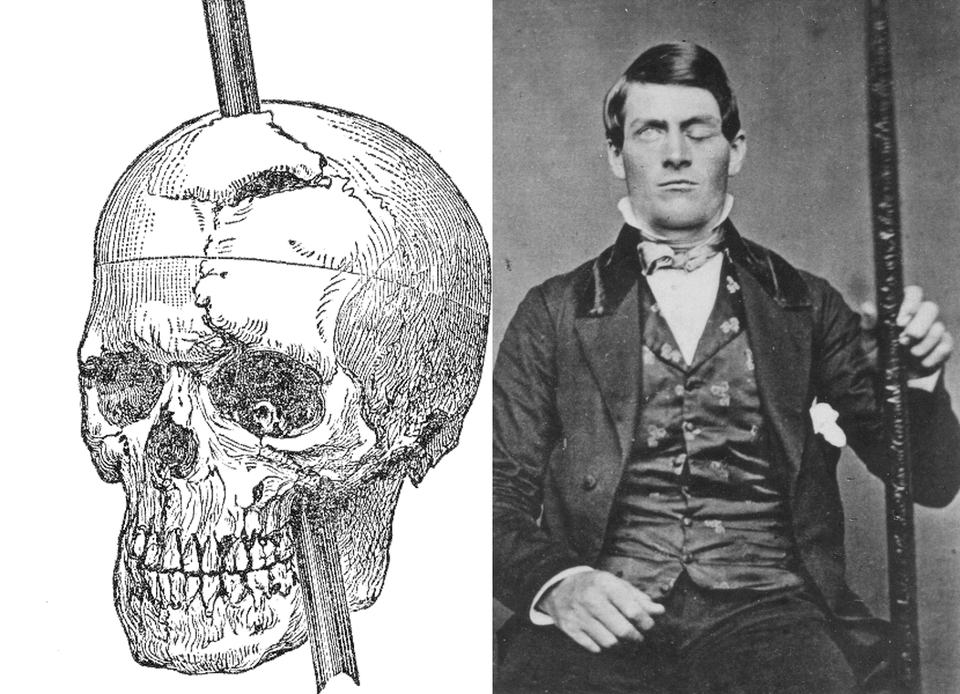

# How do emotions affect belief?
## 5 March 2019

---

### Outline

1. Emotions & Feelings
1. Habits
1. Function & measurement of emotions
1. Interaction Design: Behavior as a Medium (Video)

---

*The orator persuades by means of his hearers, when they are roused to emotion by his speech; for the judgements we deliver are not the same when we are influenced by joy or sorrow, love or hate.*

Aristotle, Rhetorica, I, II.5

Note:

Emotional arousal is a fundamental consideration in persuasion. Because of the brain pathways involved, and the implication of reward and drives, you need to delve into an understanding of motivations, if you are to engage your users.

---

## Objectives

- Understand the role of emotion in behavior.
- Understand why user motivations and values are so important to UX.

Note:

By-and-large, Damasio's observations and studies referenced in the first part of the book are still important toward our understanding of human emotion today. Damasio's work stems directly from two “fathers of affective neuroscience” - Darwin and James.

Darwin noted that animal emotions were similar to human and that there appears to be a set of basic emotions across species and cultures (anger, fear, surprise, sadness)

William James, some 10 years later, proposed that emotions are the experience of bodily changes. Carl Lange had the same theory and thus the James-Lange theory became the predominant theory of emotion.

This remains the most influential theory of emotion, though today affective neuroscientists have proposed a feedback mechanism.

Descartes error:  Emotion is a part of reason. Human reason depends on several brain systems working in concert. In Descartes Error, Damasio focuses on the role of emotion in decision-making.
- There is a distinction between emotions & feeling. Feelings are direct perceptions of the body. The essence of feeling is a continually updated image of the structure and state of the body.
- Cognition is embodied. The brain functions by mapping the body. Body represented in the brain is inextricably tied neural processes we experience in the mind. We must take into account the organism and environment.

Damasio’s is not the only theory for emotion. There is some criticism that his idea of mental states consistent of bodily awareness. [Embodied cognition.] Yet this idea seems to resonate with Kahneman’s interpretation of 'dual process' theory - that there are two systems for thinking:
unconscious (system 1 - fast and automatic) with strong emotional bonds as a part of reasoning and conscious (system 2 - slower, more effortful and affected by conscious judgments and attitudes).

System 1 plays a strong role in habit formation and we'll talk about that shortly.

The limbic system still dominates as our view of “the emotional brain”, though we understand better that it also participates in other functions such as memory.

Various studies implicate emotion processing to different regions of the brain. The amygdala plays a role in fear and also processing of facial expressions. (But its still susceptible to top-down control.)

Studies of fear conditioning in animals give evidence to two pathways:
- A direct route through the amygdala and a second route that allows for more complex analysis and a slower, conditioned response. (Zajonc)

More recent studies implicate different parts of the brain in the manifestation of different emotions: the most studied have been fear and disgust, where the amygdala plays a large role in the first and the anterior insular cortex in the second.

Dalgleish, T. (2004). The emotional brain. Nature reviews. Neuroscience, 5(7), 583

Panksepp, an animal behaviorist who coined the term “affective neuroscience”, criticizes Damasio for failing to distinguish between affective and cognitive theories of consciousness.  For example, happiness and joy relate strongly to attachment processes that also underpin other positive emotions such as play and social affection.

Panksepp, J. (2003). Damasio’s error?. Consciousness and Emotion, 4(1), 111-134.

---

## Observations

Note:

Phineas Gage - Iron spike through the brain and died in 1861 after experiencing a transformation of character. His ability to anticipate the future and plan within a complex social environment impaired. Conventions, ethics, forethought, impaired decision-making. Some part of the value system remains abstractly - but not connected to real-life situations.

Impaired social conduct and prefrontal lobe damage.

“Elliot” was a patient of Damasio’s that was a modern correlate to Phineas Gage. Tumor just above nasal cavity and damaged neural tissue removed, as well. Elliot seemed sound, but there were subtle changes in intellect. The primary changes were emotional. Topics that once evoked a strong emotion no longer caused any reaction, positive or negative. He had a normal ability in social situations and for moral reasoning.

Subjects with similar brain lesions also encountered abnormal decision-making with very specific injuries in the emotional system.

Interestingly, their ability to do cost/benefit analysis was not lost.

Damasio speculates that emotion allows you to mark things as good, bad, or indifferent.

---

## Emotions & feelings

Antonio Damasio, Looking for Spinoza, Joy, Sorrow and the Feeling Brain, 2004, figure 2.2, p37

Notes:

(Damasio, Looking for Spinoza pp 37-38)

"The brain is constantly receiving signals from the body, registering what is going on inside of us. It then processes the signals in neural maps, which it then compiles in the so-called somatosensory centers. Feelings occur when the maps are read and it becomes apparent that emotional changes have been recorded—as snapshots of our physical state, so to speak."
http://www.scientificamerican.com/article/feeling-our-emotions/

Feelings are how our mind interprets and perceives feedback from our bodies in an the environment.

Feelings of emotion are the composite perceptions of what happens in the body and mind when we are emoting. Feelings are images of actions; feelings are perceptions.

Emotion creates visceral responses (feelings) that run in parallel paths to thoughts and beliefs as we experience in the moment and then recall in the future.

In the David Brooks interview, Damasio referred to a two stage process where first actions are non-conscious emotions (e.g., sweating, heart rate, circulation, fight/flight, etc.) and then comes our awareness or perception of emotions. Feelings are perceptual and part of what we remember.

We act both on emotions and on feelings.

---
## Emotion thermometer

Note:

In this model, there are two dimensions: arousal and valence. They both vary from low to high (negative to positive).

You can have emotion without feelings, but not the other way around.

Emotions and feelings both lead to action -  changes in behavior.

They also color and change the way we see the world.

---

http://www.paulekman.com/uncategorized/darwins-claim-universals-facial-expression-challenged/

Note:

To talk about emotions, we also have to reference reward & punishment, and drives & motivations. They are important as key elements in decision-making and learning.

Damasio speaks of emotions as automated programs of actions. (Facial expressions, posture, etc.)

This raises the question of whether emotions are universal? There appear to be universal facial expressions; reflections of emotion through feeling.

Facial expressions are not only are informative about individuals’ feelings, but also patterns of neurophysiological activation in their bodies.

Paul Ekman notes that facial expressions are universal - they are predictably stable biological constructs. But what triggers emotions are not.

His experiments noted that when subjects moved facial muscles to reflect emotional states, they experienced feelings appropriate to the expression.

Not unlike the metaphor of the emotion thermometer, Damasio refers to the idea of background emotions that re largely positive or negative; he discusses their role in our perception of the continuity of conscious awareness.

Damasio also talks about fear, anger, sadness, happiness, disgust, and surprise as "so-called universal emotions". But Eklman lists six overlapping basic emotions, while Panksepp (animal behaviorst) seven. There is no universal agreement on basic emotions.

---

## Foundation of Human and Animal Emotions

https://youtu.be/65e2qScV_K8

Note:

Emotions are tied to drives and motivations which are components of each emotion.

[Biological drives also shape behavior. Some may not be purely about survival (hunger, thirst). Panksepp talked about the SEEKING which relates to curiosity, sensory stimulation, and movement.]

Emotional states unfold over time in a chain of events, triggered by images of objects or events (actual or recalled).

The amygdala plays a role in forming associations between external stimuli and reinforcing events (Pavlovian associations) that stamp in experiences.

Such associations can guide goal-directed behavior.

Happiness / sadness alter one's drives and motivations.

Positive emotions:

Oxytocin is released when a mother touches a child. Reduces panic and separation responses. Also found in breast milk.

Brain opiods are partially addictive and give us a sense of security.

Panksepp notes that attachment is addictive and promotes social bonding.

---

## Social emotions

<iframe width="560" height="315" src="https://www.youtube.com/embed/meiU6TxysCg" frameborder="0" allow="autoplay; encrypted-media" allowfullscreen></iframe>

Two Monkeys Were Paid Unequally: Excerpt from Frans de Waal's TED Talk (Moral Behavior in Animals)

Note:

These can be characterized as more complex emotions. For example: compassion, embarrassment, shame, guilt, contempt, jealousy, envy, pride, admiration -- and fairness

Some emotions are triggered in social settings. These are thought to be more recent in an evolutionary sense. There is a focus on mental and social feelings rather than physical. Such emotions form a natural grounding for ethical systems.

One example of how a primary emotion might contribute to higher order social emotions is how actions in the disgust program may have been co-opted by a social emotion: contempt.

---

## How does emotion work?

Blakeslee S, Dr Joseph Ledoux, [Using Rats to Trace Routes of Fear](http://www.nytimes.com/1996/11/05/science/using-rats-to-trace-anatomy-of-fear-biology-of-emotion.html?_r=0), NYT, Nov 5, 1996. Image: http://www.cns.nyu.edu/home/ledoux/

Note:

Let's walk through this:

1. There is a conscious thought about a situation.
2. This activates network in pre-control cortex pairing previous knowledge and paired emotional responses.
3. Non-conscious signaling to amygdala triggers the body to react emotionally and also change to the brain to result in additional mental change.
4. Finally, there is an emotional response (perception) as a feeling.

Right hemisphere of brain is more involved in processing emotion.

Most of what happens is non-conscious, to include decision-making. Feelings give us control.

“An emotion is about action. It’s a collection of automated actions aimed at a particular effect that will have importance for the regulation of life.” (Damasio)

Amygdala gets input from all sensory systems and higher order systems such as the PFC. This sets up a condition for Pavlovian associations.

If a bell occurs just before food, then the sound is associated with a positive event. It helps stamp in experiences in a stronger way.

This is useful for adaptive behavior - guides goal-directed behavior.

It's part of our mammalian brain - fight or flight. It was designed to detect predators. The human amygdala contains cells that fire in response to expressions on faces and may also react to objects of fear.

Double wiring - separate emotion and cognition - but interacting.

Feelings of emotion are continuous because they are so tightly connected to bodily states. They are not wiped clean like images - feeling requires attention.

---

# The amygdala in 5 minutes

<iframe width="560" height="315" src="https://www.youtube.com/embed/fDD5wvFMH6U" frameborder="0" allowfullscreen></iframe>

---

## Emotions on perception

Note:

Our perception of steepness will change depending on mood. Feeling sad, steeper.

Fear can also affect low-level visual processes.

Emotion and motivation can also make things easier to see.

Zadra & Clore, 2011
Ramsoey, 2014

---

## Emotions on memory

Note:

Memory stores accompanying emotion.

Negative emotion leads to recall of ideas of negative facts.

Perceptual signals from images reach multiple parts of the brain responsible for language, movement, conceptual association - but also may trigger an emotional chain reaction. This may take a few hundred milliseconds.

---

## Emotions on attention

Note:

Emotional arousal guides attention.

It also facilitates early visual processing.

Contrast sensitivity at threshhold is improved by 3% following a fearful face.

The amygdala has reciprocal connections with visual processing regions and may receive information about emotional salience quickly and prior to awareness.

People see better in the presence of an emotional stimulus.

(Phelps, Ling, Carrasco, 2006)

5 ms neuron to fire
.2 ms conscious of a pattern
.5 ms "feeling"
.8 ms to process a concept.

If this is so, the amygdala processes fear, perhaps, as quickly as recognition of a pattern.

---

## Emotions on priming

- **Implicit attitudes** are expressed automatically.  The PFC may consciously attempt to suppress implicit attitudes to reflect an explicit attitude.

Note:

Explicit & implicit ethnocentrism are distinct.  Social groups and activated attitudes have an indirect relationship on implicit ethnocentrism.

Cunningham, Nazlek, Banaji, 2004 - us/them ethnocentrism. Task goals can affect - move attention away from social category toward an individual person or shared task and the response may disappear.

"The amygdala is implicated in the automatic evaluation of socially relevant stimuli, while the anterior cingulate and dorsolateral prefrontal cortices are involved in the detection and regulation, respectively, of implicit attitude." (Stanley, Phelps, Banaji, 2008).

---

## Emotions on thinking

Note:

Effects on thinking - sadness slows down thinking.

There is an inter-dependence between executive and affective processes:
  - Emotionally salient information can disrupt the ability to attend to task-relevant information (Arnsten & Goldman-Rakic, 1998)
  - Emotional stimuli can enhance cognitive processing (Delcos & MCarthy, 2006)

---

*A belief which does not spring from conviction in the emotions in no belief at all.*

Evelyn Scott, writer

Note:

Emotions influence the content and strength of belief - amplifies or alters by making them resistant to change.

Emotion is stronger than belief which is stronger than knowledge in the context of action.

---

## Emotions on attitude

Image credit: http://www.whatsappstatusbest.com/2014/07/attitude-whatsapp-status-best.html

Note:

Long term affect is sentiment - this is, perhaps, a latent representation of feeling?

Attitude - orientation  toward or away; reflects the potential for intent - positive, negative favorability. Predictive of behavior for choices, judgements and behavior.

---

*As soon as behavior becomes automatic, the PFC is not needed: your  brain is working less.*

---

## Habit loops

http://charlesduhigg.com/how-habits-work/

*Habits help overcome decision fatigue... sound familiar?*

Note:

The cue signals the brain to go into system 1 processing mode.

The central executive is disengaged and thinking/behavior is automatic.

It takes effort to overcome this.

---
## How do they work?

[Behavior chunking - that's why change is tough](https://xray-delta.com/2012/03/06/behavior-chunking-thats-why-change-is-tough/)

Note:

Sequences of actions are "chunked" into behavior loops linked to the basal ganglia - brain region critical to habits, addiction, and procedural learning. Learned patterns remain in the brain after the behavior is extinguished.

After numerous repetitions, the cerebral cortex is required less -- even for retrieving memory.

http://news.mit.edu/2005/habit

Barnes, Kubota, Hu, Jin, Graybiel Nature 2005

The basal ganglia facilities learning during behavior routines. It plays a role in processing rewards.

The areas of the brain associated with the basal ganglia are constantly communicating with the PFC (decision-making) which make value judgements about good and bad. When positive associations  are cued, we develop habits and cravings.

---

## Social habits?

Note:

Activated both at a personal level and within social groups.

"Peer pressure— and the social habits that encourage people to conform to group expectations— is difficult to describe, because it often differs in form and expression from person to person. These social habits aren’t so much one consistent pattern as dozens of individual habits that ultimately cause everyone to move in the same direction. The habits of peer pressure, however, have something in common. They often spread through weak ties. And they gain their authority through communal expectations. If you ignore the social obligations of your neighborhood, if you shrug off the expected patterns of your community, you risk losing your social standing. You endanger your access to many of the social benefits that come from joining the country club, the alumni association, or the church in the first place."

Duhigg, Charles (2012-02-28). The Power of Habit: Why We Do What We Do in Life and Business (Kindle Locations 3474-3480). Random House Publishing Group. Kindle Edition.

---

## Wrap-up: What do emotions do?

- Lead to actions
- Change how we perceive things
- Behavioral efficiencies (heuristics)
- Social signaling

---

## How can we assess emotions?

- **Emotional response** (e.g., pupillary response, sweating, neuroimaging, heart rate, respiration, facial expressions)
- **Actions** - response times, choice
- **Feelings** - self-reports, surveys, interviews, live reporting

---

## Motivations prime actions

**Liking** - Hedonic, evaluative experience. "I like that"
** Wanting** - Unconscious, measured indirectly

Note:

In brain studies, the higher the motivation index, the more people pay. The brain makes up it mind several seconds before there is conscious awareness.

Knutson et. al 2007. Neural predictors of purchases.

Liking and wanting involve distinct processes neurologically. 'Wanting' involves some sense of future reward or goal.

---

## Values

Note:

Relative values are involved when making choices between motivations

---

## Values, motivation, and emotions are inextricably bound.

*To be persuasive, you must understand and draw upon user motivations and values.*

Note:

This reinforces the value of ethnographic research.

And... consider the role of social bonds in persuasion. We will discuss this later!

To delve further into decision-making, we will return to Kahneman in a couple of weeks.

---

<iframe src="https://player.vimeo.com/video/3730382" width="640" height="480" frameborder="0" webkitallowfullscreen mozallowfullscreen allowfullscreen></iframe>

<a href="https://vimeo.com/3730382">Robert Fabricant - Behavior is our Medium</a> from <a href="https://vimeo.com/ixdaglobal">Interaction Design Association</a> on <a href="https://vimeo.com">Vimeo</a>.

Note:

This is a great video -- and it will give you insight into how to think about your case study.

It runs an hour.

---

## References

- Arnsten AF, Goldman-Rakic PS. Noise stress impairs prefrontal cortical cognitive function in monkeys: evidence for a hyperdopaminergic mechanism. Arch Gen Psychiatry. 1998;55(4):362–368.

- Barnes, T. D., Kubota, Y., Hu, D., Jin, D. Z., & Graybiel, A. M. (2005). Activity of striatal neurons reflects dynamic encoding and recoding of procedural memories. Nature, 437(7062), 1158-1161.

---

## References (2)

- Cunningham, W. A., Nezlek, J. B., & Banaji, M. R. (2004). Implicit and explicit ethnocentrism: Revisiting the ideologies of prejudice. Personality and Social Psychology Bulletin, 30(10), 1332-1346.

- Dalgleish, T. (2004). The emotional brain. Nature reviews. Neuroscience, 5(7), 583.

- Damasio, A. (2012). Self comes to mind: Constructing the conscious brain. Vintage.

---

## References (3)

- Damasio, A. R. (2003). Looking for Spinoza: Joy, sorrow, and the feeling brain. Houghton Mifflin Harcourt.

- Dolcos F, McCarthy G. Brain systems mediating cognitive interference by emotional distraction. J Neurosci. 2006;26(7):2072–2079.

- Duhigg, C. (2012). The power of habit: Why we do what we do in life and business (Vol. 34, No. 10). Random House.

- Kahneman, D. (2011). Thinking, fast and slow. Macmillan.

---

## References (4)

- Panksepp, J. (2003). Damasio’s error?. Consciousness and Emotion, 4(1), 111-134.

- Phelps, E. A., Ling, S., & Carrasco, M. (2006). Emotion facilitates perception and potentiates the perceptual benefits of attention. Psychological science, 17(4), 292-299.

- Zadra, J. R., & Clore, G. L. (2011). Emotion and Perception: The Role of Affective Information. Wiley Interdisciplinary Reviews. Cognitive Science, 2(6), 676–685.
