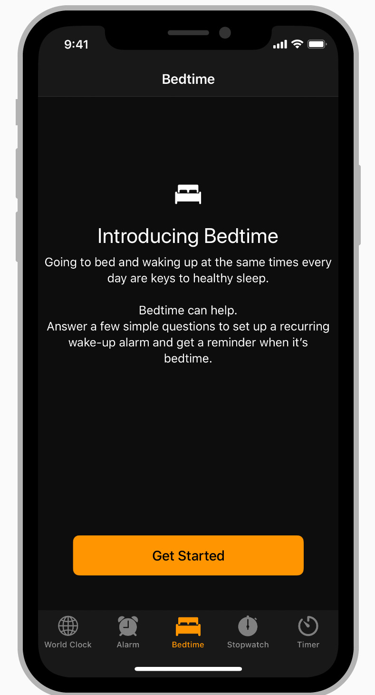
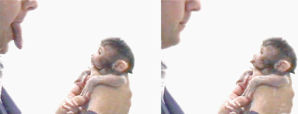
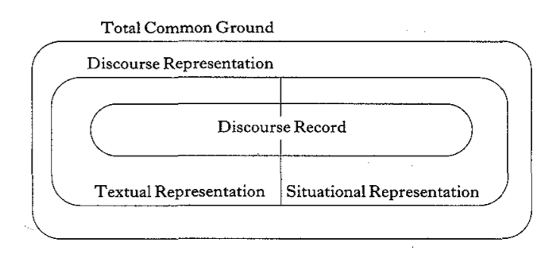
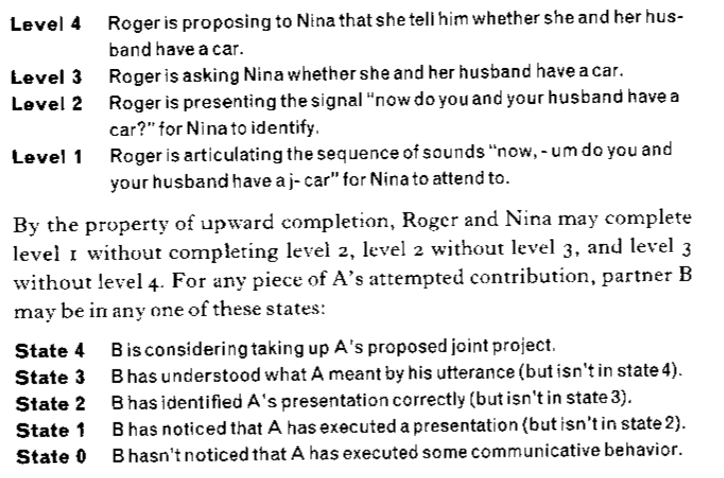
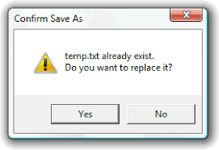

# How do we understand?
## 17 Oct 2017

---

## Outline

- Recap: Behavior is our medium
- What is dialogue?
- Linguistic patterns are design patterns
- Considerations for UX design

Note:

These are the many things we will touch upon:

- Linguistic patterns are design patterns
- Social coordination
- Joint activities (macro interactions)
- Frames
- Participant framework
- Layers
- Understanding is incremental
- Sequences (turns)
- Signals and communicative acts
- Conventions
- Common ground and belief updating
- Action ladders
- Speech acts
- Detecting and correcting error
- Information packaging
- Indexicality
- Routinizing the UI (micro-interactions)
- Multimodality

---

## "Behavior is our medium"
([Robert Fabricant, IXDA 2009 keynote](https://vimeo.com/3730382))

- Smart brains are lazy
    - Most brain activity supports unconscious processes 
    - We are pattern matchers
    - Emotion drives thought

*Leverage habits and established behaviors*

Example mentioned by Fabricant - "Purity Balls"

http://www.nytimes.com/2012/07/21/us/purity-balls-local-tradition-or-national-trend.html

Note:

Robert Fabricant spoke about "behavior is our medium". Up until now, we have focused on snapshots in time -- perception, attention, memory & recall, emotion. I've emphasized the moment of decision, and not so much the goals, intentions, and process linked to that decision.

Fabricant brought into view for us, the importance of a user's motivations, emotional state, and interaction during the course of a user's journey (aids testing in South Africa): approaching awareness, actively seeking information, during a testing event, and support following testing. But they also considered the importance of social bonds and channel for communication. To have sustained change you need to consider behavior from a macro-interactional perspective.

Thus, Fabricant focused on a number of examplars where design goals was intended for supporting and sustaining behavior change. And while not every design is concerned with changing behavior -- a persuasive design should be concerned with helping people achieve their goals -- and creating measurable **impact**. (Great example of "purity balls": it's not enough to have lots of ceremonies if the impact -- or behavioral change does not come as a consequence.

We also touched on habit (and we'll return to it later).

---

## Is this a dialogue?

Note:

This is certainly a dialogue act. 

- (Would you) answer a few simple questions.
- If you click "Get Started", this seems to be an acceptance.

The two acts together have the feel of "question-answer". 

---

## Is this dialogue?

Note:

This looks similar, but the human initiated. 

---

## *Both are human - computer dialogues*

Note:

Perhaps, you don't think of yourself as a dialogue designer, but you are!

---

## What about....?

- Q. Who was the first president of the United States?
- A. George Washington.
- Q. When was he born?
- ?

---

## Dialogue is multi-turn

Only this year, Amazon released a simple dialogue development kit. 
https://developer.amazon.com/docs/custom-skills/dialog-interface-reference.html

Why is it hard?
- Contextual expressions: for example, he/she/it, this/that/these..., here/there, yesterday/today...
- Pragmatic interpretation: "what you mean" versus "what you say"
- Error detection and repair

Note:

- Deictic expressions and those which refer to previous dialogue context

---

*Humans are inherently wired for conversation -- and conversation is a kind of joint action*

---

## Linguistic patterns are design patterns

Note:

Today we're going to focus on the relation between linguistic patterns and design patterns.

- F2F conversation the most natural means of interaction
- Until now, we've looked at decision-making as a discrete action, but interaction is continuous
- Conversation gives insight into how we organize, or package, information for comprehension, and how we exchange thoughts (much more than just information)
- Conversations move through time, but there are devices for using the physical and mental environment to make some objects more salient
- Conversation also gives insight into natural processes in error prevention, detection, and repair
- Finally, we will look at both macro-interactions and micro-interactions. Interaction viewed from both perspectives are important to design.

---

## Social coordination

*Empathy is the basis for social connection and cooperation*

Note:

There is a link between empathy & cooperation

Monkeys and people have neural systems in pre-motor cortex to coordinate complex actions. When you perform an action certain neurons fire; the same neurons fire when you see someone perform an action. Neural connections to the parietal cortex. These are tuned when you do something or see someone do something. Linked to your emotional system. If you see someone happy, you feel happiness. This is the basis of empathy. Empathy is the basis of social connection. How you are brought up matters? What you experience gets strengthened.

Early learning is important - half of neural connections die off by the age of 5.

People are inherently cooperative. And this is built into how we do everything, include communicate.

Points from another great talk from George Lakoff
https://www.youtube.com/watch?v=T46bSyh0xc0

---

## Joint activity (macro interactions)

<iframe width="560" height="315" src="https://www.youtube.com/embed/3YxXsQMAvWg" frameborder="0" allowfullscreen></iframe>

Note:

Examples: teaching, job interview, game, dinner party, task.

Store transaction - server, customer roles. What we say is partly defined by our roles. But people also have their personal identities, beliefs, feelings & desires.

People participate in joint activities to achieve goals.

In most joint activities, people pursue multiple goals - public and private goals. Business goal (transaction), procedural goals (doing this quickly and efficiently), interpersonal goals (remaining polite), private agendas.

Joint activities require coordination. Conventional procedures and language use.

Joint activities are composed of joint actions.
- Greeting
- Request assistance
- Pay for items
- Conclude

Joint actions can be coordinated because they divide into phases: they have identifiable functions and entry/exits.

Phases get coordinated.

Phases in conversation are turns which divide into intonation units. Entries and exists are marked in syntax, morphology and intonation. For example, intonation units begin on a high pitch, drop gradually over the unit, and end with a distinctive fall or rise. They also tend to have a focal accented syllable at or near the end. Found in all languages. Aids listeners to project exit times more accurately. Need for synchronizing actions.

People are surprisingly good at judging entry and exit times, as well as accounting for processing difficulty.

There are boundaries - entries and exits that each participant has to recognize and understand.

People agree on the joint activity, who takes part, what roles they play before committing to the part.

Various dimensions:
- scriptedness (Marriage ceremony versus encounter in a hallway)
- formality (formal meeting, gossip)
- verbalness (phone call, tennis game)
- cooperativeness (restaurant to competitive game)
- governance "side-edness" (greeting a colleague, versus student in a class)

---

## Frames

http://www.businessinsider.com/how-deceptive-sponsored-news-articles-could-be-undermining-trusted-news-brands-even-with-a-disclosure-message-2016-3

Example of [sponsored article](http://paidpost.nytimes.com/netflix/women-inmates-separate-but-not-equal.html?_r=0) on NYT

Note:

Even joint activities fall within and between frames.

"Change in our frame for events" (Goffman talks about alignment and stance)

Persistent feature of talk - though, most likely to change footing during certain (predictable) points during interaction

We change gears constantly during the course of an interaction (code switching)

- small talk to initiate and terminate a transaction
- enter into the business part of a conversation
- changes signaled by who is addressed, posture, dialect, etc.
- From Gumperz 1976
  I . direct or reported speech
  2.selection of recipient
  3. interjections
  4. repetitions
  5. personal directness or involvement
  6. new and old information
  7. emphasis
  8. separation of topic and subject
  9. discourse type, e g , lecture and discussion

Change in footing is a change in alignment - a change in our frame or stance - and this is reflected in how we both produce and comprehend language.

We can enact/mock someone else (as an actor). And, in fact, plays are embedded social scenes where this happens.

Meaning in Frames (Fillmore)

Imagine you are on the phone with a friend. Your friend yells, "Stop it!"

Language is understood with the context of frames. Not just the meaning, but from perspectives.

Study by Wojdynski and Evans found that 60% did not notice the sponsor disclosure label placed at the top of a sponsored ad.

"It also showed that readers are seven times more likely to recognize the labels that use some form of the words "advertising" or “sponsored,” than those which use more vague phrases like “brand voice” or “presented by.” Overall, only 20% of people in the study were aware that they were reading advertising, rather than objective, editorial content."

---

## Participant framework

[Goffman regions and audience segregation](https://youtu.be/OcFgCudciss?list=PLAZgQtqtqwF05EJW0CG3rMsE8jJrmA7BM)

*We design for an audience*

Note:

participants - visual & aural range. ratified or not (by-standers).

"Side participants and overhearers help shape how speakers and addressees act toward each other. They also represent different ways of listening and understanding" (Clark)

social situation - encounter (words signal phases). WH scene between Nixon and Thomas was an "embedded part of a ritualized political procedure, the ceremonial signing of a bill". Each has a role within the frame - each potentially has multiple social roles during the course of an interaction.

Evidence of structural significance of the social situation:
  - response cries
  - collusion / byplay (between subset of participants)/ crossplay (participants and bystanders)
  - changed language in deference to bystanders

Different sorts of talk (production formats): political addresses, monologues (videoblog), panel discussions

*Audiences are imagined recipients.*

---

## Layers

<iframe width="560" height="315" src="https://www.youtube.com/embed/gO-xmi1JgnE" frameborder="0" allowfullscreen></iframe>

Can you spot layers and footing changes in this video?

Note:

"what's up man -- I kee - how can I help you today"?
(overlapping) "hey"
"uh.. see what you guys have here"
visual search
(self) "smoothies"
move back to counter
alright... I'm going to go with a water and three cookies
alright.
so its gonna be a dollar, and a dollar 25, a dollar 50, and a dollar 75 (note gesture timing; and note that its obvious who is to pay)
alright.
here's this.
alright sweet.
break -- so what you do in a situation like this.

Note:

For example, someone telling a story in layer one may break out of the story to take a break or clear her voice. Layer two represents a meta-level above the story. And there can be more layers.

---

## Understanding is incremental

Note:

Most actions aren't sequential but over-lapping in time. They may not be so discrete but continuous, as well. Timing is important to understanding meaning -- not just the sequence.

Clerk: I'll be right there.
You: Okay.

Immediate response versus delayed response? Reluctant agreement or commitment?

---

## Synchrony and sequences

Two phases:

- Question | Answer
- Greeting | Greeting
- Invitation | (non) Acceptance
- Offer | (non) Acceptance
- Complaint | Apology / Denial
- Summons | Response
- Assertion | Assent
- Request | Acceptance
- Promise | Acknowledgement
- Thanks | Acknowledgement
-  Goodbye | Goodbye

Note:

Pre-sequences - set up for a joint action.
Discourse markers - signal for new topics, change of footing, difference of opinion, digression, etc.

"Oh, there's something I wanted to ask you"
"So..."

Adjacency pairs - two ordered utterances by different speakers. The form of the second depends on the form of the first.

Exchanges generally accomplished in phases: presentation and acceptance.

Requirement of positive evidence of understanding.

1. Assertions of understanding (could include backchannel response - uh-huh, m, I'see, nod)
2. Presupposition of understanding - speaker A continues speaking.
3. Displays of understanding - B displays understanding
4. Exemplification of understanding - paraphrase, iconic gesture, etc.

Researchers such as Birdwhistle, Kendon and others have studied synchrony and rhythm in conversation.

There is synchrony between speakers and also among speakers and listeners. Onset of gestures timed with prosodic rhythm of speech. Rhythm is crucial for conversation understanding and outcome. Comparable to musical performance.

Pitch is a carrier of non-verbal information (as body language) and speakers tend to synchronize with their conversational partners.

---

## Signals and communicative acts

*"The joint act of one person signaling another and the other recognizing what was meant is called a communicative act."*

Gaze is a signaling device that participates in turn-taking.

([Foulsham & Kingstone, 2005](http://journals.plos.org/plosone/article?id=10.1371/journal.pone.0136905))
]
Note:

Word and phrases are linguistic signals. They acquire meaning through convention.

Signals mean something, but they are also coordinating devices. If a server in a restaurant says, "I'll be right there", its a signal to coordinate our actions.

Eye gaze and body posture can also be used for signaling. These can also be communicative acts.

People generally adhere to a cooperative principle: Make your conversational contribution such as required, at the stage at which it occurs, by the accepted purpose or direction of the talk exchange in which you are engaged. This is a complicated way of saying that people generally say something relevant, informative, neither too much or too little, nor in some obscure/ambiguous way unless intended.

"Could you turn up the heat?"
"Yes" (but taken literally rather than as a request)

"I'm parked in a meter-ed spot"
"The university has garages"

Linguistic signals also participate in footing changes.

Student training video from earlier:
"Hey man"
"Can I help you"

---

## Conventions and coordinating devices

"Let's meet at 9"

Note:

External representations are important. Simultaneous and parallel representation. Objects in space. Items can be manipulated and exchanged.

People keep track of their moves and their partner's moves. It's not enough to predict what they will do next. People use some sort of coordinating device. You could do so by agreement (let's meet at 9). That, in itself is a joint action. Conventions can also be coordinating devices. Conventions are a group (or community's) solution to a coordination problem. "In North
America, leaving a tip at the table in a restaurant is a solution to the recurrent problem of how to help pay the waiter or waitress." (Clark 70)

---

## "Common ground" and belief updating

Common ground is cumulative:

- Initial state
- Current state
- Public events so far (if joint activity)
  - What is said (linguistic and other signals)
  - What is talked about (time, place, referents, etc)
  - What is officially on the record (discourse record)
- Private or off record (including prior, shared knowledge/beliefs)

Note:

When participants cooperate, they share a mutual expectation or belief about what the other will do.

Common ground is a pre-requisite for coordination. Interlocutors have an awareness of what is salient to the other (or shared salience). If agree to go out to supper together and you are choosing a restaurant, you will consider what you know of your partner. What food they may like, location, etc. You make a choice on what you take to be your partner's and your own common ground.

We synchronize by adding information to commmon ground taking into account mutual salience; we keep track of what we know in common via the conversation as well as shared background knowledge.

This is reflected in the language we use - shared referents.

There are costs to grounding, as well.

- Medium (co-present?)
- Production
- Updating
- Repair

Principle of least collaborative effort: people try to minimize total effort spent on a contribution in both presentation and acceptance phases

Compare language used by air traffic controllers and a casual communication.

---

## Action ladders

Note:

To succeed in joint projects (level 4), A & B need to ground what is taken to mean for B and to do that (level 3), they need to ground what A is presenting to B (level 2) and to do that they need to ground what behavior A is executing for B (level 1). Inference chain.

Principle of closure: Agents performing an action require evidence, sufficient for current purposes, that they have succeeded in performing it.

Elevator - light

Principle of least effort: All things being equal, agents try to minimize their effort in doing what they intend to do.

---

## Speech Acts

Note:

Utterances in conversation contain not only explicit meaning-based content but carry what is known as illocutionary force (John Searle). This force has something to do with intent; it performs a sort of action -- and sets up expectations in the minds of hearers. For example,

a directive: Shut the window.
an interrogative: Why here?
a declarative: The rain has started.
a cornmissive: The job will be done by three o'clock.

Cues to the intentional force of an utterance might be the presence of specific words, but could also be communicated by tone, loudness, rhythm, etc.

This is something challenging to do in text chat -- hence the popularity of emoticons and the reason people react to the marked use of all caps, punctuation, and other uses of text to convey intent and feeling.

There are various ways a designer uses acts to acknowledge, inform, respond, query etc. They can be used to change the state of belief and, therefore, update common ground.

---

## Detecting and correcting error in dialogue

<iframe width="560" height="315" src="https://www.youtube.com/embed/rXXKn27rQLA" frameborder="0" allowfullscreen></iframe>

Bohus example in a spoken dialog system: http://slideplayer.com/slide/4812415/

Note:

Speech - can create complex queries / interactions
Ambient technology - hands free
Dialogue requires little training

But still brittle so the study of error detection and repair is extremely important. Speech recognition, variability in speaking style, disfluencies, accents, input channels such as cell phone, VOIP, background noisy environment and overlapping speech

Two approaches in conjunction:
- Prevention
- Detect error and repair

Discourse processes contribute to both: for example,

Task structure
Gaze
Chunking
Adjacency pairs
Backchanneling
Confirmation

How do they do it? A process for preventing error repair.
Starbucks order (slot filling)

Every signal is part of presentation phase of a projected contribution. If there is trouble, a new project is initiated.

Repairs can also be initiated by the original contributor after seeing a mis-understanding in the partner's uptake.

"No, I meant..."

---

## Information packaging

  <iframe width="560" height="315" src="https://www.youtube.com/embed/ZBdQplMyWrs" frameborder="0" allowfullscreen></iframe>

Note:

How large a contribution should the two participants try to complete to minimize joint effort?

Limited by working memory.

https://www.youtube.com/watch?v=ZBdQplMyWrs

Depends on skill and purpose.

---

## Routinizing the UI (micro-interactions)

- "I don't know"
- "Cat in the ___"

This is a fairly complex contribution. What does this mean?

.footnote[http://ahiddendiscourse.com/blog/2013/05/17/routinizing-the-ui/]

Note:

When we learn language, concepts and patterns become entrenched with frequent use.

"I don't know" - You don't have to parse this to understand what it means. It's been routinized through repeated activation and use. Production and understanding require little cognitive effort.

If someone says: "cat in the _", you can fill in the blank. We chunk language into repeatable bits. These bits are linked frames. [Fillmore]

Priming is also at play. UI components share familiar patterns so that you don't have to think to hard about what they mean.

Interaction design patterns and linguistic patterns share much in common. But while we all know how to use language, it takes specialized training to produce good interaction design patterns.

- Designers don't get continuous feedback of understanding by the user
- Production is not linked to comprehension in a real time feedback loop
- Patterns of behavior may not be aligned with the intended interaction.

Dialogue boxes examples...

Easy to break design patterns:

- Information packaging
- Altering labels
- Altering positions of components
- Semantic mis-match between text and button labels
- Multiple choice tasks in a UI component

It's also easy to be complacent about design patterns.

---

## Indexicality

Image credit: McGlaughlin, F. (2011, December). Banner Ad Design. In Marketingexperiments.com (pp. 1–40).

Note:

Indexicality or deixis - "I". Or even, "I'm speechless" pointing to oneself from outside of oneself.

Deixis refers to indexical behaviors - those that point to something or some state of affairs: attention, person, time, place or physical object, event, description, attitude, social identity, curses, expletives, etc.

"I don't give a damn" - referencing Gone with the Wind.

- Icons - signify through visual representation
- Index - sign linked to its object by a relation (button, back and forward arrows)
- Symbol - represents an object by convention

Back to our paid, sponsored content example:

"Many readers who notice the disclosure label are unaware that it is linked to the content of the article, thinking instead that they are looking at an unconventionally-placed banner ad, Wojdynski told Business Insider."

This level of ambiguity could have consequences on trust of producers.

---

## Multimodality

Image from: http://groups.csail.mit.edu/vision/vip/lmorency.html

Note:

If we process multiple streams of perceptual information in parallel, what is context?

- We know knowledge, emotion, etc. have an effect on visual perception. What about speech (or language)?
  - pop-out visual features when distinguished by one
  - but attention required when looking for multiple different features at the same time.
  - there may be more of a continuum of reaction - not additive. Some interaction between channels with improved efficiency. Continuous incremental processing
- Does the converse hold? Does visual perception constrain real-time spoken language comprehension? (Deixis)

---

## Summary concepts

- Communication is social
- Think of your communications design from both a macro-interactional and micro-interaction perspective (task/joint action, communicative act)
- Be concerned with information packaging (chunking, salience) for comprehension
- Build in natural error prevention / detection / repair EVERYWHERE there is user interaction
- Support routinized interaction (consistency)

*We use the same social / cognitive mechanisms used in conversation for media interaction.*

---

*All forms of communication entail design, as the intent of communication is to be understood by others or by one’s self at another time. Communication design, then, is inherently social, because to be understood by another or by self at another time entails fashioning communications to fit the presumed mental states of others or of one’s self at another time.* (B. Tversky, 2010, p. 6)

---

## Discussion: Vy's question

*Could social relationships affect comprehension?*

---

## References

Clark, H. H. (1996). Using Language. Cambridge University Press.

Goffman, E. (1981). Forms of talk. University of Pennsylvania Press.

Searle, J. R. (1969). Speech Acts. Cambridge University Press.

Tversky, B. (2010). Visualizing thought. Topics in Cognitive Science, 3(3), 499–535.

---

## Next Week

- Papers: Tauhid, Guy, Widmarc
- How do we make decisions?
