# How do people make decisions?
## 24 Oct 2017

---
## Outline

- Review
- Biases and Heuristics
- Prospect Theory
- Choice Design

Note:

Most of the concepts we learned about relating to perception, cognition, memory, emotion etc. are reflected in language use. Since you, the designer, are responsible for designing communications for users in an interactive media, principles in face-to-face communication (also interactive) apply heavily. So we’ll review some examples within the context of design.

We’ll then move on to Kahneman again, since as you recall, the focus of his work has been on systemic and predictable bias in how people make decisions. 

Heuristics are essentially simple rules that people use to form judgements and make decisions. Such heuristics can lead to cognitive bias.

A cognitive bias is a systematic error in thinking or judgement where subjective factors lead to distortions in perception or thinking.

Because as a designer you want to positively influence users to make predictable decisions, understanding such heuristics and biases are key.

The second influentional body of work that Kahneman and Tversky contributed to behavioral economics is known as Prospect Theory. In this work, they studied how people make decisions on potential losses and gains in situations of risk, and estimate these losses and gains by using heuristics.

Finally, we’ll talk briefly about how you are not just a UX designer, but a choice architect. Framing choices is essential in driving behavior. Any potential action a user can take is a choice... whether reading content, clicking a link, or engaging with your site in the future. Richard Thaler, the author of the article “Choice Architecture" (which you will read next week), recently won the Nobel Prize in economics.

--- 

## Dialogue - Prediction

Note:

- We are pattern matchers
- Smart brains are lazy

*This image and those to follow from: http://www.creativebloq.com/ux/problems-81412676*

---

## Dialogue - Immediate Feedback

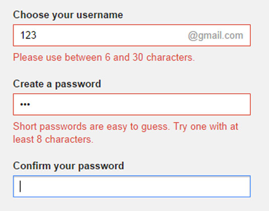

Note:

- We understand interactions as dialogue - dialogue is a joint activity
- We build common ground by exchanging thoughts
- There are costs to common ground, so we try to minimize collaborative effort

---

## Dialogue - Error prevention

Note:

- Leverage (and be cognizant of) habits

---

## Dialogue - Framing

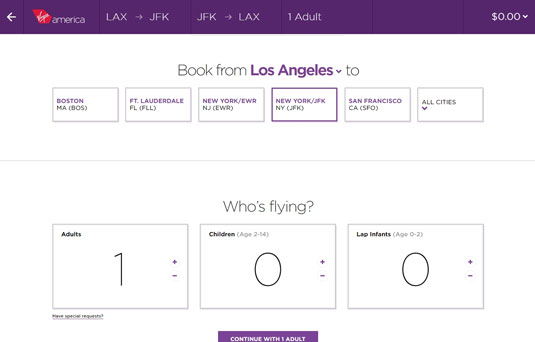

Note:

http://www.creativebloq.com/ux/problems-81412676

- What script are we in? (Comprehension)
- Johnson (chapter 12 pg. 174) gives a similar example and frames it as helping System 2.

---

## Dialogue - Salience

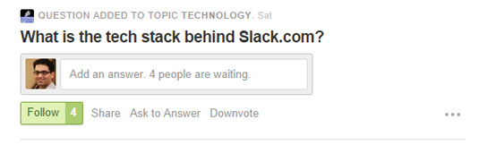
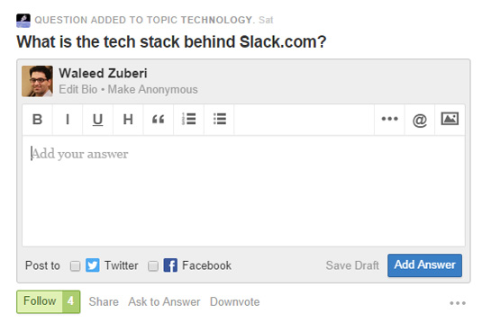

Note:

- Perceptual salience - objects should stand-out when they are the focus of attention.

---

##  Dialogue - Sub-dialogues & information packaging

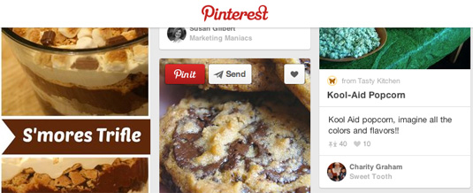

Note:

- Working memory is a limited resource.

You could also see this as information packaging, but when you think about sub-dialogues, imagine how conversations can be broken into smaller pieces, each with its own agenda.

---

## Kahneman & Tversky

[Judgement under Uncertainty: Heuristics and Biases](http://psiexp.ss.uci.edu/research/teaching/Tversky_Kahneman_1974.pdf)

image credit: http://www.slideshare.net/arjanharing/introduction-persuasive-technology-behavioral-economics

Note:

Kahneman (as Tversky had passed away) - Nobel prize in 2002 "for having integrated insights from psychological research into economic science, especially concerning human judgment and decision-making under uncertainty". They lay the foundation for a new field of research known as behavioral economics, which even today is generating new insights into human behavior in a myriad of contexts.

Their work on biases and heuristics went a long way toward explaining how people often simplify problems to answer difficult questions. We do not, in fact, think like computers and have a difficult time taking past evidence to make inferences about the future.

In their second work on prospect theory, K&A critique traditional models of decision-making where it assumed that people make decisions on the basis of rational thought. (It turns out that we have a hard time with this!)

Tversky, A., & Kahneman, D. (1974). Judgment under uncertainty: Heuristics and biases. Science. 1124-1131.

---

## Biases and heuristics

- Anchoring
- Availability 
- Affect
- Representativeness

Note: 

These are the biases from Kahneman that we will discuss. We’be talked about others, for example the Halo effect, but we won’t try to cover all possible cognitive biases.

---

## Moneyball

<iframe width="560" height="315" src="https://www.youtube.com/embed/pWgyy_rlmag" frameborder="0" allowfullscreen></iframe>

Note:

Warm-up video!

“Michael Lewis’s bestselling Moneyball is a story about the inefficiency of this mode of prediction. Professional baseball scouts traditionally forecast the success of possible players in part by their build and look. The hero of Lewis’s book is Billy Beane, the manager of the Oakland A’s, who made the unpopular decision to overrule his scouts and to select players by the statistics of past performance. The players the A’s picked were inexpensive, because other teams had rejected them for not looking the part. The team soon achieved excellent results at low cost." Kahneman, pg. 150

"The central premise of Moneyball is that the collective wisdom of baseball insiders (including players, managers, coaches, scouts, and the front office) over the past century is subjective and often flawed." (Wikipedia)

Based on statistical analyses, the Oakland A's considered that traditional statistics might be flawed and began to look for predictors of player performance that were under-valued by the market.

Question of similarity easier than liklihood (estimations off base rates).

---

## Anchoring - Setting a reference point

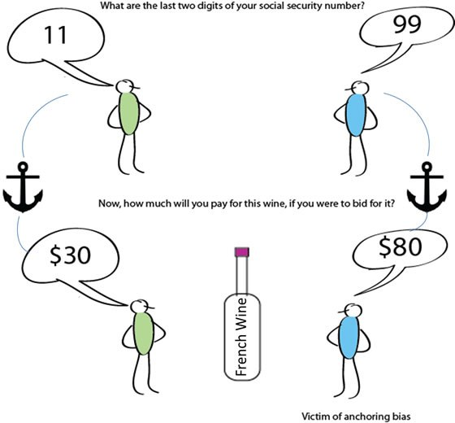

Image credit: http://quotesgram.com/dan-ariely-quotes/

Note:

Ariely experiment: Dan Ariely and his students would hold up a bottle of wine (or other object) and give a positive review. Then each student wrote down the last two of his/her SSN in the form of a price for that object. If the last two digits were 22, then the bottle of wine was priced at $22. Then the bidding began. 

“Sure enough, the anchoring effect scrambled their ability to judge the value of the items. People with high social security numbers paid up to 346 percent more than those with low numbers. People with numbers from 80 to 99 paid on average $26 for the trackball, while those with 00 to 19 paid around $9.”
https://www.inc.com/the-build-network/the-anchoring-effect.html

The anchoring affect accounts for "consideration of a particular value for an unknown quantity before estimating that quantity."

Back to Kahneman. He notes that System 1 is influenced by priming. He gives the example of an experiment from Mussweiler and Strack. Memories are more easily activated in the context of temperature (Is the annual mean temp in Germany higher or lower than 68/41 deg Fahrenheit). Priming of temperate affected the ease of access for recalling "summer" or "winter words".

Because System 2 makes its judgment using information retrieved by memory (an automatic process enabled by System 1), it is susceptible to biasing without conscious awareness.

- People adjust less when mental resources are depleted
- Affected by actions such as head nods / shakes
- Reference point sets the measure by which we judge

---

## Availability heuristic

*The availability bias describes the process of judging frequency by "the ease of which instances come to mind."*

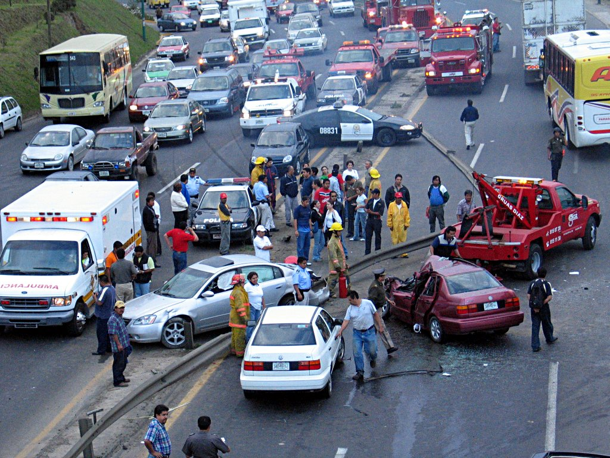

Note:

Which is more likely, death by accident or death by diabetes? At what ratio?

For example, Kahnemann cites work from Slovic, Lichtenstein and Fischoff where they surveyed participants to consider pairs of causes of death (diabetes & asthma, stroke & accidents). Death by accidents was judged to be more than 300 times more likely than death by diabetes, but the true ratio was 1:4.

”Unusual events (such as botulism) attract disproportionate attention and are consequently perceived as less unusual than they really are." pg 138

From our own experiences in recent times, Kahneman's statement that "estimates of deaths warped by media coverage which is biased toward novelty and poignancy" is particuarly applicable.

If you think back to Damasio, the "ease at which ideas of various risk that come to mind are inextricably linked to emotional reactions." There is "almost a direct representation of activation of ideas in associative memory."

---

## Representativeness: How many fish do you see?

*People make predictions based on how representative (similar) something is*

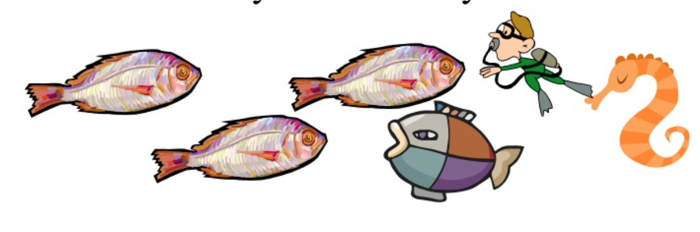

Image credit: http://www.slideshare.net/tchinton/unit7myers8thedpt2

Note:

- Humans are bad at statistics
- Question of similarity is easier than likelihood
- Intuitive impressions usually more accurate than chance guesses.

Note:

The Tom W case is a good example.

Tom W is a graduate student at the main university in your state. Please rank the following nine fields of graduate specialization in order of the likelihood that Tom W is now a student in each of these fields. Use 1 for the most likely, 9 for the least likely. business administration computer science engineering humanities and education law medicine library science physical and life sciences social science and social work

Kahneman, Daniel. Thinking, Fast and Slow (p. 146). Farrar, Straus and Giroux. Kindle Edition. 

In the absence of specific information about Tom W, you will go by the base rates and guess that he is more likely to be enrolled in humanities and education than in computer science or library science, because there are more students overall in the humanities and education than in the other two fields.

Kahneman, Daniel. Thinking, Fast and Slow (p. 147). Farrar, Straus and Giroux. Kindle Edition. 

Next comes a task that has nothing to do with base rates. The following is a personality sketch of Tom W written during Tom’s senior year in high school by a psychologist, on the basis of psychological tests of uncertain validity: Tom W is of high intelligence, although lacking in true creativity. He has a need for order and clarity, and for neat and tidy systems in which every detail finds its appropriate place. His writing is rather dull and mechanical, occasionally enlivened by somewhat corny puns and flashes of imagination of the sci-fi type. He has a strong drive for competence. He seems to have little feel and little sympathy for other people, and does not enjoy interacting with others. Self-centered, he nonetheless has a deep moral sense.

Kahneman, Daniel. Thinking, Fast and Slow (p. 147). Farrar, Straus and Giroux. Kindle Edition. 

Kahneman notes that even those trained in statistics fall prey to represenativeness bias.

---

## Representativeness and availability in UX?

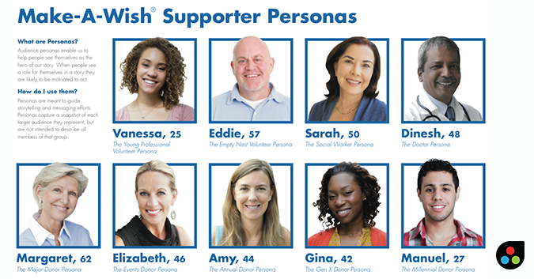

https://www.cooper.com/journal/2010/7/combating_availability_bias

Note:

"Availability biases leads to poor design decisions because they are based on single, potentially skewed, examples."

From Cooper.com:
"A well-crafted, research-based persona is an archetype that smooths out the idiosyncrasies of real individual people while retaining the patterns of needs and behaviors in the target market. At the same time, a persona retains enough human detail to feel like a real person. With practice and dedication, the persona becomes the first example that comes to mind. You still suffer from availability bias, but the bias is in favor of reality."

---

## Affect heuristic

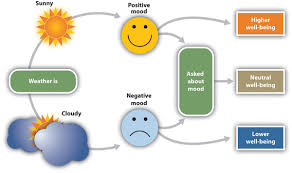

*Positive/negative words and themes influence decision-making*

Note:

“Slovic eventually developed the notion of an affect heuristic, in which people make judgments and decisions by consulting their emotions: Do I like it? Do I hate it? How strongly do I feel about it? In many domains of life, Slovic said, people form opinions and make choices that directly express their feelings and their basic tendency to approach or avoid, often without knowing that they are doing so. The affect heuristic is an instance of substitution, in which the answer to an easy question (How do I feel about it?) serves as an answer to a much harder question (What do I think about it?)." Kahenman, 138-139

---

## Affect in UX

- Focus attention on the user problem (for example, “Get dinner delivered faster” is better than “Fast food delivery online.”)
- Cut irrelevant info from your design. Every irrelevant message dilutes the relevant ones.
- Give users positive feedback when they solve a problem, and remind them what it was. “Congrats—you’re one step closer to inbox 0!” is better than “Congrats!”
- Use representativeness to frame something new and potentially scary/risky

From: https://uxmag.com/articles/the-3-most-powerful-heuristics-designers-can-use

Image credit: https://uxmag.com/articles/the-3-most-powerful-heuristics-designers-can-use

---

## Biases and Heuristics - Cheatsheet

Image from: https://betterhumans.coach.me/cognitive-bias-cheat-sheet-55a472476b18#.aokr2wkoj

Note:

What do marketing and advertising analysts study and understand well?

---

## "Anxiety: campaigns and certain media are engaging in a form of neurological warfare."

http://www.rollingstone.com/politics/features/why-were-living-in-the-age-of-fear-w443554

Note:

"So how is it possible to be living in the safest time in human history, yet at the exact same time to be so scared?"

"For mass media, insurance companies, Big Pharma, advocacy groups, lawyers, politicians and so many more, your fear is worth billions. And fortunately for them, your fear is also very easy to manipulate. We're wired to respond to it above everything else. If we miss an opportunity for abundance, life goes on; if we miss an important fear cue, it doesn't."

Availability is a process mediated by retrieval of memories. This means that we can be manipulated by tugging at our anxieties. Even, perhaps, creating anxiety.

Where fear is a response to a present threat, anxiety is a more complex and highly manipulable response to something one anticipates might be a threat in the future. "It is a worry about something that hasn't happened and may never happen," says LeDoux. It is an experience of uncertainty.

And that uncertainty is the exact lever that politicians regularly use to try to influence your behavior.

There are two particular ways, among many, in which living with these anxieties month after month can change your brain.

The first: "If you look at the cellular level of the prefrontal cortex and the hippocampus" – the thinking and memory-forming parts of the brain – "when you're living under constant states of fear and anxiety, you can actually see them shutting down," says Justin Moscarello, who works in LeDoux's lab. "They shrink. They wither. And the amygdala actually gets bigger."

The second way: Anxiety can turn to fear. Part of threat detection is learning, and the brain can create a false correlation when a stimulus that's not actually a threat activates the body's threat-response system.

---

## Buying a car - rationally

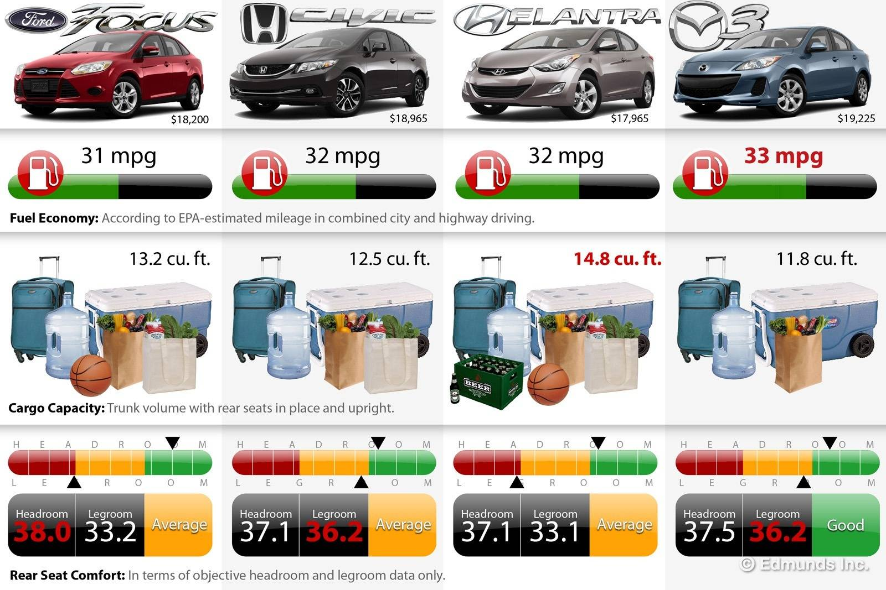

---

## People are predictably irrational

https://www.ted.com/talks/dan_ariely_asks_are_we_in_control_of_our_own_decisions

Note:

Does this seem crazy?

From an interview with Dan Ariely (https://www.theguardian.com/money/2008/may/20/consumeraffairs.economics):

"Economists know all about choosing jam," he says, ambling down an aisle with 73 varieties. He describes an experiment where academics set up a tasting booth in a store in California. On some days they put out six kinds of jam, on others 24. When the booth had 24 types, it was mobbed - "there was more colour, more excitement". But it was the sales that were truly remarkable: with six jams on show, 30% of customers bought a jar; when 24 were out, only 3% did. "Jams are hardly complex things, but people saw 24 stacked together and thought: 'I have no idea how to deal with this.'"

---

## Loss aversion

*You are offered a gamble on the toss of a coin. If the coin shows tails, you lose $ 100. If the coin shows heads, you win $ 150.*

Note:

Is this gamble attractive? Would you accept it?

We're designed to give more attention faster to bad things: we're highly sensitive to threats.

This works even for bad words (war, crime) and bad faces. Bad feedback has more impact that good. Good interactions are about avoiding the negative.

Asymmetry of intensity to avoid losses.

---

## Certainty

Note:

Decision makers tend to prefer the sure thing over the gamble (they are risk averse) when the outcomes are good.

They tend to reject the sure thing and accept the gamble (they are risk seeking) when both outcomes are negative.

---

## Framing effect (positive & negative)

- Treatment A or B?
- Total of 600 people

Note:

1981 Tversky and Kahneman study that asked participants to choose between two treatments, A and B, for 600 people affected by a deadly disease. (Asian disease problem)

Positive Frame:
Most chose program A: certain option over gamble.

Negative Frame:
Most people chose B: gamble

Re-framing is effortful:

- Amygdala associated with emotional arousal (KEEP / LOSE frames).
- Anterior cingulate associated with self control (System 2)
- Most rational subjects enhanced activity (and conflict) with activation of the latter region.

---

## Prospect Theory

image credit: http://www.sketchplanations.com/post/118976026701/prospect-theory-dan-kahneman-and-amos-tverskys

- Anchoring
- Loss aversion
- Certainty
- Isolation effect

Note:

Prospect theory is predictive of behavior. We are guided by both emotion and biases.

---

## Prospect theory in UX

*Which would be a better scenario for rewarding users who write product reviews?*

- Given all reviewers a coupon for 10% on next purchase?
- Offer a $1000 sweepstakes?

---

## Prospect theory in UX

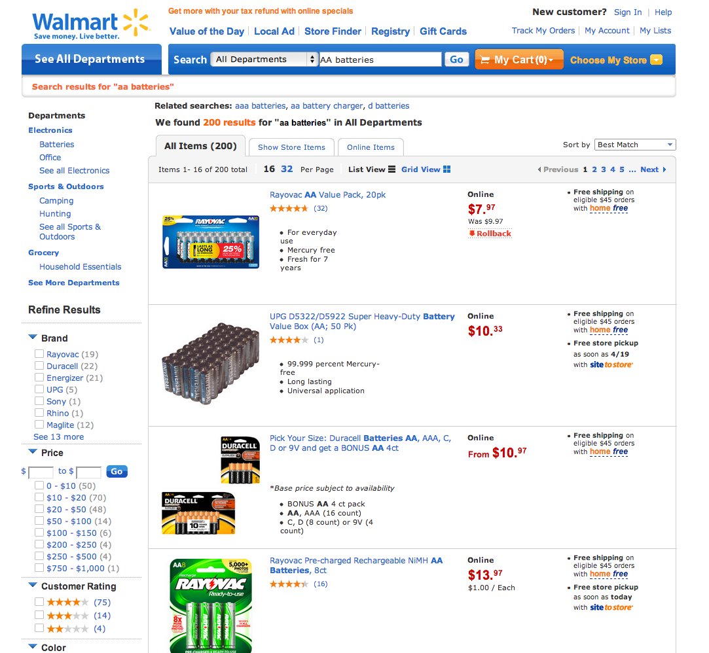

Note:

Does this work? Why?

People tend to try to focus on differences between options. (Isolation effect)

So simplify the number of differentiators for cognitive ease.

Collaborative filtering is another solution to a choice architecture problem - it simplifies, saves cognitive resources and search costs, thus making choice easier. (But it has risk, as well, which we'll discuss in the lecture on social networking.)

---

## Fourfold pattern

Image credit: http://www.burns-stat.com/review-thinking-fast-slow-daniel-kahneman/

Note:

Faced with a low probability of a gain, people buy lottery tickets.

Faced with a low probability of a loss, we buy insurance. (we're risk averse!)

We are risk averse when we have a high probability of a gain — we would rather accept a slightly low salary than risk not getting (or continuing) a job.

When there are no good options - we gamble.

---

## A puzzle for designers (Johnson)

Why -- when people are risk averse and the cost low, but impact large -- would they not purchase back-up and virus protection?

Note:

As Johnson mentions, statistics from 2012 indicate that the majority of users do as Prospect Theory predicts (17% of PCs have no virus protection; 31% of personal computers have lost all of their files). Nonetheless, how can designers nudge users even further?

Are we gambling? Does this mean there are no good options?

---

## Defaults and framing

Johnson, E. J., & Goldstein, D. (2003). [Do defaults save lives?](https://www8.gsb.columbia.edu/sites/decisionsciences/files/files/Johnson_Defaults.pdf). Science, 302(5649), 1338-1339.

Note:

This study indicated a disparity across countries in terms of organ donation behavior. It was very high in some countries (blue) and very low in others (gold)

(2003 study) Since 1995, more than 45,000 people in the United States have died waiting for a suitable donor organ.

1993 Gallup poll showed that 85% of Americans approve of organ donation.
- Less half had made a decision about donating
- 28% granted permission by signing a donor card.

This pattern repeated in several other countries.

Why might people not opt-in?

---

## Privacy context

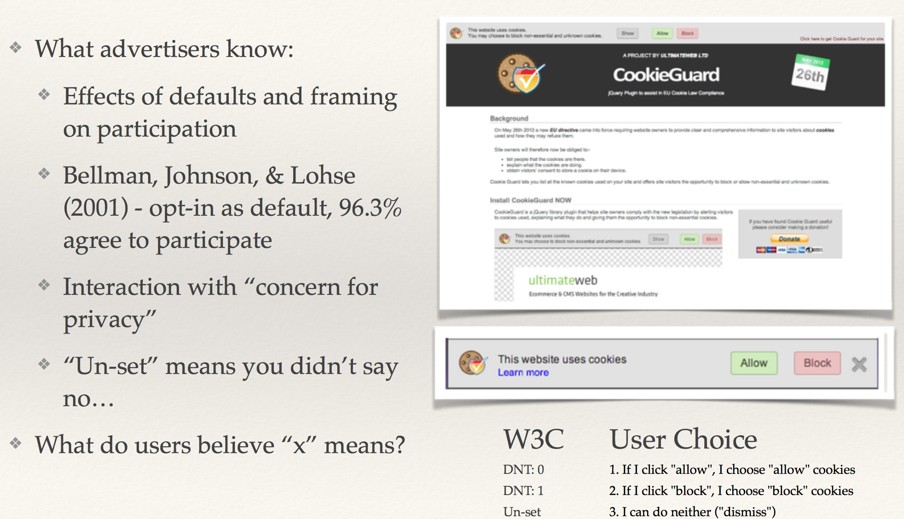

Note:

Here's a study in which there was no default.

In an experiment where most users stated that privacy was important, behavior in practice seemed to contradict this belief. They desire online privacy, but still accept cookies.

Many users simply click the cookie box away using the little 'x'. When asked later, more than half had reported a specific inference in all conditions. (This effect was even higher in mixed modal conditions.)

There are tangible, significant effects in comprehension (via inference) by changing:
- wording on/off, allow/block
- graphics + text vs text

We let System 1 take over and do the clicking without any thinking. Upon reflection, we may not even have understood what we were doing! Habit and repetition have powerful effects.

---

*"A choice architect has the responsibility for organizing the context in which people make decisions."*

Note:

Thaler, R. H., Sunstein, C. R., & Balz, J. P. (2014). Choice architecture. The behavioral foundations of public policy.

A good rule of thumb is to assume that "everything matters."

---

## Prospect theory in UX - Loss aversion

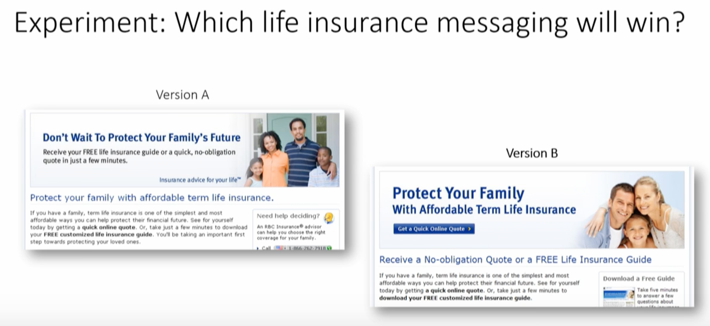

Which option do you think would be more successful?

Note:

Let's look at a choice.

Consider framing. Should you focus on pain/fear or not?

Marketingexperiments.com indicates 91% increase in downloads for version B.

*Design for users that will remember bad experiences more than positive ones.*

Why does this work?

---

## You are a choice architect 
Fear-based messaging

<iframe width="560" height="315" src="https://www.youtube.com/embed/PYm87nE7JGc" frameborder="0" allowfullscreen></iframe>

http://www.marketingexperiments.com/marketing-optimization/fear-based-messaging

Note:

"You influence and shape thinking through dialogue with users. You optimize thoughts as in a conversation. You want them to agree on proposals and continue to collaborate in interaction."

Tweet example: 3:20
10:45-15:20 "Does the value outweigh the cost" Focus on value. Message the value to the user.

---

## Choice architecture

- iNcentives
- Understand mappings
- Defaults
- Give feedback
- Expect error
- Structure complex choices

Note:

The more choices, the more choice architecture matters.

Incentives - Are choosers aware of incentives? Sometimes no. Home thermostats which indicate cost per hour to decrease usage.

Good example of mappings:
  camera megapixels - 4x6, 9x12, poster

Defaults

Give feedback - how well you are doing versus your neighbors for power usage? 

Expect error (drug dosages, email attachments, checklist for routine actions)

Structure complex choices - Collaborative filtering is a solution to a choice architecture problem - it simplifies, saves cognitive resources and search costs, thus making choice easier.

---

## Next Week

- Happy Halloween! Presentation/discussions only
- Journal (Kahneman)

---

## References (1)

- Ariely, D. (2008). Predictably irrational. New York: HarperCollins.

- Johnson, E. J., & Goldstein, D. (2003). [Do defaults save lives?](https://www8.gsb.columbia.edu/sites/decisionsciences/files/files/Johnson_Defaults.pdf) Science, 302(5649), 1338-1339.

- Kahneman, D., & Tversky, A. (1979). [Prospect theory: An analysis of decision under risk](https://www.princeton.edu/~kahneman/docs/Publications/prospect_theory.pdf). Econometrica: Journal of the econometric society, 263-291.

- Kahneman, D. (2011). Thinking, fast and slow. Macmillan.

---

## References (2)

- Marketing Experiments. Does fear-based marketing work? 05/18/2016. Retrieved from: http://www.marketingexperiments.com/marketing-optimization/fear-based-messaging

- Thaler, R. H., Sunstein, C. R., & Balz, J. P. (2014). [Choice architecture](https://papers.ssrn.com/sol3/papers.cfm?abstract_id=1583509). The behavioral foundations of public policy.

- Tversky, A., & Kahneman, D. (1974). [Judgment under uncertainty: Heuristics and biases](http://psiexp.ss.uci.edu/research/teaching/Tversky_Kahneman_1974.pdf). Science. 1124-1131.
