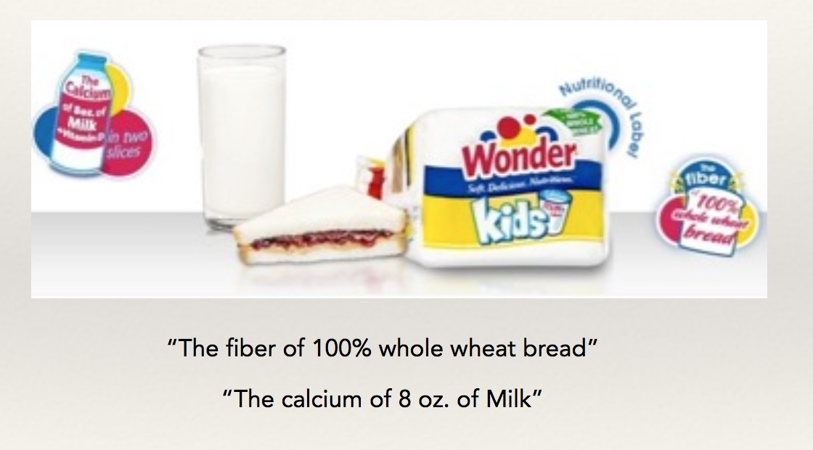
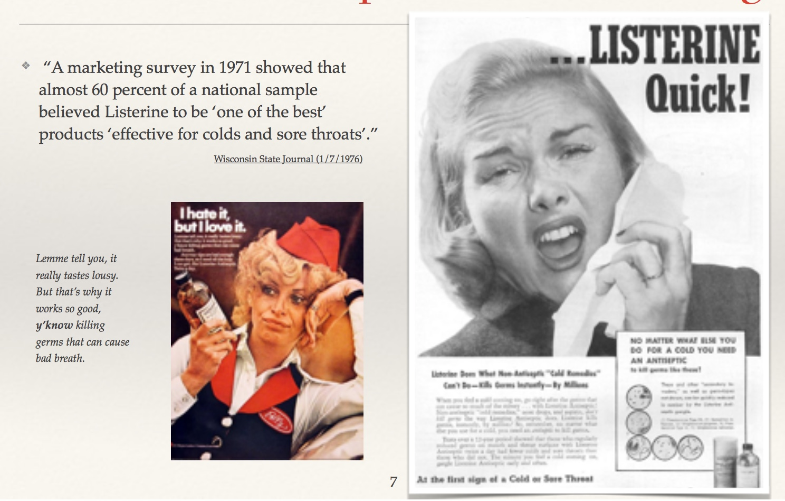
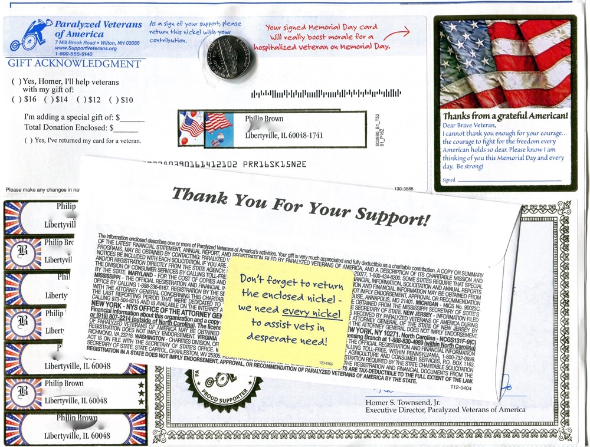
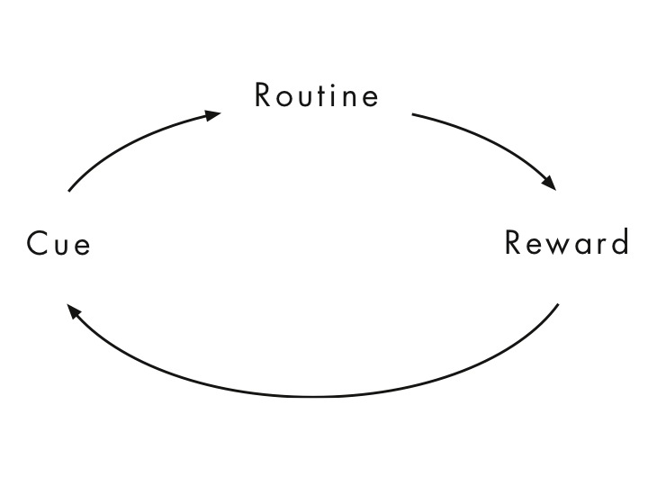
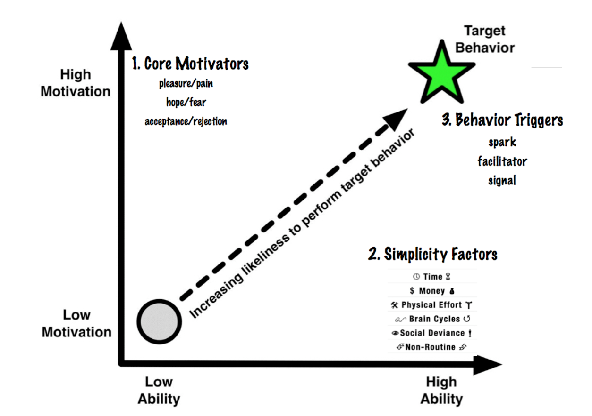

# How are people influenced through persuasion?
6 November 2018

---

## Outline

- Review
- Persuasion vs. manipulation
- Persuasion by social influence
- Persuasive design

Note:

---

## Review

- We believe what comes to mind easiest
- We remember bad things better
- We use anchors to estimate cost and effort
- We like sure things and are averse to loss - but liklihood matters

Note:

Prior learning points:
- Smart brains are lazy
- We are pattern matchers
- 98% of brain activity supports unconscious processes
- Thinking is only a limited part of what we do
- Emotion drives thought
- To reduce effort, we leverage habits
- We understand through dialogue - dialogue is a joint activity
- We build common ground by exchanging thoughts
- We influence and change thinking through dialogue
- There are costs to common ground, so we try to minimize collaborative effort
- We are choice architects - choices that people make are affected directly by our designs and how we've influenced thought.

---
## Deceptive?

Note:

What do you think? If you trust the advertiser, you probably understand these two statements differently than someone who doesn’t.

The fiber is derived from soy or cottonseed.
The calcium as added.

Wonder Bread has a history of deception
1971 FTC complaint - bread based on government standards promoted to appear particularly nutritious. “Uniqueness claim” when no different than other products:

- Wonder Bread is a standardized enriched bread
- It contains the same amounts and kinds of nutrients as most other enriched breads
- All enriched breads are required by law to contain minimum levels of certain nutrients
- Wonder Bread will not provide a child with all of the nutrients that are essential to healthful growth and development

---

## Persuasion and manipulation in advertising

Note:

What is persuasion? Geis (1982) Involves conscious evaluation by the recipient on the source message.

 Manipulation does not.

 "A statement or action can be said to be manipulative if it does not sufficiently engage or appeal to people’s capacity for reflective and deliberative choice." (Sunstein, 2016)

Persuasive use of language involves textual content and style: often through arguments advertisers use to get consumers to buy. Perhaps, less now than historically.

Packard (1957)
- "Nose counting" - what prospective customers said what they wanted and would buy if it cost no more than 'x', unsuccessful. What people said had little bearing on what they did when confronted with a situation. You can't assume people know what they want. "Moreover, you can't assume people will tell you the truth about their wants and dislikes even if they know them."

- Light beer example: 3:1 reported drinking it, but 9x more regular beer brewed and sold. " Do you drink the kind preferred by people of refinement and discriminating taste, or do you just drink the regular stuff?"

- Because marketers and advertisers felt that they could not rely on rational, conscious processes in direct interaction with consumers - they began to focus on the unconscious.

---

## How it works
*Implicature: What is meant versus what is said.*

---

## Other examples

- A lot more Chevrolet for a lot **less money** *compared to what?*
- The new Chevette has **more head room, more seat and leg room, more trunk room**
- Wartsoff contains vivaline and **you know** [anchoring] that vivaline removes warts instantly.
- **Choosy moms** choose Jif
- Introducing the **new**...

Note:

From Geis, 1982

- Conventional implicature. Relies on meaning inherent in words themselves (“She was poor but honest”)
- Conversational implicature. Makes reference to conversational situation: follows the conversational maxim of relation/relevance (under normal conditions, you wouldn't say something not relevant). You infer that Listerine is a “cold remedy” because its compared with cold remedies.

---

## What about retractions?

Note:

In fact, other claims were proven false. But, as Geis (1982) notes — forcing Listerine to add a disclaimer did not mean they would directly assert the falsehood. Conventional implicatures are less perceptually salient than assertions.

---

## Testing the bounds of persuasion

"If you do not do X, your chances of death from heart disease will triple!”

Note:

- Manipulation or persuasion?
- Is the framing manipulation?
- Ethnical or not?

"It is certainly reasonable to take the choice of the relative risk frame (which suggests a large impact on health) is an effort to frighten people and thus to manipulate them (at least in a mild sense)."

It's hard to avoid framing. But framing itself is not manipulation.

Is it justified if it saves a number of lives across a large population?

Sunstein, C. R. (2016). Fifty shades of manipulation. Journal of Behavioral Marketing, 213.

---

## Persuasion as social influence

Note:

Chinese prison camps in Korea (Korean War:
- "lenient policy" (psychological manipulation)
    - effective at gaining informants... why so effective at compliance?
- make a list of "how america is not perfect" and sign it
- read the list to other prisoners
- political essay contests with small prizes. Very mild pro-Communist/anti-American statements
- propaganda

Committing power of written statements; concessions to Communist dogma

- Procter & Gamble and General Foods run those “25-, 50-, or 100 words or less” testimonial contests.

Cialdini PhD, Robert B. (2009-05-28). Influence: The Psychology of Persuasion (Collins Business Essentials) (p. 61). HarperCollins. Kindle Edition.

---

---

Note:

Disabled American Veterans org mails out requests for contributions:
- 18% success for basic appeal
- 35% success free personalized address labels included

Why?

Cialdini pg. 76

Societal norm that obligates people to repay in kind.
- free samples
- free in-home inspections
- free workouts
- "charitable gifts" (not allowed for public servants)
- favors

People feel obliged to repay in kind. Why?

Principle of Cooperation (tendency to move toward common ground and achieve common goals)

Get a smaller concession (Rejection-then-retreat)

Perceptual contrast; side effects of feelings of responsibility and satisfaction

---

## Reciprocity

---

Note:

Public commitment to a cause.

"Joseph Schwarzwald of Bar-Ilan University in Israel and his co-workers nearly doubled monetary contributions for the handicapped in certain neighborhoods. The key factor: two weeks before asking for contributions, they got residents to sign a petition supporting the handicapped, thus making a public commitment to that same cause." p. 78.

---

Note:

- Reinforced pathway; small movement in a direction, makes it easier in the future
- Principle of least effort
- Coherent (consistent) behavior

Brings change and effects that last. No need for continued reinforcement.

---

## Consistency and commitment

---

Note:

- canned laughter
- salted tip jars
- advertising "fastest growing"
- likes, views...
- "Werther effect" (suicide statistics). For every front page statistic, an average of 58 more people more than usual killed themselves.

---

## Social proof

Note:

If you are unsure or don't know how to behave -- look to others.

Development of social norms -- what is correct in society?

This can backfire. Don't focus on the negative or undesirable behaviors of others (Werther effect). This will make the undesirable behavior more salient and can actually increase it.

---

Note:

People say 'yes' to those they like.

- Tupperware parties. Company arranges for its customers to buy from a liked friend rather than a salesperson.
- Physical attractiveness
- Similarity or rapport
- Compliments
- Good guy bad guy routines

People tend to say "yes" to those they like.
"Us versus them" - social connection.

---

## Liking

---

Note:

---

## Authority

Note:

Milgrim study
http://www.age-of-the-sage.org/psychology/milgram_obedience_experiment.html

1974 Experiment at Yale University

 The fictitious story given to the "teachers" was that the experiment was intended to explore the effects of punishment for incorrect responses on learning behavior.

1955 study - a man could increase by 350% the number of pedestrians who would follow him across a street if he were wearing a suit and time (mark of authority).

4 out of 5 doctors recommend....

---

Note:

- limited time only
- promotional foods in cafeterias
- scarcity of product x scarcity of information (no one else knows this...)

---

## Scarcity

---

## Social influence

- Reciprocity
- Consistency and commitment
- Social proof
- Liking
- Authority
- Scarcity
- ?

---

### Persuasive systems may be defined as “computerized software or information systems designed to reinforce, change or shape attitudes or behaviors or both without using coercion or deception.”
Oinas-Kukkonen & Harjumaa 2008

---

## Some tools for persuasive design

- **Support for visual thinking**
- **Support for understanding and social cooperation**
- **User motivations and values**
- **Habit loops and behavior modeling (next)**

Note:

- **Support for visual thinking**
 - Design for visual queries (e.g., clear display; repeated experience; primed ideas)
 - Attentional guidance
 - Task breakdown (perceptual chunking, cognitive threads)
 - Memory support
- **Support for understanding and social cooperation**
 - Signals, information packaging, conventions, and timing
 - Multimodal and memorable messages
 - Error detection & repair
 - Acceptance / commitment
 - Appearance (authority/trustworthiness/competency/liking)
 - Reciprocity
 - Social proof
 - Coherence (consistency)
 - Cognitive ease (e.g., defaults, mappings, simplifications, familiarity)
 - Positive mood
- **User motivations and values** (ethnographic research; personas)
- **Habit loops and behavior modeling (next)**
---

Note:

Trigger feature. Male robin will act as if a rival has entered its territory on a clump of red robin features. And also ignore a stuffed replica of a male robin without a red breast.

“Called fixed-action patterns, they can involve intricate sequences of behavior, such as entire courtship or mating rituals. A fundamental characteristic of these patterns is that the behaviors that compose them occur in virtually the same fashion and in the same order every time. It is almost as if the patterns were recorded on tapes within the animals.” Cialdini

"Excuse me..."

---

## Remember the habit loop?

https://youtu.be/W1eYrhGeffc

Note:

"Automatic, stereotyped behavior is prevalent in much of human action, because in many cases it is the most efficient form of behaving, and in other cases it is simply necessary." Cialdini

---

## Fogg's behavior model

This model posits that three elements must be present for a behavior to occur:
- motivation
- ability
- trigger

When a behavior does not occur, at least one of these three elements is missing.

behaviormodel.org

This is not a predictive model like Prospect Theory: it's more of a heuristic. But you can think of "ability" in terms of cost. Is it worth the effort (value) to perform the behavior?

Note:
A model that gives us a way to think about behavior change.

If you had direct insight into a user's habit cycle - cues, routines and rewards - and you knew exactly where they were in this cycle at any point in time - this would be easy.

But you probably don't. (Though, advertisers may.)

You can still make use of cues as a behavior trigger. In addition, you need to understand user motivations and what you can do to make it easy for them to adopt the behavior you want.

Some new ideas from Fogg, 2009: triggers.

Spark trigger - "When a person lacks motivation to perform a target behavior, a trigger should be designed in tandem with a motivational element. I call this type of trigger a “spark.” Examples of sparks can range from text that highlights fear to videos that inspire hope."

Facilitator - "For example software updates often use facilitators to gain compliance by implying that one click can get the job done." High motivation, but lacks ability.

Signal - button "click here". Ability and motivation are there.

---
## How do we think about simplicity?

"Simplicity is a function of a person’s scarcest resource *at the moment a behavior is triggered*."

Note:

Fogg, B. J. (2009, April). Creating persuasive technologies: an eight-step design process. Persuasive '09, Claremont.

---

## A Compelling Case Study

1. Tell a story.
2. Focus on the characters.
3. Why should we believe that your solution would be effective?

Note:

- The power of narrative can't be understated.
- Direct attention toward your target customers/clients/users
    - What is THEIR problem?
    - What do they value?
    - What motivates them?
    - What drivers and rewards?
    - Quotes are great.
- Use science to help explain the problem and to back-up your solution.
    - What levers can you use?
    - How would you measure the effectiveness of your solution?

---

## Case Study Rubric

- The challenge problem (5 points)
- The target user population (5 points)
- Your design solution for nudging behavior and your desired outcome (5 points)
- Design decisions that link to scientific concepts explored in this class (5 points)
- How you might evaluate the effectiveness of your design (5 points)
- The most useful concept(s) or interesting idea(s) you drew from the class (5 points)

Note:

- 10 minutes with up to 5 for Q&A

---

## Next Week

- Culture 

---

## References

- Cialdini, R. B. (2001). The science of persuasion. Scientific American, 284(2), 76-81.

- Cialdini, R. B. (2006). Influence: The Psychology of Persuasion.

- Fogg, B. J. (2009, April). Creating persuasive technologies: an eight-step design process. In Proc of the 4th Int Conf on Persuasive Tech.

- Fogg, B. J. (2003). Persuasive Technology: Using Computers to Change what We Think and Do. Morgan Kaufmann.

- Fogg, B. J. (2009, April). A behavior model for persuasive design. In Proc of the 4th Int Conf on Persuasive Tech.

- Geis, M. L. (1982). The language of television advertising. Academic Pr.

---

## References (continued)

- Oinas-Kukkonen, H., & Harjumaa, M. (2008, June). A systematic framework for designing and evaluating persuasive systems. In International Conference on Persuasive Technology (pp. 164-176). Springer Berlin Heidelberg.

- Sunstein, C. R. (2016). Fifty shades of manipulation. Journal of Behavioral Marketing, 213.

- Vance, P. (1981). Hidden Persuaders.
