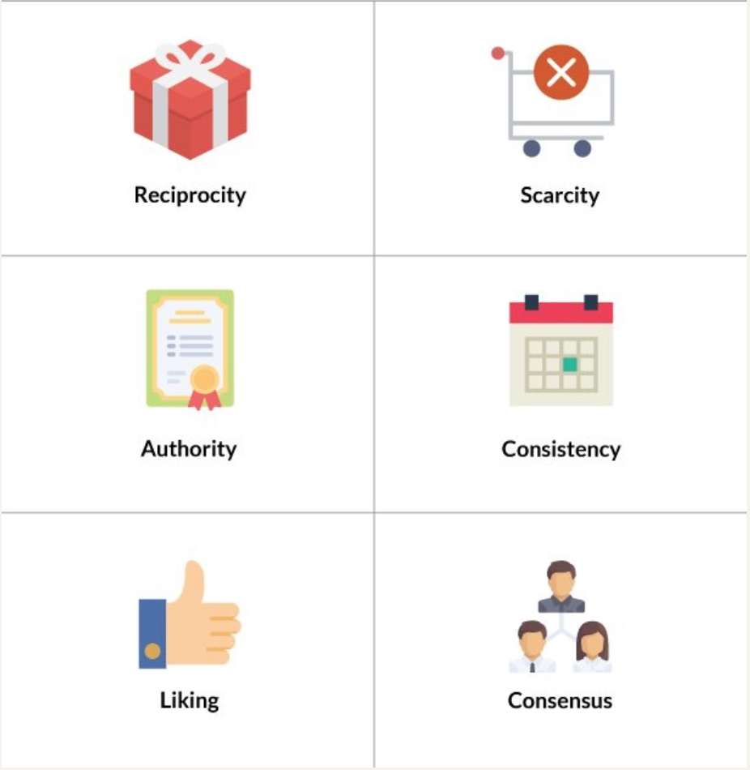
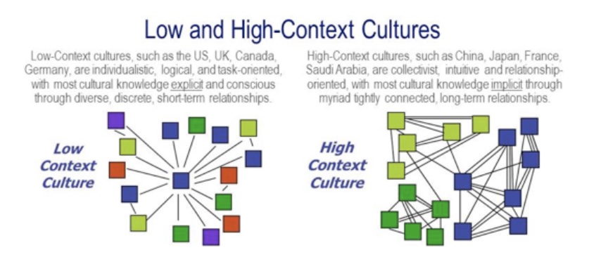
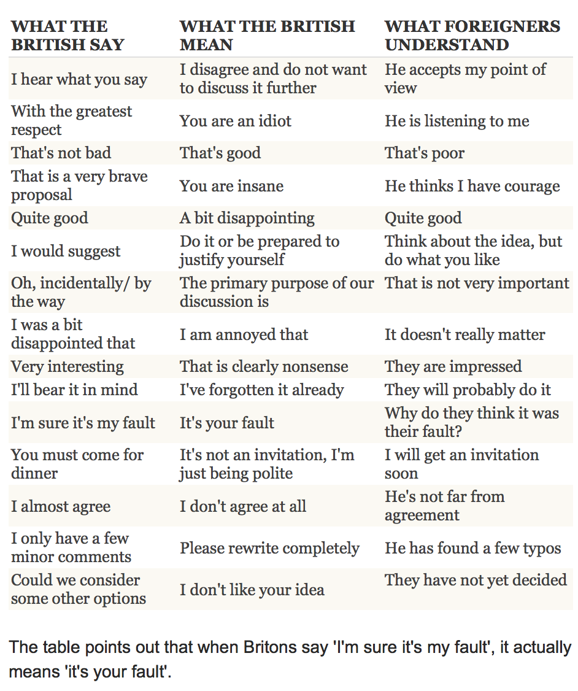
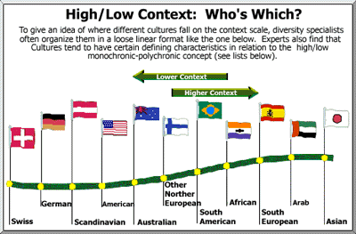

## How does culture affect thinking?
13 Nov 2018

---

## Outline

- Review (Persuasion)
- What is culture (according to Hall)?
- What affect might it have on thinking?
- How might it influence design?

---

## Objectives

- Gain an appreciation for how culture affects interface design

---

## Cialdini - influence

Note:

https://www.influenceatwork.com/principles-of-persuasion/

---

## Persuasion (call to action)

- Is the user sufficiently motivated?
- How easy is to take action?
- Is there a trigger **trigger**?

Note:

The Fogg Behavior Model is a simple one to adopt. In this model, timeliness is very important:  "for a person to perform a target behavior, he or she must (1) be sufficiently motivated, (2) have the ability to perform the behavior, and (3) be triggered to perform the behavior. These three factors must occur **at the same moment**, else the behavior will not happen."

Fogg, BJ. A behavior model for persuasive design (April 26-27 2009). Persuasive '09', Claremont CA.

To be effective, you need to understand your user and what motivates them, what is difficult, and when a trigger can be applied.

---

## Hofstede and Hall

- https://4squareviews.com/2012/12/19/six-sigma-green-belt-define-team-dynamics-and-hofstedes-cultural-dimensions/
- http://blog.usabilla.com/ux-designers-culture-affects-your-job/img3/

Note:

There are two prominent models referred to in interaction design research.

Gerard Hofstede was a social psychologist in the area of organizational culture who studied cross-cultural groups. While working at IBM, he created an employee opinion survey for over 70 IBM subsidiaries around the world. He continued to travel and collect large amounts of data.  In 1971 he took a sabbatical to finally study this data. With 100K questionnaires and additional data he collected as a visiting lecturer, he began to analyze his data. Today, Hofstede's model is referred to as 'value' or 'cultural' dimensions and have now been compared with other value survey research (World Values Survey.)

There are a number of criticisms of Hofstede's model. For example, it is based upon aggregate data and does not apply to individuals. It also presumes uniformity across cultures and has issues with other sorts of validity such as construct validity in its application to interaction design.

For this reason, we focus more on the work of Edward T. Hall. He was an anthropologist who also studied cross-cultural communication. Instead of focusing on an entire culture, he focused his attention to small moments of interaction. In particular, he focused attention on communication across cultures. For this reason, we focus on Hall. However, both the works of Hofstede and Hall have value in consideration of cross-cultural design.

Hofstede - 6 cultural dimensions. From: How Do Design and Culture influence Digital Marketing?https://www.conversion-uplift.co.uk/cultural-factors-in-web-design/

1. The Power Distance Index – How is power distributed in a culture? The Power Distance Index is the degree to which people accept and expect inequality in a society. Cultures that score low on this dimension will seek to reduce the level of inequality and expect justification for where it does exist.
2. Individualism versus collectivism – Is a personʼs self-image defined by “I” or “we”? In Western cultures, we tend to focus on the needs and wants of the individual. Conversely, Eastern cultures place the needs of the collective ahead of individual.
3. Masculinity – Does a culture have a preference for achievement, heroism, assertiveness and material rewards? If so, to what degree? In this context, femininity translates to collaboration, modesty, caring and quality of life.
4. Uncertainty Avoidance – How comfortable does a society feel with uncertainty and ambiguity? A high score indicates a society that has formal rules and policies and are often intolerant of unorthodox behaviour and ideas. They also like to plan for every eventuality and are more concerned about product specifications than societies that score lower on this dimension.
5. Long Term Orientation – This describes a cultureʼs time orientation – long- term vs short term. Scoring low means a culture favours long-standing norms and is suspicious of societal change. Cultures that score high are pragmatic and take a long-term view of business.
6. Indulgence versus Restraint – Does a culture restrain or indulge in fun and instant gratification? A high score means a culture
encourages instant gratification and enjoying life and having fun. Low scores reflect strict social norms which suppress indulgent behaviour.

---

## Beyond Culture

Note:

*Edward T. Halls theory was intended to provide the means for evaluating communications within a culture.*

Hall speaks of group with similar experiences and expectations from which inferences are drawn. This is reminiscent of work done by sociologists like Goffman where changes in footing reflect in-group and out-group stance.

---

## Screening function of culture

*Ethnographic study of users is important because it stresses the importance both internal and external contexting.*

Note:

"One of the functions of culture is to provide a highly selective screen between man and the outside world. In its many forms, culture therefore designates what we pay attention to and what we ignore. This screening function provides structure for the world and protects the nervous system from "information overload." Hall

According to Hall, communications consists of:

Message
Internal contexting - schemas, scripts
External contexting - situation or setting

It is nearly impossible to separate the individual from the environment in which he functions.

"We labor under a number of delusions, one of which is that life makes sense; i.e., that we are sane. We persist in this view despite massive evidence to the contrary. We live fragmented, compartmentalized lives in which contradictions are carefully sealed off from each other. We have been taught to think linearly rather than comprehensively, and we do this, not through conscious design or because we are not intelligent or capable, but because of the way in which deep cultural undercurrents structure life in subtle but highly consistent ways that are not consciously formulated." McLuhan 1960, 1962

Edward Hall and Marshall McLuhan were contemporaries. Hall influenced McLuhan and affected the latter's theory about the impacts of communication technology on the human senses.

---

## Marshall McLuhan

Note:

McLuhan is known for coining the expression "the medium is the message" (Understanding Media: The extensions of Man). He proposed that the a medium itself should be the focus of society.

Image credits:

http://blog.usabilla.com/ux-designers-culture-affects-your-job/img3/
https://www.ccpa-accp.ca/the-medium-is-the-message/

---

## Learned or innate?

Note:

Implicature again!

Models of culture have different levels of behavior:
- overt versus covert
- implicit and explicit
- things you talk about and things you don't

Culture is:
- learned and not innate
- facets of culture are interrelated
- shared and defines the boundaries of different groups

---

## Culture is a medium

Note:

"Culture is man's medium" and carries meaning and structure in such a way to direct our attention to specific information in our environment. Personality, expression, thinking, moving, solving problems, organization of cities and transportation, economy, government.

Example: welfare case worker office should be private, but not private because such workers do not rank high enough for an office. The size of an office generally reflects social status.

Context carries meaning. The code or message is incomplete without context.

---

## Hall's 5 dimensions

Hall refers to five dimensions affecting perception:
1. **Activity**
2. **Situation**
3. **Status in a social situation**
4. **Past experience**
5. **Culture**

Note:

- Legal proceeding, for example
- Court of law - includes place, time, actors
- Status and role of participants
- What has been experienced before?

- Shifting context can be regarded as communication (I believe he means something like change in footing)

Do you see how top-down processes can affect perception and habits? How information is encoded in terms of culture?

---

## High and low-context cultures

http://www2.pacific.edu/sis/culture/pub/Context_Cultures_High_and_Lo.htm

Note:

HC systems have more information in the receiver and setting. Fast, efficient, satisfying. Need common ground. Stable.

Every culture and situation has high and low aspects

High
- less verbal explicit communications
- multiple cross cutting ties
- long term relationships
- strong boundaries
- dense networks
- knowledge situational
- decisions focus around f2f relationships

neighborhood restaurant with regular clientele

Low
- role-oriented
- more codified knowledge
- sequencing, separation of activities in time and space
- more interpersonal connections of shorter duration
- loose networks
- knowledge more transferable - transient
- task-centered activities

chain supermarket

Need to adapt and change - LC

---

## Meaning

Note:

HC message is one in which the most of the information is either in the physical context or internalized in the person.

LC communication is the opposite where the mass of information is in explicit code.

Code, context and meaning different aspects of a single event.

Kluckhohn and Leighton - The Navaho. Verb oriented children (loosely structured adjectival language) had difficulties in white schools because the two groups attend to entirely different things in nature. 1946

In Japan, silence is a virtue. Less likely to enter into a discussion to offer personal opinion. Strong non-verbal communication.

Chinese language has changed little in 3000 years. The need for context is experienced when using a dictionary. To find a word for star, look under the sun radical. And to know this, you need to know something about Chinese history. You also need to know the spoken pronunciation.

Chinese express their ideology in language: certain speech is permitted, some is forbidden. In official communications, very slight differences in language can point to profoundly different interpretations.

Two headlines - one word difference.

Former First Lady of Taiwan
Wu Shu-chen visits US, talks about Taiwan's democratic story.
Wu Shu-chen: Washington D.C. speech propagates Taiwan's democracy.

English version: First lady ready to stand up for her island on upcoming US trip.

All describe the same situation, but signal social or political opinions of the newspaper about the events. Seemingly minor difference is significant.

---

## Neurological variation?

Image: https://sites.ualberta.ca/~tmasuda/stimuli.htm
]

Note:

Analytic versus Holistic

 Nisbett proposes that cultures stemming from "Greek tradition" can be described as analytic such that the focus of attention is on some salient object, has particular attributes, and operates on the basis of rules governing its behavior.

 Ancient Chinese tradition tends to be holistic such that Chinese attend to the field in which a salient object is located. Instead of logical rules, Chinese philosophers look for dialectical schemas in making judgements about the behavior of objects and individuals.

Culture influences:
- Visual perception
- Memory - Cultural variation in holistic versus analytic thinking styles affects how people encode and retrieve information
- Emotion - people exhibit greater amygdala response to fear faces expressed by own- relative to other-culture members
- Social cognition - Individualists think of themselves as autonomous form others, while collectivists think of themselves as highly interconnected with others (Markus & Kitayama). Recent evidence from social neuroscience indicates that specific brain regions, such as the medial prefrontal cortex (MPFC) and posterior cingulate cortex (PCC) are involved in self-evaluation and self-knowledge

Masuda and Nisbett (2001) examine whether East Asians attend to context more than Americans. Results show that 1) Japanese attend more to contextual information and relations than did American study participants and 2) they recognize objects more accurately when seen again in their original settings than when in novel settings. Masuda and Nisbett provide an explanation of differences in terms of cognitive and perceptual orientation. This supports previous studies that refer to thinking as holistic versus analytic. This study adds to a large body of cross-cultural findings concerning human attention and provides evidence for attentional differences as an important factor contributing to cultural differences in higher cognitive mechanisms.

---

## Application to design

- Text important
- Clear, direct communication
- Visual order and structure
- Strong foregrounding
- Supports sequential reading pattern

- Heavy use of graphics
- Less text
- More animation
- Harmony between background and foreground
- Harmony among content areas

Note:

Eye fixations:

http://www.ijdesign.org/index.php/IJDesign/article/view/267/163

Localization is not limited to translating elements on a webpage. It's understanding cultural differences.

Some reported considerations:

- Individualism versus collectivism
- Explicit versus implicit communication
- More or less verbal information

---

## MacDonalds

Note:

http://www.yetanotherstudio.com/2011/03/21/mcdonalds-around-the-world-website/

https://en.wikipedia.org/wiki/List_of_countries_with_McDonald%27s_restaurantsÓ

http://www.globalpropaganda.com/articles/TranslatingColours.pdf

---

## Pizza Hut

---

## Coca Cola

---

### References

- Bas, J. (2011). UX Designers: Culture Affects Your Job. Retrieved from: https://usabilla.com/blog/ux-designers-culture-affects-your-job/

- Cardon, P. W. (2008). A Critique of Hall's Contexting Model A Meta-Analysis of Literature on Intercultural Business and Technical Communication. Journal of Business and Technical Communication, 22(4), 399-428.

---

### References

- Chang, Yin-Sin, "Cultural differences in the context of fast food website design: a comparison of Taiwan and the United States" (2015). Graduate Theses and Dissertations. 14796.

- Cole, N. (2005). How Do Design and Culture influence Digital Marketing? Retrived from: https://www.conversion-uplift.co.uk/cultural-factors-in-web-design/

- Hall, E. T. (1989). Beyond culture. Anchor.

---

### References

- Markus, H. R., & Kitayama, S. (1991). Culture and the self: Implications for cognition, emotion, and motivation. Psychological review, 98(2), 224.

- Masuda, T., & Nisbett, R. E. (2001). Attending holistically versus analytically: comparing the context sensitivity of Japanese and Americans. Journal of personality and social psychology, 81(5), 922.
