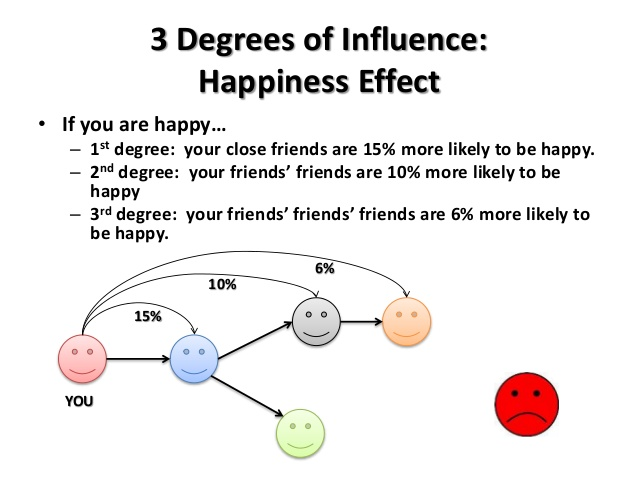
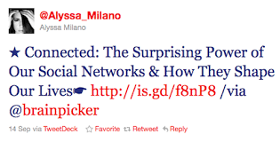
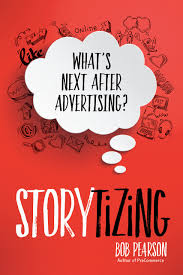
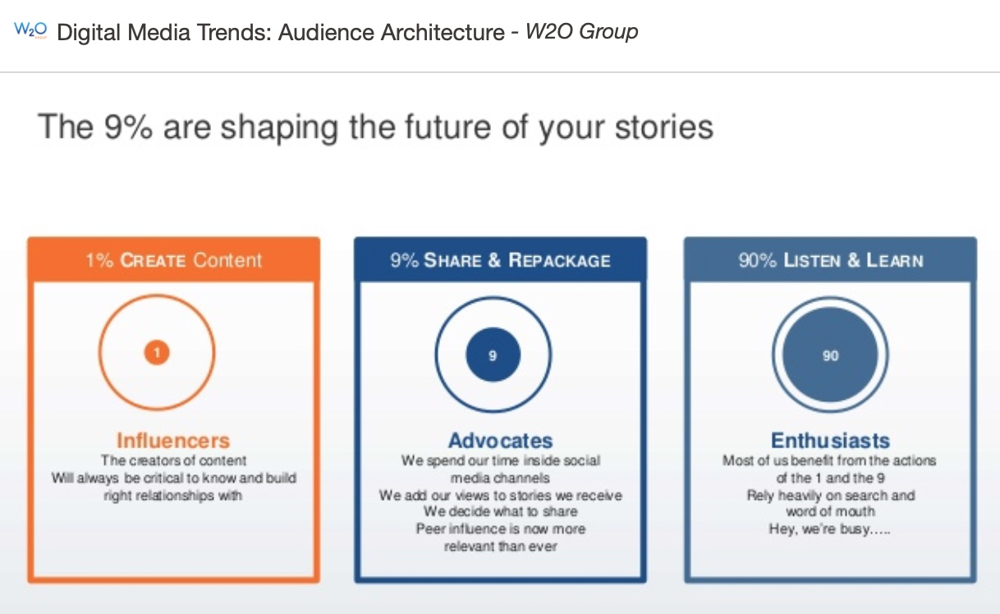

# How do social networks affect behavior?
30 April 2019

---

---?image=images/quote-steve-jobs.jpg

---

## Why does this work?

<iframe width="560" height="315" src="https://www.youtube.com/embed/IIW3l-ENHdA" frameborder="0" allowfullscreen></iframe>

---

## Why does this work?

<iframe width="560" height="315" src="https://www.youtube.com/embed/rdQrwBVRzEg" frameborder="0" allowfullscreen></iframe>

---

## Why does this work?

<iframe width="560" height="315" src="https://www.youtube.com/embed/d0XOPxgsUec" frameborder="0" allowfullscreen></iframe>

---?image=images/fun-quote.jpg

Note:

We're wrapping up the semester -- you've done the hard work already. Don't stress on your case study presentation! You are presenting an idea.

---?image=images/colored-pencils.jpg

Note:

You don't need to use all of the colors under the rainbow to make your point. Choose simply.

---

## Objectives

- Understand the potential for social networks to play a role in social processes
- Learn about challenges associated with determining influence in a social network
- Understand the purpose and utility of methods and tools used to measure human behavior within a social economy

Note:

We’re going to spend some time on the first question, because its not an open and shut case. We’ve only recently developed the means to study social networks at scale with the availability of social data at very large scale. And this is not laboratory controlled data that lets us easily examine causal questions.

The mechanisms by which social networks operate are complex. But there is a grand race to understand such networks; again, it’s a race for attention and influence. As Kevin Spacey said in an address in 2014, “anyone with an internet connection and an idea can develop an audience.” http://www.cleveland.com/business/index.ssf/2014/09/kevin_spacey_challenges_conten.html.

There is a dark side to this story, of course. There is the very salient fact that all of us are subject to manipulation over social media. For a fascinating read, you can read about how a Russian troll @TEN_GOP gained influence in America’s political drama in 2016. It remained active for 18 months fooling both the left and the right.

“Its success came from its stepwise approach. First, it imitated genuine far-right commentators by posting hyper-partisan tweets, and attracted their attention by mentioning and praising them. Their responses gave it an appearance of legitimacy which allowed it to interact with higher-profile figures, including in the campaign, and to be quoted by genuine media outlets.” (2 017, Nimmo, B., How a Russian Troll Fooled America, https://medium.com/dfrlab/how-a-russian-troll-fooled-america-80452a4806d1)

While measuring influence in social networks is challenging, it is an emergent business area as evidenced by the influential klout measure and a huge surge of interest based on bots, counter-influence, fake news, etc. Finally, while we can be manipulated and driven as a herd, we are also more open to fine-grained targeting than ever before. We’ll look at a few ways marketing and advertising professionals are gather tiny social signals from users to quantify behavior.

---

## Social networks

**A social network consists of all the connections and ties within a group or collection of groups**

1. We shape our network
2. Our network shapes us
3. Our friends affect us
4. Our friends' friends' friends affect us
5. The network has a life of its own

Note:

Networks have:
- nodes
- connections
- flow (contagion)

Rule 1: Homophily. Tendency to associate with people that resemble us. We decide how many people we connect go and the structure of our network.

Rule 2: You are connected - how dense is your network? The number of contacts friends and family have are relevant. This affects how information flows.

Rule 3: Every direct tie is the potential for strong influence. Are you more central or not? Does your network have high transitivity or not? Centrality and transitivity affects much. In an epidemiological model, if a virus is spreading through a network, where do you want to be?

Rule 4: Hyperdyadic spread is the tendency to spread beyond a direct social tie. Reinforcement from multiple people plays a role in behavioral choices.

This is a potential key insight Christakis’ and Fowler’ work. That those who are not closely connected still have an affect on our behavior. Think about social proof and how we take our cues from the norms of the group. And think back to the idea of mirror neurons where we naturally mirror what we observe. This affects both learning and social behavior. And is strongly tied to our intrinsic cooperative nature.

Perhaps, think of this as resonant frequencies or waves, as well. The reason this is a relatively new idea is because we finally have enough data to study such effects.

Rule 5: Networks have properties and functions (and shapes) in and of themselves. "Waves", bird flocking, swarming... this behavior seems to be some sort of collective intelligence that is a property of groups and not individuals.

---
## Six Degrees of Separation

<iframe width="560" height="315" src="https://www.youtube.com/embed/a99ry70CnRs" frameborder="0" allowfullscreen></iframe>

---

# Three degrees of influence

Note:

The core insight promulgated by C\&F is “The Three Degrees Rule” which they ascribe to behaviors, attitudes, and feelings. Your friends-friends-friends may influence you. These seem to be fairly stable network ties. Beyond this there is much noice - which C\&F talk about in terms of “intrinsic decay”.

- Difficult to study social influence effects in observational studies. How do we know whether social networks operate in the same way as face-to-face social networks?

- How do we know the network influences and other factors such as Homophily are not the cause?

- Framework to distinguish influence and homophily effects in dynamic networks.
	- "Global instant messaging network of 27.4 million users, using data on the day-by-day adoption of a mobile service application and users' longitudinal behavioral, demographic, and geographic data."
	- "We find that previous methods overestimate peer influence in product adoption decisions in this network by 300–700%, and that homophily explains >50% of the perceived behavioral contagion."

	Aral, S., Muchnik, L., & Sundararajan, A. (2009). Distinguishing influence-based contagion from homophily-driven diffusion in dynamic networks. Proceedings of the National Academy of Sciences, 106(51), 21544-21549.

Image credit: https://www.slideshare.net/jbradfo4/topic-4-social-networks

---

## Contagion

<iframe width="560" height="315" src="https://www.youtube.com/embed/8aEtyRD1j5U" frameborder="0" allowfullscreen></iframe>

[Connected links](http://connectedthebook.com/pages/links.html)

Note:

Based on Framingham Heart Survey Social network @ 2200 people. Spread of obesity, relations w/in network and changes over 32 years.

Other relevant evidence for emotional contagion:

"For one week in January 2012, data scientists skewed what almost 700,000 Facebook users saw when they logged into its service. Some people were shown content with a preponderance of happy and positive words; some were shown content analyzed as sadder than average. And when the week was over, these manipulated users were more likely to post either especially positive or negative words themselves."

http://www.theatlantic.com/technology/archive/2014/06/everything-we-know-about-facebooks-secret-mood-manipulation-experiment/373648/

---

## Teens: Homophily and conformity effect

http://www.psychologicalscience.org/news/releases/social-media-likes-impact-teens-brains-and-behavior.html

Note:

Neural effects - Teens highly influenced by the number of "likes" on their own photos.

32 teens 13-18. 148 photos on screen for 12 mins including 40 of own photos.

fMRI brain activity studied. Large # of likes led to wide activity in the brain to include reward circuits, social cognition, imitation, and visual attentional centers.

More likely to like a photo when significant "liked".

---
## What social phenomena can we see in networks?

- Signals (words, topics, sentiment, etc.)
- People (also organizations, groups, ...)
- Actions (likes, shares, reply, favorite, etc.)
- Relationships (people, time, place, language, etc)

Note:

When we're studying social networks, we look for observable, quantifiable signals.

 Language is intrinsically social and social structures -- like social networks -- are intrinsically linguistic. So while its great that mathematicians and physicists give us great insight into how to model dynamic networks, to actually make sense of information contained in networks requires social science. Not only is the content important, but the process by which people communicate. We care about how information is signaled via actions and we also care about how people are connected to each other.

 When studying social networks, these are the sort of signals that answer questions like:
 - What communities of people care about chess?
 - If they like baseball, what other things do they like?
 - What sites do they visit?
 - etc.

---
## Where can we observe influence in a network?

- Message content
- Actions and behavior of strong ties
- Weak ties

Note:

- What really matters is the nature and quality of the tie.
-
Weak ties (according to C\&F):
- 46% of the variation in how many friends you have is explained by your genes. (Okay, so not too surprising that this would be a facet of personality.)
- But 47% in the variation in whether your friends know each other is attributable to your genes. So, perhaps, some people are likely to introduce their friends to one another, and some are not. This has an impact on the structure of your network.
- 30% of the variation in whether people are in the middle or edge of a network is attributable to their genes.

---
# Networks are like a super-organism

Note:

— You can’t study the individuals to see properties of the whole - these properties are not reducible.

If this sort of thing is interesting to you, I recommend this course from FutureLearn. Big Data: Measuring And Predicting Human Behavior.

https://www.futurelearn.com/courses/big-data/3

---
## Amplifying attitudes with "filter bubbles"

Note:

Algorithms may have intended/un-intended effects.

---
## Social media news use

http://www.journalism.org/2016/05/26/news-use-across-social-media-platforms-2016/

Note:

A majority of Americans get their news via social media and most only get their news on one site. The demographics are different across sites and all of this is changing over time.

From: Inside a Fake News Sausage Factory - this is all about income

https://www.nytimes.com/2016/11/25/world/europe/fake-news-donald-trump-hillary-clinton-georgia.html

"... Among the more than a dozen registered by Mr. Latsabidze, were busts. Then he shifted all his energy to Mr. Trump. His flagship pro-Trump website, departed.co, gained remarkable traction in a crowded field in the prelude to the Nov. 8 election thanks to steady menu of relentlessly pro-Trump and anti-Clinton stories."

“My audience likes Trump,” he said. “I don’t want to write bad things about Trump. If I write fake stories about Trump, I lose my audience.”

“If Hillary had won, it would be better for us,” he said. “I could write about the bad things she was going to do,” he said. “I did not write to make Trump win. I just wanted to get viewers and make some money.”

---

## A puzzle

[Do tweets change your behavior?](http://www.cnn.com/2010/OPINION/11/16/fowler.christakis.tweeting/)

Note:

"Although our research shows that obesity, happiness and even divorce can spread in networks between close friends, there is little evidence that behaviors spread between the tenuous relationships people have online."

Milano - 2011 timeframe 1M followers - posted on Twitter a direct link to Connected on Amazon.

What happened to sales? (no extra copies in a 24-hour period)

Maybe someone influential? Tim O'Reilly also sent out a tweet to about 1.5M followers. Small bounce.

Samantha Fox (4,345 followers) - another small bump, but bigger than the other two.

More than the number of ties - nature and quality of ties.

Who are influential - who is influenceable? Personal connectedness in "real life"? (Strong ties) Timing? "Cost"?

---

## Voting behavior

61M person person experiment on FB (2010)

http://phenomena.nationalgeographic.com/2012/09/12/a-61-million-person-experiment-on-facebook-shows-how-ads-and-friends-affect-our-voting-behaviour/

Note:

	- F2F social pressure and strong ties very effective
	- But most information campaigns little influence
	- Randomized trial on FB

	Bond, R. M., Fariss, C. J., Jones, J. J., Kramer, A. D., Marlow, C., Settle, J. E., & Fowler, J. H. (2012). A 61-million-person experiment in social influence and political mobilization. Nature, 489(7415), 295-298.

Day of US congressional election. 98% saw a social message encouraging to vote at top of feed. Link to local polling place and clickable button "I voted". Counter and which friends through randomly selected profile pictures.

2% saw something different.
Half same box but without friends.
Half without message.

Messages mobilized people to express their desire to vote -- and social ones spurred some to vote. Rippling effects. (Offline correlational data used to measure.)

---

## Storytizing

1. Segmentation is not effective
2. Primary research is harder to do
3. Paid media -> optimized to earned & shared
4. Emailing customers is not as effective anymore
5. Ad campaigns are too slow

Note:

We need to use data to better segment populations. How many people does a persona represent? With data we can be more agile and more accurate.

The audience is constantly shifting -- advertizers are getting smarter about tapping into unconscious behavior.

Go where the audience is. Their attention is limited and email campaigns fall under .05% for reach.

Ad campaigns now move at a tempo of a week vice months. The speed of interaction is accelerating.

"Storytizing refers to a brand's ability to make its full story accessible to a present or future customer at any time, anywhere in the world, and based on the needs of the customer." p. 18

---

## Audience Architecture

https://www.slideshare.net/WCGWorld/digital-media-trends-audience-architecture/

Note:

Network algorithms help you determine what's someone's role is in the audience at any given time. Other algorithms help you filter to the audience you are interested in by their interests, habits, location, social channel, etc. Then you can study -- perhaps as a digital ethnographic study -- to better understand them over time.

To do this,

- All online platforms including mobile
- Content must be available at all times on all platforms
- Social media is becoming a commerce hub - be active there.
- Keep your audience happy since word-of-mouth is ever important.

---

## Media Influence Campaigns

Note:

There is a race to understand how to find and shape influencers in addition to direct targeting of consumers or individuals.

It’s not easy to find influencers: you can’t just use centrality and assume it’s a valid measure... in fact, it isn’t. But it does indicate a potential influential position in terms of information flow.

Variables:
- local vs global context
- authentic, credible voice
- likability
- social and network context
- emotion in social environment
- medium
- ??

There are about 400 signals per person across multiple social media platforms such as Twitter, FB, LinkedIn, etc. (source ??)

Older content:

https://www.wired.com/2012/04/ff_klout/
Extract:
“But even if you have no idea what your Klout score is, there’s a chance that it’s already affecting your life. At the Palms Casino Resort in Las Vegas last summer, clerks surreptitiously looked up guests’ Klout scores as they checked in. Some high scorers received instant room upgrades, sometimes without even being told why. According to Greg Cannon, the Palms’ former director of ecommerce, the initiative stirred up tremendous online buzz. He says that before its Klout experiment, the Palms had only the 17th-largest social-networking following among Las Vegas-based hotel-casinos. Afterward, it jumped up to third on Facebook and has one of the highest Klout scores among its peers.”

https://www.wired.com/2015/05/new-browser-extension-decides-trustworthy/

Extract:
“A new company is trying to do an end-run around that intransigence by scraping publicly available information from various sharing-economy services and compiling it into a trust score between 0 and 100. Called Karma, it works as a browser extension—any time you pull up a supported site (which currently includes Airbnb, Craigslist, Dogvacay, Ebay, Etsy, RelayRides, and Vayable) a pop-up window will ask if you want to link your account to your Karma score. That score is calculated by looking at the reviews you've received—both the quantitative ratings (the number of stars, for instance) as well as a textual analysis of written comments.”

---

## Algorithms monitor behavior

- Clickstreams & cookies
- Search engine queries
- Online purchases
- Credit card data from offline purchases
- Profile data from social media platforms (views, relationships, etc.)
- URLs - url shorteners
- Location data based on your Internet access
- etc.

Note:

Summarized from: http://cmtoday.cmu.edu/technology_business/online-advertising-marketing-research/

---
## Psychographics - New Frontier

[Image credit](http://www.wordstream.com/blog/ws/2017/08/16/psychographics-in-marketing)

Note:

Psychographics is a quantitative methodology used to describe consumer by psychological attributes.

Broadly, it spans more than the above to include personality, attitude, feelings, etc.

---

## Summary

- Close friends can have strong influence on behavior
- Three degrees of influence: If your social network were 20 x 20 x 20 - you would have an influence on 8000 people
- Weak messages can alter behavior by very small amounts ("butterfly effect")
- Data in aggregate may be used by algorithms to both predict and influence behavior

Note:

From the FB study - tiny effects 1/10 to 1/100th of a percentage point. Maybe no different than recent news and political advertisements (Gelman).
http://andrewgelman.com/2014/11/13/experiment-700000-participants-youll-problem-statistical-significance-b-get-call-massive-scale-c-get-chance-publish-tabloid-top-journal/

"The differences may seem small, but try scaling them up. If the proportion of voters rises by 0.39 percentage points and you’re dealing with 61 million people, you’ve got 238,000 extra votes.""

Networks have a multiplicative effect - Indirect effects of social contagion large. (Fowler)

http://phenomena.nationalgeographic.com/2012/09/12/a-61-million-person-experiment-on-facebook-shows-how-ads-and-friends-affect-our-voting-behaviour/

---
## Behavioral Economics (redux)

Note:

Richard Thaler - Nobel Prize in Economics 2017. Coined the term Behavioral Economics and brought Tversky and Kahenman's work out of academia to more popular understanding.

Cass Sunstein, a law professor, teamed up with Thaler to write the work "Choice Architecture" (which you read). He served under the Obama Administration as the Administrator of the WH Office of Information and Regulatory Affairs from 2009-2012 and has had an effect on Government.

"The federal government now became sensitive to both loss aversion and framing effects: People didn’t choose between things, they chose between descriptions of things. The fuel labels on new automobiles went from listing only miles per gallon to including the number of gallons a car consumed every hundred miles. What used to be called the food pyramid became MyPlate, a graphic of a dinner plate with divisions for each of the five food groups, and it was suddenly easier for Americans to see what made for a healthy diet. And so on."

Sunstein was particularly interested in what was now being called “choice architecture.” The decisions people made were driven by the way they were presented. People didn’t simply know what they wanted; they took cues from their environment. They constructed their preferences. And they followed paths of least resistance, even when they paid a heavy price for it.

Millions of U.S. corporate and government employees had woken up one day during the 2000s and found they no longer needed to enroll themselves in retirement plans but instead were automatically enrolled. They probably never noticed the change. But that alone caused the participation in retirement plans to rise by roughly 30 percentage points. Such was the power of choice architecture. One tweak to the society’s choice architecture made by Sunstein, once he’d gone to work in the U.S. government, was to smooth the path between homeless children and free school meals. In the school year after he left the White House, about 40 percent more poor kids ate free school lunches than had done so before, back when they or some adult acting on their behalf had to take action and make choices to get them.

Lewis, Michael. The Undoing Project: A Friendship That Changed Our Minds (Signed Edition) (pp. 343-344). W. W. Norton & Company. Kindle Edition.

---

## Next Week - Posters!

